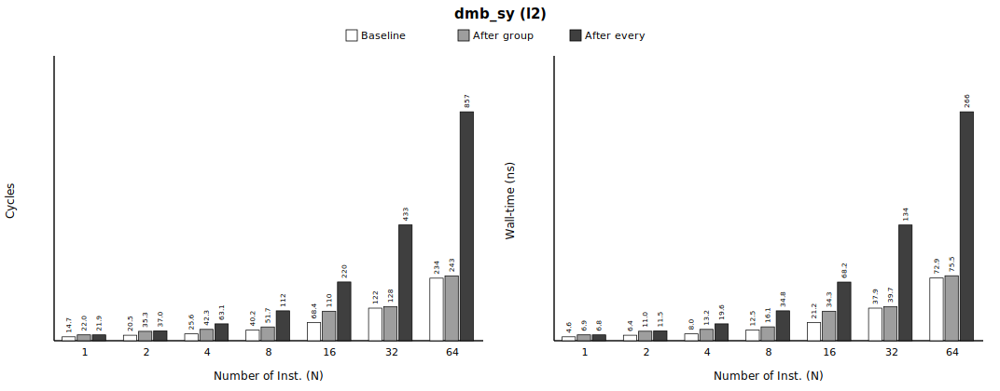
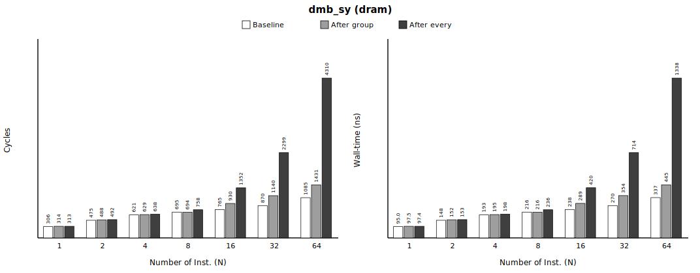
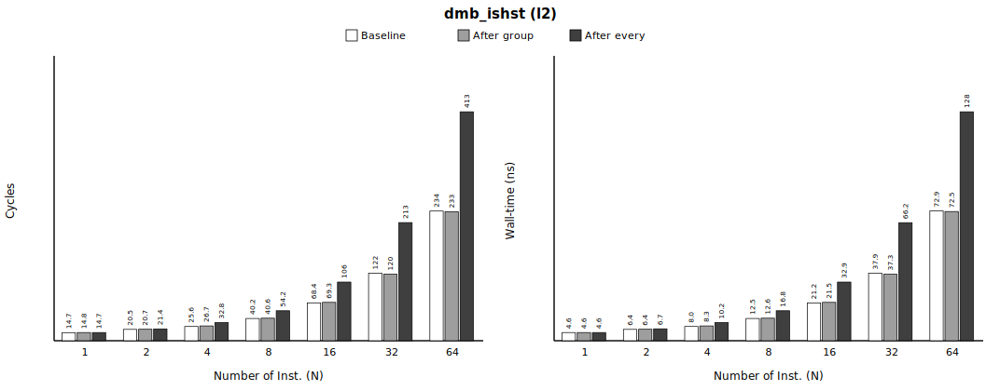
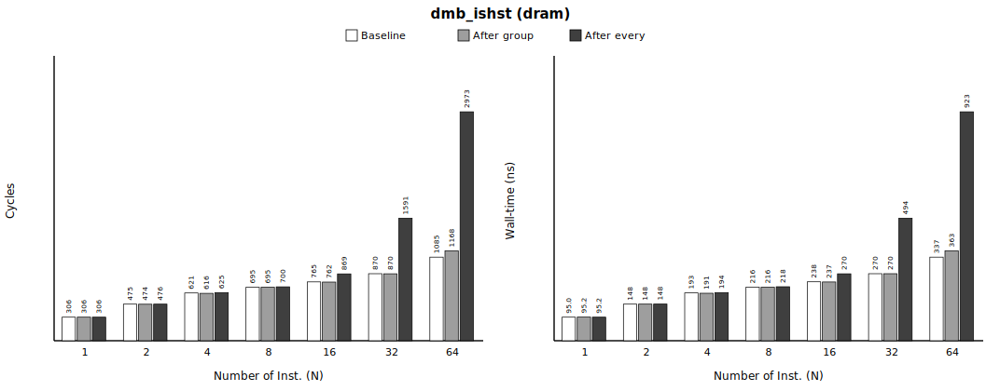
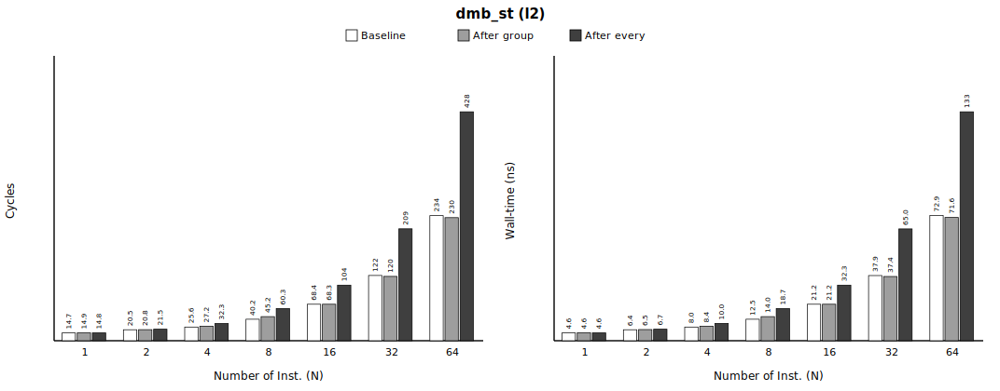
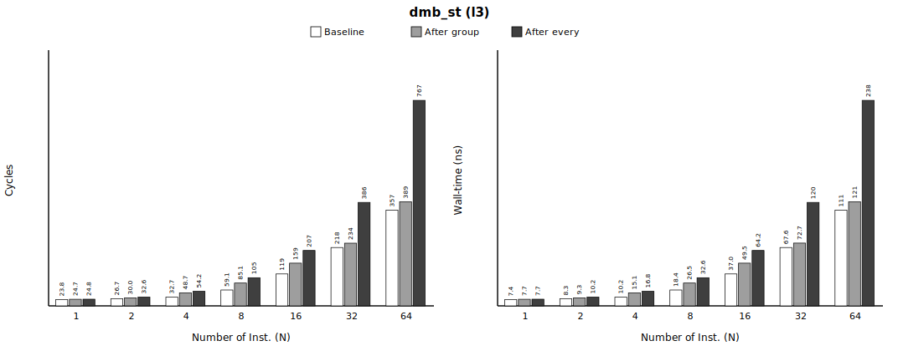
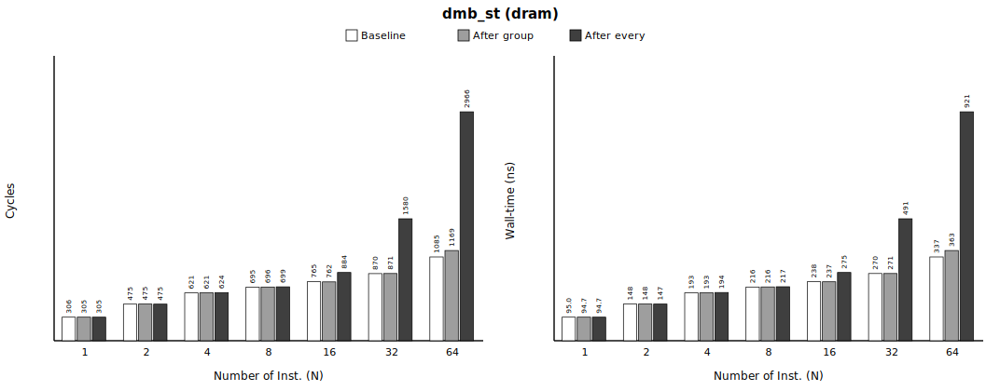
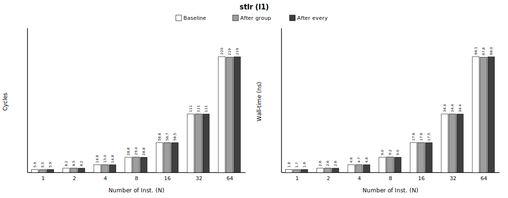
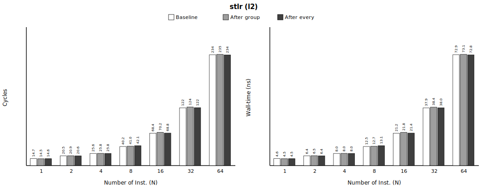
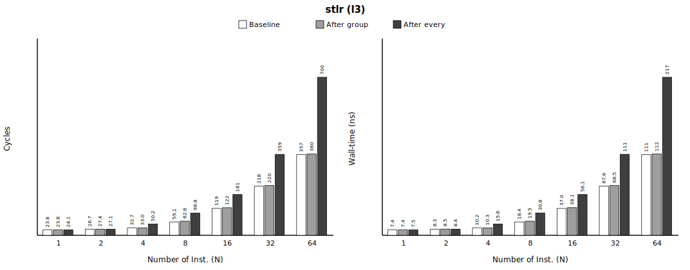

# Group 1 — store-side ordering (fences + store-release) (`1_store_side`)

> **Status** — 5 treatments · single-thread sweep **280/280 gate-clean** · paired, 1M iters · regenerated 2026-06-11.

**Pair with** — methodology spec [`../METHODOLOGY.md`](../METHODOLOGY.md) · master report [`../README.md`](../README.md) · integrated data [`processed/1_store_side_incremental.csv`](processed/1_store_side_incremental.csv) · raw per-repeat PMU in each `<treatment>/out/bench.csv`.

**Contents**
1. [At a glance](#at-a-glance)
2. [Metadata](#metadata)
3. [What this measures](#what-this-measures)
4. [Number Repeated Runs](#number-repeated-runs)
5. [Cache resident / miss validation](#cache-resident--miss-validation)
6. [Prefetcher not engaged](#prefetcher-not-engaged)
7. [Baseline cost (no memory-ordered op)](#baseline-cost-no-memory-ordered-op)
8. [Result](#result)
9. [Summary](#summary)

## At a glance

Headline of the memory-ordered op — the deepest sweep point (**`after_every` · N=64**), across the **cache-residency** sweep (`l1`→`dram`). All cells are the **absolute** per-iteration cost in cyc (ns): the first row is the **baseline** (no memory-ordered op); each treatment row is the cost **with** that op (= baseline + its Δ). `*` = statistically equal to baseline (the op adds no measurable cost). The op's incremental Δ is in the *Result* tables. Full sweep below.


| memory-ordered instruction | **`l1`** | **`l2`** | **`l3`** | **`dram`** | gate |
|---|---|---|---|---|---|
| baseline, no op | 219.6 cyc (68.1 ns) | 234.2 cyc (72.9 ns) | 357.3 cyc (111.0 ns) | 1085.3 cyc (337.3 ns) | — |
| `dmb_ish` | 842.0 cyc (261.1 ns) | 864.5 cyc (268.4 ns) | 1326.0 cyc (411.6 ns) | 4315.4 cyc (1339.8 ns) | PASS ✓ |
| `dmb_sy` | 844.2 cyc (261.8 ns) | 856.5 cyc (266.0 ns) | 1314.2 cyc (407.8 ns) | 4310.4 cyc (1338.2 ns) | PASS ✓ |
| `dmb_ishst` | 380.9 cyc (118.2 ns) | 413.4 cyc (128.5 ns) | 760.7 cyc (236.1 ns) | 2973.1 cyc (923.3 ns) | PASS ✓ |
| `dmb_st` | 380.9 cyc (118.1 ns) | 428.4 cyc (133.1 ns) | 766.8 cyc (238.0 ns) | 2966.4 cyc (921.1 ns) | PASS ✓ |
| `stlr` | 219.2* cyc (68.0* ns) | 233.9* cyc (72.8* ns) | 700.2 cyc (217.3 ns) | 2489.0 cyc (773.0 ns) | PASS ✓ |

> A store-side fence between cache-missing stores **serializes** them — full (`ish`/`sy`) > store-only (`ishst`/`st`), cost grows ~linearly with N (merge-buffer drain) and **deepens with cache residency** (`l1`→`dram`: the deeper the missing stores resolve, the more drain the fence exposes); at `l1` (resident) it is ≈0 (nothing to drain). Store-release `stlr` pays the **same store-side drain** — its retirement waits on the po-older stores — measured here as STLR vs STR.

## Metadata

Machine / environment:

| field | value |
|---|---|
| Node | `rg-uwing-1` (CRNCH), reached from `rg-login` via `srun --jobid=<J>` |
| Arch/CPU | aarch64, **ARM Neoverse-V2** (Grace), 72 cores |
| Clock | **3.375 GHz fixed**, governor `performance` (1 cyc ≈ 0.296 ns) |
| Cache | line 64 B; L1d 64 KiB/core; L2 1 MiB/core; L3 ~114 MiB shared |
| NUMA | node 0 = 72 cores + 490 GB local (**membind here**); node 1 = GPU HBM (avoid) |
| ISA | **LSE atomics** + **RCpc `ldapr`**, SVE2 |
| Kernel | 6.8.0-1051-nvidia-64k |
| Compiler | gcc 11.4.0, `-O2 -march=native -pthread` |
| PMU | `perf_event_open()` (perf CLI broken): cycles, instructions, l1d_refill(0x03), l2d_refill(0x17), ll_miss_rd(0x37), mem_access(0x13), stall_be_mem(0x4005) + SW noise |

Experiment variables:

| field | value |
|---|---|
| treatments | `dmb_ish`, `dmb_sy`, `dmb_ishst`, `dmb_st`, `stlr` |
| placements | `after_group`, `after_every` |
| conditions | l1, l2, l3, dram |
| N (stores/group) | 1, 2, 4, 8, 16, 32, 64 |
| l1: iters / working-set / repeats | 1,000,000 / 2,048 B / 10 |
| l2: iters / working-set / repeats | 1,000,000 / 524,288 B / 10 |
| l3: iters / working-set / repeats | 1,000,000 / 8,388,608 B / 10 |
| dram: iters / working-set / repeats | 1,000,000 / 536,870,912 B / 10 |
| measurement | PAIRED: baseline + treatment interleaved in ONE process per repeat; PMU cycles + independent CLOCK_MONOTONIC_RAW wall-time |
| build `dmb_ish` | sha256 `65e183779011f740…`, gcc 11 |
| build `dmb_sy` | sha256 `bc391babbd48b200…`, gcc 11 |
| build `dmb_ishst` | sha256 `9ee34bc9c695645b…`, gcc 11 |
| build `dmb_st` | sha256 `0e22db8c057ec68d…`, gcc 11 |
| build `stlr` | sha256 `7a817aadf6c68454…`, gcc 11 |

## What this measures

Cost of a store-side memory-ordered instruction inserted into a **store** stream — a `dmb` barrier (full `dmb ish`/`sy`, store-only `dmb ishst`/`st`) **or a store-release `stlr`** (STLR vs STR). **Window:** store issue → retire (a retiring fence — or a store-release — blocks until po-older stores drain from the merge/write buffer). **Stream:** random **store-only** (register-hash addressing ⇒ one store per op, write-allocate misses, prefetcher-defeated) (`miss` = 512 MiB working set, `hit` = small resident set, warmed). Reported as median over repeats; baseline subtracted PAIRED. Credible source: `processed/1_store_side_incremental.csv` + this README; raw per-repeat PMU in each `<treatment>/out/bench.csv`.

> **Paper claim this measures** — *"the ordering requirements of full fences and store-release instructions are commonly enforced by **draining older stores before retirement, which stalls commit**"* (paper §1), illustrated by the Fig 4 walk-through: *"S2 cannot retire until the merge-buffer entry of po-older store S1 drains. Because retirement is in order, this also prevents S3 from passing S2 in the ROB, even though S2 imposes no ordering constraint"* (paper §3.2, Fig 4 — S2 is a store-release). This group measures that drain-induced stall directly: the Δ of a store-side `dmb` / `stlr` placed in a cache-missing store stream.

## Number Repeated Runs

Single-thread sweep — repeat counts that passed ALL validity gates (multiplexing + OS-noise + anti-elision + cache-condition + exposed-latency), per pass. Counts, not cost.

| treatment | configs | base runs PASS/total | treat runs PASS/total |
|---|---|---|---|
| `dmb_ish` | 56 | 560/560 | 560/560 |
| `dmb_sy` | 56 | 560/560 | 560/560 |
| `dmb_ishst` | 56 | 560/560 | 560/560 |
| `dmb_st` | 56 | 560/560 | 560/560 |
| `stlr` | 56 | 560/560 | 560/560 |

## Cache resident / miss validation

Group 1 sweeps cache **residency**: the store working set is sized to resolve at L1 / L2 / L3 (shared SLC) / DRAM. The residency **level is set by the working-set size + the per-store latency** — validated by [`tools/cache_residency.c`](../tools/cache_residency.c) (~4 / 11 / 21 / 645 cyc) — **not** by the core "miss" counters, which cannot separate the on-mesh shared SLC from DRAM. `latency cyc/store (N=1)` below is the **N=1 baseline** (one store/iter, exposed by the cross-iteration dependency): it **rises monotonically L1→DRAM** — it would be ~8 cyc flat for every level if cross-iteration store-MLP were *not* removed (the OoO core would overlap many iterations' misses), so this gradient is the proof the dependency neutralized cross-iteration MLP AND the proof of residency.

> **Why no `l3d_refill` (0x2a) column.** Two reasons. (1) It is **not in the main 6-counter PMU group** (cycles + l1d_refill/l2d_refill/ll_miss_rd/mem_access/stall + instructions already fill the 6 programmable counters at `mux = 1.000`); adding it would force multiplexing. (2) Even if measured, it **mislabels residency**: at the L3-resident 8 MiB it reads ≈ 1.0 — identical to DRAM — because the 114 MiB "L3" is the 72-core **shared SLC outside the core**, so `l3d_refill` / `ll_miss_rd` count "left the core cluster," which an SLC hit also triggers. See METHODOLOGY §7.1, *Finding — the "L3" is the shared System-Level Cache (SLC)*. (`l2d_refill` and `ll_miss_rd` are shown above only as info, with the same caveat.) The focused `lmiss` run in *Prefetcher not engaged* (below) uses these events for the prefetch check, where the mislabel is also visible (`l3d_lmiss_rd` rises L1→DRAM but is non-zero already at L2/L3-resident).

> **Counter note — cross-iteration dependency.** Iterations are serialized by a residency-matched pointer-chase (one dependent miss-load per iteration; see METHODOLOGY §7.1), so `l1_refill/acc` carries the chase's own L1 miss **on top of** the stores — ≈ **1 + 1/N** at the miss levels (~2 at N=1, ~1 at N=64). The gate uses it only to confirm the stores **miss L1** (resident `l1≤0.02`; l2/l3 `l1≥0.50`; dram `l1≥0.90` + `ll≥0.50` + `stall≥10%`); all rows mux = 1.000, cs/mig/pf = 0.

| condition | working set | latency cyc/store (N=1) | l1_refill/acc | l2_refill/acc | ll_miss_rd/acc | stall %cyc | mux | cs/mig/pf | gate-clean |
|---|---|---|---|---|---|---|---|---|---|
| **l1** — L1-resident | 2 KiB | 5.89 | 0.00 | 0.00 | 0.00 | 0% | 1.000 | 0/0/0 | 70/70 ✓ |
| **l2** — L1-miss / L2-resident | 512 KiB | 14.70 | 0.93 | 0.04 | 0.10 | 33% | 1.000 | 0/0/0 | 70/70 ✓ |
| **l3** — L2-miss / L3-resident (SLC) | 8 MiB | 23.76 | 1.11 | 0.41 | 0.99 | 59% | 1.000 | 0/0/0 | 70/70 ✓ |
| **dram** — DRAM (deep miss) | 512 MiB | 305.50 | 1.13 | 1.29 | 1.89 | 94% | 1.000 | 0/0/0 | 70/70 ✓ |

## Prefetcher not engaged

Is the baseline `cyc/store` fast because a hardware prefetcher hid the misses? **No.** Neoverse-V2 has **no dedicated prefetch counter**, so the **long-latency-miss** events are the proxy: a miss a prefetcher had hidden would not be *long-latency*. This focused 6-event run (no multiplexing) replays the **exact construction-B baseline store stream** (no ordering op) at each residency level — [`tools/prefetch_probe.c`](../tools/prefetch_probe.c), data [`prefetch_probe.csv`](prefetch_probe.csv), `N=1` cold rows (1 store + 1 chase per op):

| condition | cyc/store (cold) | `l1d_refill_wr`/op (store L1-miss) | `l1d_lmiss_rd`/op (read long-lat.) | `l2d_lmiss_rd`/op | `l3d_lmiss_rd`/op | mux |
|---|---|---|---|---|---|---|
| **l1** | 5.7 | 0.00 | 0.00 | 0.00 | 0.00 | 1.000 |
| **l2** | 17.1 | 0.90 | 1.00 | 0.25 | 0.32 | 1.000 |
| **l3** | 24.0 | 0.99 | 1.00 | 0.91 | 1.93 | 1.000 |
| **dram** | 627.8 | 1.00 | 1.00 | 2.23 | 3.00 | 1.000 |

Both the store addresses (register-hash) and the dependency chase (random permutation cycle) are **prefetcher-defeating by construction** (non-strided). The counters confirm it: at every miss level **each store causes an L1 write-refill** (`l1d_refill_wr/op ≈ 1` ⇒ stores miss L1, not prefetched in) and **each chase read is a long-latency miss** (`l1d_lmiss_rd/op ≈ 1`), with the deeper read-miss counts (`l2d`/`l3d_lmiss_rd`) **rising monotonically L1→DRAM**. A prefetcher that hid the misses would instead push these toward **0** while keeping `cyc/store` low — the opposite of what is measured. So the baseline `cyc/store` is genuine miss latency. (The cold `cyc/store` ≈ the serial-chase residency latency — L1 ~4 / L2 ~11 / L3 ~21 / DRAM ~645 — confirming each level is truly reached; the *Cache-validation* table's lower DRAM figure is the 10-repeat median, where re-touching the ~64 MiB footprint warms it into the shared SLC — a repeat-warming effect, **not** prefetch.)

## Baseline cost (no memory-ordered op)

*(Every individual baseline measurement — each treatment × placement × repeat — is preserved by condition × N in `processed/1_store_side_baselines.csv` for error-margin / CI work.)*

All per-iteration **averages** (= total ÷ iters per repeat). **Reference** = median over **all** pooled baseline samples for that condition×N — every treatment × placement × repeat (the **n** column below); **margin = furthest pooled sample from the reference** = max(|max−ref|, |ref−min|). **A treatment whose Δ ≤ this margin (or is negative) is statistically EQUAL to the baseline** — the apparent value is run-to-run fluctuation (within boundary), not a real cost. (σ = 1 standard deviation, for reference.)

| condition | N | n | ref cyc | min–max cyc | σ cyc | **margin ±cyc** | ref ns | min–max ns | σ ns | **margin ±ns** |
|---|---|---|---|---|---|---|---|---|---|---|
| l1 | 1 | 100 | 5.9 | 5.6–6.0 | 0.1 | **0.3** | 1.8 | 1.7–1.9 | 0.0 | **0.1** |
| l1 | 2 | 100 | 8.2 | 7.6–8.3 | 0.2 | **0.6** | 2.6 | 2.4–2.6 | 0.1 | **0.2** |
| l1 | 4 | 100 | 14.8 | 13.9–15.4 | 0.4 | **0.9** | 4.6 | 4.3–4.8 | 0.1 | **0.3** |
| l1 | 8 | 100 | 28.8 | 26.8–29.4 | 0.9 | **2.0** | 9.0 | 8.3–9.2 | 0.3 | **0.7** |
| l1 | 16 | 100 | 56.6 | 52.3–57.4 | 1.7 | **4.2** | 17.6 | 16.3–17.8 | 0.5 | **1.3** |
| l1 | 32 | 100 | 110.9 | 103.4–113.2 | 3.2 | **7.5** | 34.4 | 32.1–35.1 | 1.0 | **2.3** |
| l1 | 64 | 100 | 219.6 | 204.7–225.2 | 6.5 | **14.9** | 68.1 | 63.5–69.9 | 2.0 | **4.6** |
| l2 | 1 | 100 | 14.7 | 13.8–25.8 | 3.6 | **11.1** | 4.6 | 4.3–8.0 | 1.1 | **3.4** |
| l2 | 2 | 100 | 20.5 | 17.5–25.3 | 2.3 | **4.8** | 6.4 | 5.5–7.9 | 0.7 | **1.5** |
| l2 | 4 | 100 | 25.6 | 22.7–30.9 | 2.4 | **5.2** | 8.0 | 7.1–9.6 | 0.8 | **1.6** |
| l2 | 8 | 100 | 40.2 | 34.6–44.7 | 2.2 | **5.6** | 12.5 | 10.8–14.0 | 0.7 | **1.7** |
| l2 | 16 | 100 | 68.4 | 59.2–75.2 | 4.0 | **9.2** | 21.2 | 18.4–23.3 | 1.2 | **2.8** |
| l2 | 32 | 100 | 122.1 | 113.2–130.5 | 4.1 | **8.9** | 37.9 | 35.2–40.5 | 1.3 | **2.7** |
| l2 | 64 | 100 | 234.2 | 219.4–252.3 | 9.1 | **18.1** | 72.9 | 68.1–78.3 | 2.8 | **5.4** |
| l3 | 1 | 100 | 23.8 | 22.9–25.6 | 0.6 | **1.9** | 7.4 | 7.1–8.0 | 0.2 | **0.6** |
| l3 | 2 | 100 | 26.7 | 25.5–28.1 | 0.7 | **1.4** | 8.3 | 7.9–8.7 | 0.2 | **0.4** |
| l3 | 4 | 100 | 32.7 | 32.0–33.5 | 0.4 | **0.8** | 10.2 | 9.9–10.4 | 0.1 | **0.3** |
| l3 | 8 | 100 | 59.1 | 57.3–60.4 | 0.8 | **1.8** | 18.4 | 17.8–18.8 | 0.2 | **0.6** |
| l3 | 16 | 100 | 119.2 | 116.9–121.4 | 0.8 | **2.3** | 37.0 | 36.3–37.7 | 0.2 | **0.7** |
| l3 | 32 | 100 | 217.7 | 213.8–223.6 | 2.5 | **5.9** | 67.6 | 66.4–69.5 | 0.8 | **1.9** |
| l3 | 64 | 100 | 357.3 | 351.1–368.2 | 3.5 | **10.9** | 111.0 | 109.0–114.4 | 1.1 | **3.4** |
| dram | 1 | 100 | 305.5 | 291.3–636.5 | 93.6 | **331.0** | 95.0 | 90.5–197.8 | 29.1 | **102.9** |
| dram | 2 | 100 | 474.6 | 458.6–634.6 | 46.4 | **160.1** | 147.5 | 142.6–197.3 | 14.4 | **49.7** |
| dram | 4 | 100 | 620.6 | 603.6–663.6 | 15.9 | **43.0** | 192.9 | 187.6–206.2 | 4.9 | **13.3** |
| dram | 8 | 100 | 695.2 | 669.9–739.8 | 15.0 | **44.6** | 216.1 | 208.3–229.9 | 4.6 | **13.8** |
| dram | 16 | 100 | 764.6 | 746.8–795.4 | 12.5 | **30.9** | 237.6 | 232.2–247.3 | 3.9 | **9.6** |
| dram | 32 | 100 | 870.3 | 839.6–883.9 | 10.7 | **30.8** | 270.5 | 261.0–274.7 | 3.3 | **9.5** |
| dram | 64 | 100 | 1085.3 | 1079.4–1095.5 | 4.6 | **10.3** | 337.3 | 335.4–340.5 | 1.4 | **3.2** |

**NOP padding (instruction-slot matching).** The no-ordering baseline carries a `nop` (`asm volatile("nop")`) wherever the treatment carries its ordering op — one per store (`after_every`) or one at the group end (`after_group`) — so both paths decode the same number of instructions and the paired Δ isolates the fence's **drain**, not the front-end decode of an extra instruction. For the store-side `dmb` treatments the `dmb` **occupies** that slot (treatment adds **no** `nop`); **`stlr` is the exception** — STLR *replaces* the STR, so to match slot count and give a clean STLR−STR contrast **both** its baseline and treatment carry the `nop` (cancels in the paired Δ).

objdump static counts (`<t>/out/objdump.full`), decomposed:

| function | `nop` (objdump) | of which: ours (intended) | gcc alignment | ordering-op |
|---|---|---|---|---|
| `pass_base` — baseline (every treatment) | 6 | 2 (one per code path) | 4 | **0** |
| `pass_treat` — `dmb …` | 4 | 0 (the `dmb` fills the slot) | 4 | **2** |
| `pass_treat` — `stlr` | 4 | 2 (STLR replaces STR) | 2 | **2** |

> **Reading the table — these are STATIC instruction counts (the binary), not runtime.** (1) The N sweep (1→64) is a **runtime loop bound**, not unrolling: the compiler emits **one** store + **one** `nop`/`dmb` per loop body, and at runtime that single static `dmb` **executes N×iters times** (`after_every`) or `iters` times (`after_group`) — so the static count never grows with N. (2) Each `pass_*` has **two** code paths (`after_every` + `after_group`), so there are **2** static ordering-ops (one per path) and **2** intended `nop`s in `pass_base` (one per path) — they match. (3) The `nop` *total* is larger (`pass_base` = our 2 + gcc alignment) because gcc pads loop heads / branch targets (and bytes after `ret`) to a 16-byte instruction-fetch boundary — a standard codegen optimization **outside** the hot loop, never executed in the timed region, so it does not affect Δ. The clean check is the **ordering-op column: 0 in `pass_base`** (no fence in the baseline) **and 2 in `pass_treat`** (one per code path).

## Result

- **Tested** — a store-side memory-ordered instruction inserted into a **store** stream — a `dmb` barrier (full `dmb ish`/`sy`, store-only `dmb ishst`/`st`) **or a store-release `stlr`** (STLR vs STR); swept across **cache residency** (`l1` 2 KiB / `l2` 512 KiB / `l3` 8 MiB / `dram` 512 MiB, latency-validated) × placement × N. Iterations are serialized by a residency-matched dependency chase (METHODOLOGY §7.1) so the baseline reflects per-iteration cost, not cross-iteration store-MLP.
- **Compared** — the same stream **without** the memory-ordered op (baseline) vs **with** it (treatment) — interleaved in ONE process per repeat (paired).
- **Result value** — **Δ = treatment − baseline** = the memory-ordered op's incremental cost, median over 10 repeats, per group-iteration, in BOTH cycles and ns.

How to read each table:

| column | meaning |
|---|---|
| `placement` | `after_group` = one memory-ordered op per group of N stores · `after_every` = one per store |
| `N` | stores per group (pressure built up before the memory-ordered op) |
| `base avg cyc` / `base avg ns` | baseline cost per iteration — pooled-median reference (its margin: *Baseline cost (no memory-ordered op)* above) |
| `var avg cyc` / `var avg ns` | with-treatment cost per iteration (= base + Δ) |
| **`Δ cyc` / `Δ ns`** | **the incremental cost (paired median) — the result** |
| `*` | Δ ≤ baseline margin (or negative) ⇒ within run-to-run fluctuation ⇒ statistically **zero** |

Per treatment below: a short note, the objdump opcode proof, then the cost tables.

### `dmb_ish`

objdump (emitted opcode):
```
3374:	d5033bbf 	dmb	ish
3434:	d5033bbf 	dmb	ish
```
build `sha256=65e183779011f740…`, gcc 11.


**l1** — median over repeats (column meanings above; raw per-repeat PMU in `out/bench.csv`):

| placement | N | base avg cyc | base avg ns | var avg cyc | var avg ns | **Δ cyc** | **Δ ns** |
|---|---|---|---|---|---|---|---|
| after_group | 1 | 5.9 | 1.8 | 14.1 | 4.4 | **+8.2** | **+2.5** |
| after_group | 2 | 8.2 | 2.6 | 16.4 | 5.1 | **+8.2** | **+2.6** |
| after_group | 4 | 14.8 | 4.6 | 20.2 | 6.3 | **+5.4** | **+1.7** |
| after_group | 8 | 28.8 | 9.0 | 28.4 | 8.9 | **-0.4*** | **-0.1*** |
| after_group | 16 | 56.6 | 17.6 | 56.2 | 17.5 | **-0.3*** | **-0.1*** |
| after_group | 32 | 110.9 | 34.4 | 110.5 | 34.3 | **-0.4*** | **-0.1*** |
| after_group | 64 | 219.6 | 68.1 | 217.1 | 67.4 | **-2.5*** | **-0.8*** |
| after_every | 1 | 5.9 | 1.8 | 14.4 | 4.5 | **+8.5** | **+2.6** |
| after_every | 2 | 8.2 | 2.6 | 27.5 | 8.6 | **+19.4** | **+6.0** |
| after_every | 4 | 14.8 | 4.6 | 54.1 | 16.8 | **+39.2** | **+12.2** |
| after_every | 8 | 28.8 | 9.0 | 107.0 | 33.2 | **+78.2** | **+24.2** |
| after_every | 16 | 56.6 | 17.6 | 213.0 | 66.1 | **+156.4** | **+48.5** |
| after_every | 32 | 110.9 | 34.4 | 423.4 | 131.3 | **+312.5** | **+96.9** |
| after_every | 64 | 219.6 | 68.1 | 842.0 | 261.1 | **+622.4** | **+193.0** |


**l2** — median over repeats (column meanings above; raw per-repeat PMU in `out/bench.csv`):

| placement | N | base avg cyc | base avg ns | var avg cyc | var avg ns | **Δ cyc** | **Δ ns** |
|---|---|---|---|---|---|---|---|
| after_group | 1 | 14.7 | 4.6 | 21.7 | 6.8 | **+7.0*** | **+2.2*** |
| after_group | 2 | 20.5 | 6.4 | 29.5 | 9.2 | **+8.9** | **+2.8** |
| after_group | 4 | 25.6 | 8.0 | 39.0 | 12.1 | **+13.3** | **+4.1** |
| after_group | 8 | 40.2 | 12.5 | 63.9 | 19.9 | **+23.6** | **+7.3** |
| after_group | 16 | 68.4 | 21.2 | 81.2 | 25.2 | **+12.8** | **+4.0** |
| after_group | 32 | 122.1 | 37.9 | 125.1 | 38.9 | **+3.1*** | **+0.9*** |
| after_group | 64 | 234.2 | 72.9 | 234.8 | 73.1 | **+0.7*** | **+0.2*** |
| after_every | 1 | 14.7 | 4.6 | 21.9 | 6.8 | **+7.2*** | **+2.2*** |
| after_every | 2 | 20.5 | 6.4 | 37.8 | 11.8 | **+17.3** | **+5.4** |
| after_every | 4 | 25.6 | 8.0 | 63.5 | 19.7 | **+37.8** | **+11.7** |
| after_every | 8 | 40.2 | 12.5 | 112.4 | 34.9 | **+72.2** | **+22.4** |
| after_every | 16 | 68.4 | 21.2 | 217.4 | 67.5 | **+149.1** | **+46.2** |
| after_every | 32 | 122.1 | 37.9 | 429.6 | 133.3 | **+307.5** | **+95.4** |
| after_every | 64 | 234.2 | 72.9 | 864.5 | 268.4 | **+630.3** | **+195.6** |


**l3** — median over repeats (column meanings above; raw per-repeat PMU in `out/bench.csv`):

| placement | N | base avg cyc | base avg ns | var avg cyc | var avg ns | **Δ cyc** | **Δ ns** |
|---|---|---|---|---|---|---|---|
| after_group | 1 | 23.8 | 7.4 | 37.7 | 11.7 | **+13.9** | **+4.3** |
| after_group | 2 | 26.7 | 8.3 | 48.4 | 15.0 | **+21.6** | **+6.7** |
| after_group | 4 | 32.7 | 10.2 | 69.5 | 21.6 | **+36.8** | **+11.4** |
| after_group | 8 | 59.1 | 18.4 | 118.0 | 36.7 | **+58.9** | **+18.3** |
| after_group | 16 | 119.2 | 37.0 | 216.2 | 67.2 | **+97.1** | **+30.1** |
| after_group | 32 | 217.7 | 67.6 | 329.1 | 102.2 | **+111.4** | **+34.5** |
| after_group | 64 | 357.3 | 111.0 | 509.6 | 158.2 | **+152.2** | **+47.2** |
| after_every | 1 | 23.8 | 7.4 | 34.6 | 10.8 | **+10.9** | **+3.4** |
| after_every | 2 | 26.7 | 8.3 | 53.1 | 16.5 | **+26.4** | **+8.2** |
| after_every | 4 | 32.7 | 10.2 | 90.3 | 28.0 | **+57.6** | **+17.9** |
| after_every | 8 | 59.1 | 18.4 | 185.7 | 57.7 | **+126.5** | **+39.3** |
| after_every | 16 | 119.2 | 37.0 | 339.5 | 105.4 | **+220.4** | **+68.4** |
| after_every | 32 | 217.7 | 67.6 | 713.2 | 221.3 | **+495.6** | **+153.7** |
| after_every | 64 | 357.3 | 111.0 | 1326.0 | 411.6 | **+968.7** | **+300.6** |


**dram** — median over repeats (column meanings above; raw per-repeat PMU in `out/bench.csv`):

| placement | N | base avg cyc | base avg ns | var avg cyc | var avg ns | **Δ cyc** | **Δ ns** |
|---|---|---|---|---|---|---|---|
| after_group | 1 | 305.5 | 95.0 | 313.1 | 97.4 | **+7.6*** | **+2.4*** |
| after_group | 2 | 474.6 | 147.5 | 489.1 | 152.0 | **+14.5*** | **+4.5*** |
| after_group | 4 | 620.6 | 192.9 | 629.8 | 195.8 | **+9.2*** | **+2.9*** |
| after_group | 8 | 695.2 | 216.1 | 694.4 | 215.9 | **-0.8*** | **-0.2*** |
| after_group | 16 | 764.6 | 237.6 | 928.6 | 288.6 | **+164.0** | **+51.0** |
| after_group | 32 | 870.3 | 270.5 | 1107.8 | 344.2 | **+237.5** | **+73.7** |
| after_group | 64 | 1085.3 | 337.3 | 1433.2 | 445.2 | **+347.9** | **+107.9** |
| after_every | 1 | 305.5 | 95.0 | 314.0 | 97.5 | **+8.5*** | **+2.6*** |
| after_every | 2 | 474.6 | 147.5 | 490.2 | 152.5 | **+15.6*** | **+4.9*** |
| after_every | 4 | 620.6 | 192.9 | 636.6 | 197.9 | **+16.0*** | **+5.0*** |
| after_every | 8 | 695.2 | 216.1 | 760.0 | 236.3 | **+64.8** | **+20.2** |
| after_every | 16 | 764.6 | 237.6 | 1360.3 | 422.7 | **+595.8** | **+185.1** |
| after_every | 32 | 870.3 | 270.5 | 2311.0 | 717.6 | **+1440.6** | **+447.1** |
| after_every | 64 | 1085.3 | 337.3 | 4315.4 | 1339.8 | **+3230.1** | **+1002.5** |

*\* Δ ≤ baseline margin (or negative): within the baseline's run-to-run fluctuation (within boundary) → statistically equal to baseline, no measurable store-side cost.*

### `dmb_sy`

objdump (emitted opcode):
```
3334:	d5033fbf 	dmb	sy
33f4:	d5033fbf 	dmb	sy
```
build `sha256=bc391babbd48b200…`, gcc 11.


**l1** — median over repeats (column meanings above; raw per-repeat PMU in `out/bench.csv`):

| placement | N | base avg cyc | base avg ns | var avg cyc | var avg ns | **Δ cyc** | **Δ ns** |
|---|---|---|---|---|---|---|---|
| after_group | 1 | 5.9 | 1.8 | 14.1 | 4.4 | **+8.2** | **+2.5** |
| after_group | 2 | 8.2 | 2.6 | 16.4 | 5.1 | **+8.3** | **+2.6** |
| after_group | 4 | 14.8 | 4.6 | 20.2 | 6.3 | **+5.4** | **+1.7** |
| after_group | 8 | 28.8 | 9.0 | 28.5 | 8.9 | **-0.3*** | **-0.1*** |
| after_group | 16 | 56.6 | 17.6 | 55.8 | 17.3 | **-0.7*** | **-0.2*** |
| after_group | 32 | 110.9 | 34.4 | 109.6 | 34.0 | **-1.3*** | **-0.4*** |
| after_group | 64 | 219.6 | 68.1 | 217.1 | 67.4 | **-2.5*** | **-0.8*** |
| after_every | 1 | 5.9 | 1.8 | 14.3 | 4.5 | **+8.4** | **+2.6** |
| after_every | 2 | 8.2 | 2.6 | 27.5 | 8.6 | **+19.3** | **+6.0** |
| after_every | 4 | 14.8 | 4.6 | 54.0 | 16.8 | **+39.2** | **+12.2** |
| after_every | 8 | 28.8 | 9.0 | 108.6 | 33.7 | **+79.8** | **+24.7** |
| after_every | 16 | 56.6 | 17.6 | 213.0 | 66.1 | **+156.4** | **+48.5** |
| after_every | 32 | 110.9 | 34.4 | 423.4 | 131.3 | **+312.5** | **+96.9** |
| after_every | 64 | 219.6 | 68.1 | 844.2 | 261.8 | **+624.6** | **+193.7** |



**l2** — median over repeats (column meanings above; raw per-repeat PMU in `out/bench.csv`):

| placement | N | base avg cyc | base avg ns | var avg cyc | var avg ns | **Δ cyc** | **Δ ns** |
|---|---|---|---|---|---|---|---|
| after_group | 1 | 14.7 | 4.6 | 22.0 | 6.9 | **+7.3*** | **+2.3*** |
| after_group | 2 | 20.5 | 6.4 | 35.3 | 11.0 | **+14.8** | **+4.6** |
| after_group | 4 | 25.6 | 8.0 | 42.3 | 13.2 | **+16.7** | **+5.2** |
| after_group | 8 | 40.2 | 12.5 | 51.7 | 16.1 | **+11.5** | **+3.6** |
| after_group | 16 | 68.4 | 21.2 | 110.5 | 34.3 | **+42.1** | **+13.1** |
| after_group | 32 | 122.1 | 37.9 | 128.0 | 39.7 | **+5.9*** | **+1.8*** |
| after_group | 64 | 234.2 | 72.9 | 242.6 | 75.5 | **+8.4*** | **+2.6*** |
| after_every | 1 | 14.7 | 4.6 | 21.9 | 6.8 | **+7.2*** | **+2.2*** |
| after_every | 2 | 20.5 | 6.4 | 37.0 | 11.5 | **+16.5** | **+5.1** |
| after_every | 4 | 25.6 | 8.0 | 63.1 | 19.6 | **+37.5** | **+11.6** |
| after_every | 8 | 40.2 | 12.5 | 111.9 | 34.8 | **+71.7** | **+22.2** |
| after_every | 16 | 68.4 | 21.2 | 219.7 | 68.2 | **+151.3** | **+47.0** |
| after_every | 32 | 122.1 | 37.9 | 433.2 | 134.4 | **+311.1** | **+96.5** |
| after_every | 64 | 234.2 | 72.9 | 856.5 | 266.0 | **+622.4** | **+193.1** |


**l3** — median over repeats (column meanings above; raw per-repeat PMU in `out/bench.csv`):

| placement | N | base avg cyc | base avg ns | var avg cyc | var avg ns | **Δ cyc** | **Δ ns** |
|---|---|---|---|---|---|---|---|
| after_group | 1 | 23.8 | 7.4 | 35.0 | 10.9 | **+11.2** | **+3.5** |
| after_group | 2 | 26.7 | 8.3 | 46.4 | 14.4 | **+19.6** | **+6.1** |
| after_group | 4 | 32.7 | 10.2 | 67.7 | 21.0 | **+35.0** | **+10.9** |
| after_group | 8 | 59.1 | 18.4 | 116.5 | 36.2 | **+57.4** | **+17.8** |
| after_group | 16 | 119.2 | 37.0 | 214.8 | 66.7 | **+95.6** | **+29.7** |
| after_group | 32 | 217.7 | 67.6 | 327.2 | 101.6 | **+109.5** | **+34.0** |
| after_group | 64 | 357.3 | 111.0 | 504.1 | 156.5 | **+146.8** | **+45.5** |
| after_every | 1 | 23.8 | 7.4 | 34.0 | 10.6 | **+10.2** | **+3.2** |
| after_every | 2 | 26.7 | 8.3 | 53.3 | 16.6 | **+26.5** | **+8.2** |
| after_every | 4 | 32.7 | 10.2 | 91.5 | 28.4 | **+58.8** | **+18.2** |
| after_every | 8 | 59.1 | 18.4 | 184.8 | 57.4 | **+125.7** | **+39.0** |
| after_every | 16 | 119.2 | 37.0 | 339.6 | 105.4 | **+220.4** | **+68.4** |
| after_every | 32 | 217.7 | 67.6 | 667.7 | 207.3 | **+450.0** | **+139.6** |
| after_every | 64 | 357.3 | 111.0 | 1314.2 | 407.8 | **+956.8** | **+296.9** |



**dram** — median over repeats (column meanings above; raw per-repeat PMU in `out/bench.csv`):

| placement | N | base avg cyc | base avg ns | var avg cyc | var avg ns | **Δ cyc** | **Δ ns** |
|---|---|---|---|---|---|---|---|
| after_group | 1 | 305.5 | 95.0 | 313.7 | 97.5 | **+8.2*** | **+2.5*** |
| after_group | 2 | 474.6 | 147.5 | 487.9 | 151.6 | **+13.3*** | **+4.0*** |
| after_group | 4 | 620.6 | 192.9 | 628.7 | 195.5 | **+8.1*** | **+2.6*** |
| after_group | 8 | 695.2 | 216.1 | 694.0 | 215.7 | **-1.2*** | **-0.4*** |
| after_group | 16 | 764.6 | 237.6 | 929.7 | 288.9 | **+165.2** | **+51.3** |
| after_group | 32 | 870.3 | 270.5 | 1139.6 | 354.1 | **+269.3** | **+83.6** |
| after_group | 64 | 1085.3 | 337.3 | 1431.2 | 444.8 | **+345.9** | **+107.5** |
| after_every | 1 | 305.5 | 95.0 | 313.4 | 97.4 | **+7.9*** | **+2.5*** |
| after_every | 2 | 474.6 | 147.5 | 492.2 | 153.1 | **+17.6*** | **+5.5*** |
| after_every | 4 | 620.6 | 192.9 | 638.4 | 198.4 | **+17.8*** | **+5.5*** |
| after_every | 8 | 695.2 | 216.1 | 758.3 | 235.7 | **+63.1** | **+19.6** |
| after_every | 16 | 764.6 | 237.6 | 1352.2 | 420.1 | **+587.7** | **+182.5** |
| after_every | 32 | 870.3 | 270.5 | 2299.0 | 714.0 | **+1428.6** | **+443.5** |
| after_every | 64 | 1085.3 | 337.3 | 4310.4 | 1338.2 | **+3225.2** | **+1000.9** |

*\* Δ ≤ baseline margin (or negative): within the baseline's run-to-run fluctuation (within boundary) → statistically equal to baseline, no measurable store-side cost.*

### `dmb_ishst`

objdump (emitted opcode):
```
3334:	d5033abf 	dmb	ishst
33f4:	d5033abf 	dmb	ishst
```
build `sha256=9ee34bc9c695645b…`, gcc 11.


**l1** — median over repeats (column meanings above; raw per-repeat PMU in `out/bench.csv`):

| placement | N | base avg cyc | base avg ns | var avg cyc | var avg ns | **Δ cyc** | **Δ ns** |
|---|---|---|---|---|---|---|---|
| after_group | 1 | 5.9 | 1.8 | 6.1 | 1.9 | **+0.2*** | **+0.1*** |
| after_group | 2 | 8.2 | 2.6 | 8.2 | 2.6 | **-0.0*** | **-0.0*** |
| after_group | 4 | 14.8 | 4.6 | 14.4 | 4.5 | **-0.4*** | **-0.1*** |
| after_group | 8 | 28.8 | 9.0 | 28.1 | 8.8 | **-0.7*** | **-0.2*** |
| after_group | 16 | 56.6 | 17.6 | 55.2 | 17.1 | **-1.4*** | **-0.4*** |
| after_group | 32 | 110.9 | 34.4 | 108.5 | 33.7 | **-2.4*** | **-0.8*** |
| after_group | 64 | 219.6 | 68.1 | 215.1 | 66.7 | **-4.5*** | **-1.4*** |
| after_every | 1 | 5.9 | 1.8 | 6.1 | 1.9 | **+0.2*** | **+0.1*** |
| after_every | 2 | 8.2 | 2.6 | 12.1 | 3.8 | **+3.9** | **+1.2** |
| after_every | 4 | 14.8 | 4.6 | 24.1 | 7.5 | **+9.3** | **+2.9** |
| after_every | 8 | 28.8 | 9.0 | 47.8 | 14.9 | **+19.0** | **+5.9** |
| after_every | 16 | 56.6 | 17.6 | 95.4 | 29.6 | **+38.9** | **+12.1** |
| after_every | 32 | 110.9 | 34.4 | 193.5 | 60.0 | **+82.6** | **+25.6** |
| after_every | 64 | 219.6 | 68.1 | 380.9 | 118.2 | **+161.3** | **+50.0** |



**l2** — median over repeats (column meanings above; raw per-repeat PMU in `out/bench.csv`):

| placement | N | base avg cyc | base avg ns | var avg cyc | var avg ns | **Δ cyc** | **Δ ns** |
|---|---|---|---|---|---|---|---|
| after_group | 1 | 14.7 | 4.6 | 14.8 | 4.6 | **+0.1*** | **+0.0*** |
| after_group | 2 | 20.5 | 6.4 | 20.7 | 6.4 | **+0.2*** | **+0.1*** |
| after_group | 4 | 25.6 | 8.0 | 26.7 | 8.3 | **+1.0*** | **+0.3*** |
| after_group | 8 | 40.2 | 12.5 | 40.6 | 12.6 | **+0.4*** | **+0.1*** |
| after_group | 16 | 68.4 | 21.2 | 69.3 | 21.5 | **+0.9*** | **+0.3*** |
| after_group | 32 | 122.1 | 37.9 | 120.2 | 37.3 | **-1.9*** | **-0.6*** |
| after_group | 64 | 234.2 | 72.9 | 233.0 | 72.5 | **-1.1*** | **-0.3*** |
| after_every | 1 | 14.7 | 4.6 | 14.7 | 4.6 | **+0.0*** | **+0.0*** |
| after_every | 2 | 20.5 | 6.4 | 21.4 | 6.7 | **+0.9*** | **+0.3*** |
| after_every | 4 | 25.6 | 8.0 | 32.8 | 10.2 | **+7.1** | **+2.2** |
| after_every | 8 | 40.2 | 12.5 | 54.2 | 16.8 | **+13.9** | **+4.3** |
| after_every | 16 | 68.4 | 21.2 | 106.0 | 32.9 | **+37.6** | **+11.7** |
| after_every | 32 | 122.1 | 37.9 | 213.4 | 66.2 | **+91.4** | **+28.3** |
| after_every | 64 | 234.2 | 72.9 | 413.4 | 128.5 | **+179.3** | **+55.6** |


**l3** — median over repeats (column meanings above; raw per-repeat PMU in `out/bench.csv`):

| placement | N | base avg cyc | base avg ns | var avg cyc | var avg ns | **Δ cyc** | **Δ ns** |
|---|---|---|---|---|---|---|---|
| after_group | 1 | 23.8 | 7.4 | 24.7 | 7.7 | **+0.9*** | **+0.3*** |
| after_group | 2 | 26.7 | 8.3 | 29.7 | 9.2 | **+2.9** | **+0.9** |
| after_group | 4 | 32.7 | 10.2 | 49.1 | 15.3 | **+16.4** | **+5.1** |
| after_group | 8 | 59.1 | 18.4 | 85.9 | 26.7 | **+26.8** | **+8.3** |
| after_group | 16 | 119.2 | 37.0 | 159.4 | 49.5 | **+40.2** | **+12.5** |
| after_group | 32 | 217.7 | 67.6 | 235.3 | 73.0 | **+17.6** | **+5.4** |
| after_group | 64 | 357.3 | 111.0 | 385.9 | 119.8 | **+28.6** | **+8.8** |
| after_every | 1 | 23.8 | 7.4 | 24.8 | 7.7 | **+1.0*** | **+0.3*** |
| after_every | 2 | 26.7 | 8.3 | 32.8 | 10.2 | **+6.1** | **+1.9** |
| after_every | 4 | 32.7 | 10.2 | 53.7 | 16.7 | **+21.0** | **+6.5** |
| after_every | 8 | 59.1 | 18.4 | 105.6 | 32.8 | **+46.4** | **+14.4** |
| after_every | 16 | 119.2 | 37.0 | 207.1 | 64.3 | **+88.0** | **+27.3** |
| after_every | 32 | 217.7 | 67.6 | 384.4 | 119.4 | **+166.8** | **+51.7** |
| after_every | 64 | 357.3 | 111.0 | 760.7 | 236.1 | **+403.3** | **+125.1** |



**dram** — median over repeats (column meanings above; raw per-repeat PMU in `out/bench.csv`):

| placement | N | base avg cyc | base avg ns | var avg cyc | var avg ns | **Δ cyc** | **Δ ns** |
|---|---|---|---|---|---|---|---|
| after_group | 1 | 305.5 | 95.0 | 306.3 | 95.2 | **+0.8*** | **+0.3*** |
| after_group | 2 | 474.6 | 147.5 | 474.5 | 147.6 | **-0.1*** | **+0.0*** |
| after_group | 4 | 620.6 | 192.9 | 616.0 | 191.5 | **-4.6*** | **-1.4*** |
| after_group | 8 | 695.2 | 216.1 | 694.7 | 215.9 | **-0.5*** | **-0.2*** |
| after_group | 16 | 764.6 | 237.6 | 761.9 | 236.8 | **-2.7*** | **-0.9*** |
| after_group | 32 | 870.3 | 270.5 | 869.9 | 270.3 | **-0.4*** | **-0.1*** |
| after_group | 64 | 1085.3 | 337.3 | 1167.5 | 362.8 | **+82.3** | **+25.5** |
| after_every | 1 | 305.5 | 95.0 | 306.1 | 95.2 | **+0.6*** | **+0.2*** |
| after_every | 2 | 474.6 | 147.5 | 475.7 | 147.9 | **+1.1*** | **+0.3*** |
| after_every | 4 | 620.6 | 192.9 | 624.5 | 194.1 | **+3.9*** | **+1.2*** |
| after_every | 8 | 695.2 | 216.1 | 700.0 | 217.6 | **+4.8*** | **+1.5*** |
| after_every | 16 | 764.6 | 237.6 | 868.6 | 269.9 | **+104.0** | **+32.3** |
| after_every | 32 | 870.3 | 270.5 | 1591.0 | 494.1 | **+720.7** | **+223.6** |
| after_every | 64 | 1085.3 | 337.3 | 2973.1 | 923.3 | **+1887.9** | **+586.0** |

*\* Δ ≤ baseline margin (or negative): within the baseline's run-to-run fluctuation (within boundary) → statistically equal to baseline, no measurable store-side cost.*

### `dmb_st`

objdump (emitted opcode):
```
3334:	d5033ebf 	dmb	st
33f4:	d5033ebf 	dmb	st
```
build `sha256=0e22db8c057ec68d…`, gcc 11.


**l1** — median over repeats (column meanings above; raw per-repeat PMU in `out/bench.csv`):

| placement | N | base avg cyc | base avg ns | var avg cyc | var avg ns | **Δ cyc** | **Δ ns** |
|---|---|---|---|---|---|---|---|
| after_group | 1 | 5.9 | 1.8 | 6.1 | 1.9 | **+0.2*** | **+0.1*** |
| after_group | 2 | 8.2 | 2.6 | 8.2 | 2.5 | **-0.0*** | **-0.0*** |
| after_group | 4 | 14.8 | 4.6 | 14.4 | 4.5 | **-0.4*** | **-0.1*** |
| after_group | 8 | 28.8 | 9.0 | 28.1 | 8.8 | **-0.7*** | **-0.2*** |
| after_group | 16 | 56.6 | 17.6 | 55.7 | 17.3 | **-0.8*** | **-0.2*** |
| after_group | 32 | 110.9 | 34.4 | 108.5 | 33.7 | **-2.4*** | **-0.8*** |
| after_group | 64 | 219.6 | 68.1 | 215.0 | 66.7 | **-4.6*** | **-1.4*** |
| after_every | 1 | 5.9 | 1.8 | 6.1 | 1.9 | **+0.2*** | **+0.1*** |
| after_every | 2 | 8.2 | 2.6 | 12.1 | 3.8 | **+3.9** | **+1.2** |
| after_every | 4 | 14.8 | 4.6 | 24.1 | 7.5 | **+9.3** | **+2.9** |
| after_every | 8 | 28.8 | 9.0 | 48.2 | 15.0 | **+19.4** | **+6.0** |
| after_every | 16 | 56.6 | 17.6 | 96.5 | 29.9 | **+40.0** | **+12.4** |
| after_every | 32 | 110.9 | 34.4 | 192.4 | 59.7 | **+81.5** | **+25.3** |
| after_every | 64 | 219.6 | 68.1 | 380.9 | 118.1 | **+161.3** | **+50.0** |



**l2** — median over repeats (column meanings above; raw per-repeat PMU in `out/bench.csv`):

| placement | N | base avg cyc | base avg ns | var avg cyc | var avg ns | **Δ cyc** | **Δ ns** |
|---|---|---|---|---|---|---|---|
| after_group | 1 | 14.7 | 4.6 | 14.9 | 4.6 | **+0.2*** | **+0.1*** |
| after_group | 2 | 20.5 | 6.4 | 20.8 | 6.5 | **+0.3*** | **+0.1*** |
| after_group | 4 | 25.6 | 8.0 | 27.2 | 8.4 | **+1.5*** | **+0.5*** |
| after_group | 8 | 40.2 | 12.5 | 45.2 | 14.0 | **+4.9*** | **+1.5*** |
| after_group | 16 | 68.4 | 21.2 | 68.3 | 21.2 | **-0.1*** | **-0.0*** |
| after_group | 32 | 122.1 | 37.9 | 120.3 | 37.4 | **-1.8*** | **-0.6*** |
| after_group | 64 | 234.2 | 72.9 | 230.3 | 71.6 | **-3.9*** | **-1.2*** |
| after_every | 1 | 14.7 | 4.6 | 14.8 | 4.6 | **+0.1*** | **+0.0*** |
| after_every | 2 | 20.5 | 6.4 | 21.5 | 6.7 | **+1.0*** | **+0.3*** |
| after_every | 4 | 25.6 | 8.0 | 32.3 | 10.0 | **+6.6** | **+2.1** |
| after_every | 8 | 40.2 | 12.5 | 60.3 | 18.7 | **+20.1** | **+6.2** |
| after_every | 16 | 68.4 | 21.2 | 104.0 | 32.3 | **+35.7** | **+11.1** |
| after_every | 32 | 122.1 | 37.9 | 209.4 | 65.0 | **+87.3** | **+27.1** |
| after_every | 64 | 234.2 | 72.9 | 428.4 | 133.1 | **+194.2** | **+60.2** |



**l3** — median over repeats (column meanings above; raw per-repeat PMU in `out/bench.csv`):

| placement | N | base avg cyc | base avg ns | var avg cyc | var avg ns | **Δ cyc** | **Δ ns** |
|---|---|---|---|---|---|---|---|
| after_group | 1 | 23.8 | 7.4 | 24.7 | 7.7 | **+0.9*** | **+0.3*** |
| after_group | 2 | 26.7 | 8.3 | 30.0 | 9.3 | **+3.2** | **+1.0** |
| after_group | 4 | 32.7 | 10.2 | 48.7 | 15.1 | **+16.0** | **+5.0** |
| after_group | 8 | 59.1 | 18.4 | 85.1 | 26.5 | **+25.9** | **+8.1** |
| after_group | 16 | 119.2 | 37.0 | 159.3 | 49.5 | **+40.1** | **+12.4** |
| after_group | 32 | 217.7 | 67.6 | 234.0 | 72.7 | **+16.3** | **+5.1** |
| after_group | 64 | 357.3 | 111.0 | 388.6 | 120.6 | **+31.3** | **+9.7** |
| after_every | 1 | 23.8 | 7.4 | 24.8 | 7.7 | **+1.0*** | **+0.3*** |
| after_every | 2 | 26.7 | 8.3 | 32.6 | 10.2 | **+5.9** | **+1.8** |
| after_every | 4 | 32.7 | 10.2 | 54.2 | 16.8 | **+21.4** | **+6.7** |
| after_every | 8 | 59.1 | 18.4 | 105.0 | 32.6 | **+45.8** | **+14.2** |
| after_every | 16 | 119.2 | 37.0 | 206.7 | 64.2 | **+87.5** | **+27.2** |
| after_every | 32 | 217.7 | 67.6 | 386.1 | 119.9 | **+168.4** | **+52.3** |
| after_every | 64 | 357.3 | 111.0 | 766.8 | 238.0 | **+409.5** | **+127.1** |



**dram** — median over repeats (column meanings above; raw per-repeat PMU in `out/bench.csv`):

| placement | N | base avg cyc | base avg ns | var avg cyc | var avg ns | **Δ cyc** | **Δ ns** |
|---|---|---|---|---|---|---|---|
| after_group | 1 | 305.5 | 95.0 | 304.7 | 94.7 | **-0.8*** | **-0.3*** |
| after_group | 2 | 474.6 | 147.5 | 475.2 | 147.8 | **+0.7*** | **+0.2*** |
| after_group | 4 | 620.6 | 192.9 | 620.9 | 192.9 | **+0.2*** | **+0.0*** |
| after_group | 8 | 695.2 | 216.1 | 696.1 | 216.4 | **+0.9*** | **+0.3*** |
| after_group | 16 | 764.6 | 237.6 | 762.5 | 237.0 | **-2.1*** | **-0.6*** |
| after_group | 32 | 870.3 | 270.5 | 870.8 | 270.6 | **+0.5*** | **+0.1*** |
| after_group | 64 | 1085.3 | 337.3 | 1168.5 | 363.2 | **+83.2** | **+25.9** |
| after_every | 1 | 305.5 | 95.0 | 304.8 | 94.7 | **-0.7*** | **-0.2*** |
| after_every | 2 | 474.6 | 147.5 | 474.6 | 147.5 | **+0.1*** | **-0.1*** |
| after_every | 4 | 620.6 | 192.9 | 624.2 | 194.0 | **+3.6*** | **+1.1*** |
| after_every | 8 | 695.2 | 216.1 | 699.1 | 217.3 | **+3.9*** | **+1.2*** |
| after_every | 16 | 764.6 | 237.6 | 883.7 | 274.7 | **+119.2** | **+37.0** |
| after_every | 32 | 870.3 | 270.5 | 1579.8 | 490.8 | **+709.5** | **+220.3** |
| after_every | 64 | 1085.3 | 337.3 | 2966.4 | 921.1 | **+1881.1** | **+583.9** |

*\* Δ ≤ baseline margin (or negative): within the baseline's run-to-run fluctuation (within boundary) → statistically equal to baseline, no measurable store-side cost.*

### `stlr`

**Store-release (`stlr`), STLR vs STR** — the ordered store is emitted as `stlr` instead of `str`. It pays the **same store-side drain as a store-side `dmb`**: the release store's retirement is held until po-older stores drain the merge/write buffer, so its cost rises with the number of cache-missing stores ahead of it (`after_every`) and is hidden behind a long group (`after_group`, large N). The **directional** cost of an acquire/release atomic follows this same `stlr` rule (paper §4.4).

objdump (emitted opcode):
```
3374:	c89ffc66 	stlr	x6, [x3]
3434:	c89ffc6c 	stlr	x12, [x3]
```
build `sha256=7a817aadf6c68454…`, gcc 11.



**l1** — median over repeats (column meanings above; raw per-repeat PMU in `out/bench.csv`):

| placement | N | base avg cyc | base avg ns | var avg cyc | var avg ns | **Δ cyc** | **Δ ns** |
|---|---|---|---|---|---|---|---|
| after_group | 1 | 5.9 | 1.8 | 5.5 | 1.7 | **-0.3*** | **-0.1*** |
| after_group | 2 | 8.2 | 2.6 | 8.5 | 2.6 | **+0.3*** | **+0.1*** |
| after_group | 4 | 14.8 | 4.6 | 15.0 | 4.7 | **+0.2*** | **+0.1*** |
| after_group | 8 | 28.8 | 9.0 | 29.4 | 9.2 | **+0.6*** | **+0.2*** |
| after_group | 16 | 56.6 | 17.6 | 56.7 | 17.6 | **+0.2*** | **+0.1*** |
| after_group | 32 | 110.9 | 34.4 | 110.9 | 34.4 | **-0.0*** | **-0.0*** |
| after_group | 64 | 219.6 | 68.1 | 218.6 | 67.8 | **-1.0*** | **-0.3*** |
| after_every | 1 | 5.9 | 1.8 | 5.9 | 1.8 | **+0.0*** | **-0.0*** |
| after_every | 2 | 8.2 | 2.6 | 8.2 | 2.6 | **-0.0*** | **-0.0*** |
| after_every | 4 | 14.8 | 4.6 | 14.8 | 4.6 | **+0.0*** | **-0.0*** |
| after_every | 8 | 28.8 | 9.0 | 28.8 | 9.0 | **+0.0*** | **-0.0*** |
| after_every | 16 | 56.6 | 17.6 | 56.5 | 17.5 | **-0.1*** | **-0.0*** |
| after_every | 32 | 110.9 | 34.4 | 110.8 | 34.4 | **-0.1*** | **-0.0*** |
| after_every | 64 | 219.6 | 68.1 | 219.2 | 68.0 | **-0.4*** | **-0.1*** |



**l2** — median over repeats (column meanings above; raw per-repeat PMU in `out/bench.csv`):

| placement | N | base avg cyc | base avg ns | var avg cyc | var avg ns | **Δ cyc** | **Δ ns** |
|---|---|---|---|---|---|---|---|
| after_group | 1 | 14.7 | 4.6 | 14.5 | 4.5 | **-0.2*** | **-0.1*** |
| after_group | 2 | 20.5 | 6.4 | 20.9 | 6.5 | **+0.4*** | **+0.1*** |
| after_group | 4 | 25.6 | 8.0 | 25.8 | 8.0 | **+0.1*** | **+0.0*** |
| after_group | 8 | 40.2 | 12.5 | 41.0 | 12.7 | **+0.8*** | **+0.2*** |
| after_group | 16 | 68.4 | 21.2 | 70.2 | 21.8 | **+1.8*** | **+0.6*** |
| after_group | 32 | 122.1 | 37.9 | 123.7 | 38.4 | **+1.6*** | **+0.5*** |
| after_group | 64 | 234.2 | 72.9 | 235.1 | 73.1 | **+0.9*** | **+0.2*** |
| after_every | 1 | 14.7 | 4.6 | 14.6 | 4.5 | **-0.1*** | **-0.0*** |
| after_every | 2 | 20.5 | 6.4 | 20.6 | 6.4 | **+0.1*** | **+0.0*** |
| after_every | 4 | 25.6 | 8.0 | 25.8 | 8.0 | **+0.1*** | **+0.0*** |
| after_every | 8 | 40.2 | 12.5 | 42.1 | 13.1 | **+1.8*** | **+0.6*** |
| after_every | 16 | 68.4 | 21.2 | 68.8 | 21.4 | **+0.4*** | **+0.1*** |
| after_every | 32 | 122.1 | 37.9 | 122.4 | 38.0 | **+0.3*** | **+0.1*** |
| after_every | 64 | 234.2 | 72.9 | 233.9 | 72.8 | **-0.2*** | **-0.1*** |



**l3** — median over repeats (column meanings above; raw per-repeat PMU in `out/bench.csv`):

| placement | N | base avg cyc | base avg ns | var avg cyc | var avg ns | **Δ cyc** | **Δ ns** |
|---|---|---|---|---|---|---|---|
| after_group | 1 | 23.8 | 7.4 | 23.8 | 7.4 | **+0.1*** | **+0.0*** |
| after_group | 2 | 26.7 | 8.3 | 27.4 | 8.5 | **+0.7*** | **+0.2*** |
| after_group | 4 | 32.7 | 10.2 | 33.0 | 10.3 | **+0.3*** | **+0.1*** |
| after_group | 8 | 59.1 | 18.4 | 62.6 | 19.5 | **+3.5** | **+1.1** |
| after_group | 16 | 119.2 | 37.0 | 122.4 | 38.1 | **+3.2** | **+1.0** |
| after_group | 32 | 217.7 | 67.6 | 220.5 | 68.5 | **+2.8*** | **+0.9*** |
| after_group | 64 | 357.3 | 111.0 | 360.3 | 111.9 | **+3.0*** | **+0.9*** |
| after_every | 1 | 23.8 | 7.4 | 24.1 | 7.5 | **+0.4*** | **+0.1*** |
| after_every | 2 | 26.7 | 8.3 | 27.1 | 8.4 | **+0.4*** | **+0.1*** |
| after_every | 4 | 32.7 | 10.2 | 50.2 | 15.6 | **+17.5** | **+5.4** |
| after_every | 8 | 59.1 | 18.4 | 98.8 | 30.8 | **+39.7** | **+12.4** |
| after_every | 16 | 119.2 | 37.0 | 180.7 | 56.1 | **+61.5** | **+19.1** |
| after_every | 32 | 217.7 | 67.6 | 358.6 | 111.3 | **+140.9** | **+43.7** |
| after_every | 64 | 357.3 | 111.0 | 700.2 | 217.3 | **+342.9** | **+106.4** |


**dram** — median over repeats (column meanings above; raw per-repeat PMU in `out/bench.csv`):

| placement | N | base avg cyc | base avg ns | var avg cyc | var avg ns | **Δ cyc** | **Δ ns** |
|---|---|---|---|---|---|---|---|
| after_group | 1 | 305.5 | 95.0 | 304.4 | 94.6 | **-1.1*** | **-0.3*** |
| after_group | 2 | 474.6 | 147.5 | 475.0 | 147.6 | **+0.4*** | **+0.1*** |
| after_group | 4 | 620.6 | 192.9 | 619.6 | 192.6 | **-1.0*** | **-0.3*** |
| after_group | 8 | 695.2 | 216.1 | 702.4 | 218.3 | **+7.2*** | **+2.2*** |
| after_group | 16 | 764.6 | 237.6 | 767.2 | 238.5 | **+2.6*** | **+0.8*** |
| after_group | 32 | 870.3 | 270.5 | 872.9 | 271.2 | **+2.5*** | **+0.8*** |
| after_group | 64 | 1085.3 | 337.3 | 1102.0 | 342.5 | **+16.8** | **+5.2** |
| after_every | 1 | 305.5 | 95.0 | 305.4 | 95.0 | **-0.1*** | **+0.1*** |
| after_every | 2 | 474.6 | 147.5 | 474.6 | 147.6 | **+0.1*** | **+0.1*** |
| after_every | 4 | 620.6 | 192.9 | 619.6 | 192.6 | **-1.1*** | **-0.3*** |
| after_every | 8 | 695.2 | 216.1 | 695.7 | 216.3 | **+0.5*** | **+0.2*** |
| after_every | 16 | 764.6 | 237.6 | 764.0 | 237.5 | **-0.5*** | **-0.2*** |
| after_every | 32 | 870.3 | 270.5 | 1097.3 | 341.0 | **+226.9** | **+70.5** |
| after_every | 64 | 1085.3 | 337.3 | 2489.0 | 773.0 | **+1403.8** | **+435.7** |

*\* Δ ≤ baseline margin (or negative): within the baseline's run-to-run fluctuation (within boundary) → statistically equal to baseline, no measurable store-side cost.*

## Summary

| treatment | condition | unit | after_group (N=1→64) | after_every (N=1→64) |
|---|---|---|---|---|
| `dmb_ish` | l1 | Δ cyc/iter | +8.2 → -2.5* | +8.5 → +622.4 |
| | | Δ ns/iter | +2.5 → -0.8* | +2.6 → +193.0 |
| `dmb_ish` | l2 | Δ cyc/iter | +7.0* → +0.7* | +7.2* → +630.3 |
| | | Δ ns/iter | +2.2* → +0.2* | +2.2* → +195.6 |
| `dmb_ish` | l3 | Δ cyc/iter | +13.9 → +152.2 | +10.9 → +968.7 |
| | | Δ ns/iter | +4.3 → +47.2 | +3.4 → +300.6 |
| `dmb_ish` | dram | Δ cyc/iter | +7.6* → +347.9 | +8.5* → +3230.1 |
| | | Δ ns/iter | +2.4* → +107.9 | +2.6* → +1002.5 |
| `dmb_sy` | l1 | Δ cyc/iter | +8.2 → -2.5* | +8.4 → +624.6 |
| | | Δ ns/iter | +2.5 → -0.8* | +2.6 → +193.7 |
| `dmb_sy` | l2 | Δ cyc/iter | +7.3* → +8.4* | +7.2* → +622.4 |
| | | Δ ns/iter | +2.3* → +2.6* | +2.2* → +193.1 |
| `dmb_sy` | l3 | Δ cyc/iter | +11.2 → +146.8 | +10.2 → +956.8 |
| | | Δ ns/iter | +3.5 → +45.5 | +3.2 → +296.9 |
| `dmb_sy` | dram | Δ cyc/iter | +8.2* → +345.9 | +7.9* → +3225.2 |
| | | Δ ns/iter | +2.5* → +107.5 | +2.5* → +1000.9 |
| `dmb_ishst` | l1 | Δ cyc/iter | +0.2* → -4.5* | +0.2* → +161.3 |
| | | Δ ns/iter | +0.1* → -1.4* | +0.1* → +50.0 |
| `dmb_ishst` | l2 | Δ cyc/iter | +0.1* → -1.1* | +0.0* → +179.3 |
| | | Δ ns/iter | +0.0* → -0.3* | +0.0* → +55.6 |
| `dmb_ishst` | l3 | Δ cyc/iter | +0.9* → +28.6 | +1.0* → +403.3 |
| | | Δ ns/iter | +0.3* → +8.8 | +0.3* → +125.1 |
| `dmb_ishst` | dram | Δ cyc/iter | +0.8* → +82.3 | +0.6* → +1887.9 |
| | | Δ ns/iter | +0.3* → +25.5 | +0.2* → +586.0 |
| `dmb_st` | l1 | Δ cyc/iter | +0.2* → -4.6* | +0.2* → +161.3 |
| | | Δ ns/iter | +0.1* → -1.4* | +0.1* → +50.0 |
| `dmb_st` | l2 | Δ cyc/iter | +0.2* → -3.9* | +0.1* → +194.2 |
| | | Δ ns/iter | +0.1* → -1.2* | +0.0* → +60.2 |
| `dmb_st` | l3 | Δ cyc/iter | +0.9* → +31.3 | +1.0* → +409.5 |
| | | Δ ns/iter | +0.3* → +9.7 | +0.3* → +127.1 |
| `dmb_st` | dram | Δ cyc/iter | -0.8* → +83.2 | -0.7* → +1881.1 |
| | | Δ ns/iter | -0.3* → +25.9 | -0.2* → +583.9 |
| `stlr` | l1 | Δ cyc/iter | -0.3* → -1.0* | +0.0* → -0.4* |
| | | Δ ns/iter | -0.1* → -0.3* | -0.0* → -0.1* |
| `stlr` | l2 | Δ cyc/iter | -0.2* → +0.9* | -0.1* → -0.2* |
| | | Δ ns/iter | -0.1* → +0.2* | -0.0* → -0.1* |
| `stlr` | l3 | Δ cyc/iter | +0.1* → +3.0* | +0.4* → +342.9 |
| | | Δ ns/iter | +0.0* → +0.9* | +0.1* → +106.4 |
| `stlr` | dram | Δ cyc/iter | -1.1* → +16.8 | -0.1* → +1403.8 |
| | | Δ ns/iter | -0.3* → +5.2 | +0.1* → +435.7 |

- **`dmb_ish` / `dmb_sy`** (full) — the cost is the **merge-buffer drain**: a fence cannot retire until every outstanding missing store ahead of it has drained, so each fence waits longer the more misses are in flight — the stores execute serially instead of in parallel. The Δ **deepens with residency** (`l1`→`dram`): the deeper the stores resolve, the longer the drain. At `l1` (resident) there is nothing to drain, so only the fence's own fixed pipeline latency remains; in `after_group` even that disappears once the group is long enough to overlap it.
- **`dmb_ishst` / `dmb_st`** (store-only) — same drain mechanism, but cheaper than full: a store-only barrier orders only the store stream, so it destroys less of the surrounding parallelism. The `ishst`-vs-`st` scope difference is negligible — the load/store **direction** of the barrier is what matters, not its shareability domain.
- **`stlr`** — behaves like a store fence when *every* store is a release (after_every): its retirement waits on the same drain. In `after_group` only the group's **last** store is the release (a realistic publish), and its cost *vanishes* — the release's drain happens concurrently with the group's own misses, so by the time it retires there is nothing left to wait for. A publish at the end of a write burst is nearly free.
- **Overall** — the cost ordering full > store-only ≳ `stlr` is the ordering-strength ordering: the more the instruction forbids, the more store-MLP it serializes. And the **residency gradient** (`l1`→`dram`) shows the cost lives in the **pending drain** (deeper miss ⇒ longer drain), not in the instruction itself.

### Paper alignment

**Claim** (paper §1): *"the ordering requirements of full fences and store-release instructions are commonly enforced by **draining older stores before retirement, which stalls commit**"* — and the Fig 4 walk-through (paper §3.2): *"S2 cannot retire until the merge-buffer entry of po-older store S1 drains."*

**Measured**: exactly that signature (table above) — at the miss levels the per-op cost of every store-side `dmb` and of `stlr` **rises with the number of outstanding missing stores** and **deepens with cache residency** (`l1`→`dram`), collapsing to the small flat pipeline floor at `l1` (resident), where there is nothing to drain.

**Alignment**: **directly confirms** the drain-induced retirement stall on real Neoverse-V2 hardware — the direction (store-side, drain-bound; release ≈ store fence), the scaling (cost grows with merge-buffer pressure N), and the **residency dependence** (drain cost grows with how deep the missing stores resolve).


---

*Auto-generated by `lib/parse_group.py` from the locked `out/` sweep on 2026-06-11. **Numbers** → `processed/1_store_side_*.csv` (+ per-treatment `<t>/out/bench.csv`). **Method** → [`../METHODOLOGY.md`](../METHODOLOGY.md). **Up** → [`../README.md`](../README.md).*
