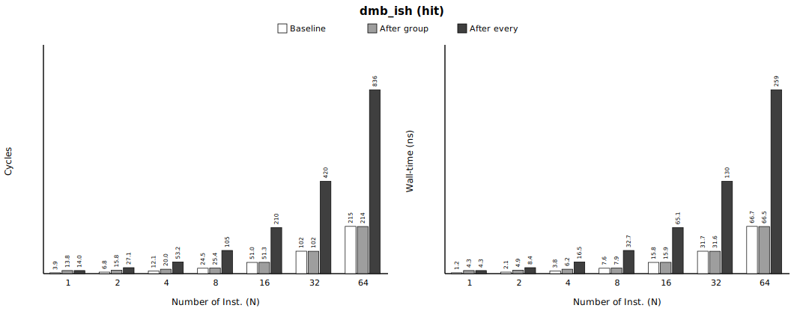
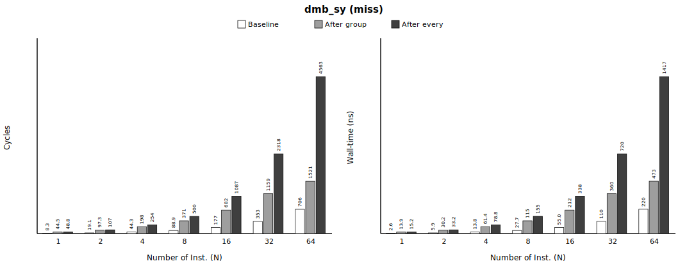
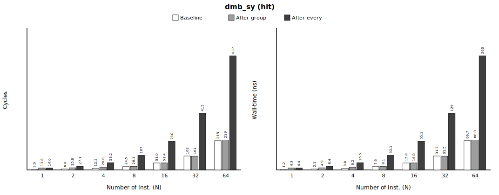
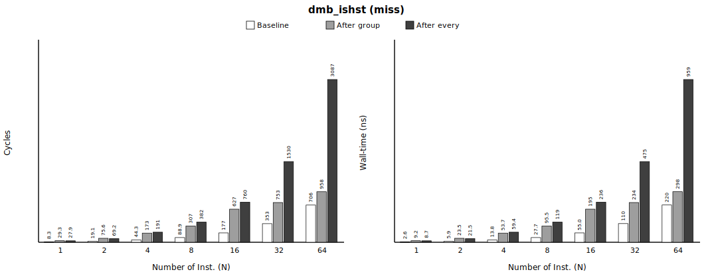
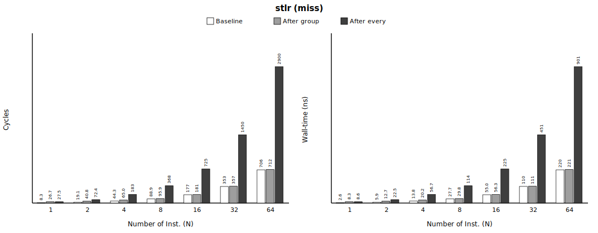
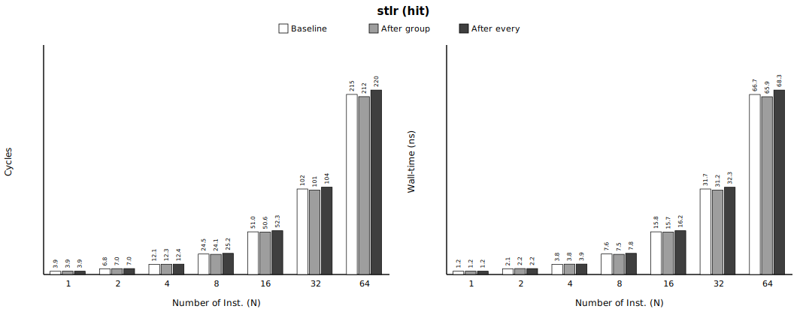

# Group 1 — store-side ordering (fences + store-release) (`1_store_side`)

> **Status** — 5 treatments · single-thread sweep **140/140 gate-clean** · paired, 1M iters · regenerated 2026-06-11.

**Pair with** — methodology spec [`../METHODOLOGY.md`](../METHODOLOGY.md) · master report [`../README.md`](../README.md) · integrated data [`processed/1_store_side_incremental.csv`](processed/1_store_side_incremental.csv) · raw per-repeat PMU in each `<treatment>/out/bench.csv`.

**Contents**
1. [At a glance](#at-a-glance)
2. [Metadata](#metadata)
3. [What this measures](#what-this-measures)
4. [Number Repeated Runs](#number-repeated-runs)
5. [Cache resident / miss validation](#cache-resident--miss-validation)
6. [Baseline cost (no memory-ordered op)](#baseline-cost-no-memory-ordered-op)
7. [Result](#result)
8. [Summary](#summary)
9. [Verdict](#verdict)

## At a glance

Headline Δ of the memory-ordered op — the deepest sweep point (**`after_every` · N=64**), `miss` vs `hit`; values exactly as in the *Result* tables (per-iteration; the per-op equivalent `incr_cyc_op` is also in the CSV; `*` = within baseline margin). Full sweep below.


| memory-ordered instruction | **Δ `miss`** (after_every·N=64) | **Δ `hit`** | gate |
|---|---|---|---|
| `dmb_ish` | +3401.3 cyc (+1056.1 ns) | +621.5 cyc (+192.8 ns) | PASS ✓ |
| `dmb_sy` | +3857.6 cyc (+1197.5 ns) | +622.3 cyc (+193.0 ns) | PASS ✓ |
| `dmb_ishst` | +2380.7 cyc (+739.4 ns) | +177.6 cyc (+55.1 ns) | PASS ✓ |
| `dmb_st` | +2400.3 cyc (+745.3 ns) | +181.2 cyc (+56.2 ns) | PASS ✓ |
| `stlr` | +2193.7 cyc (+681.4 ns) | +5.2* cyc (+1.6* ns) | PASS ✓ |

> A store-side fence between cache-missing stores **serializes** them — full (`ish`/`sy`) > store-only (`ishst`/`st`), cost grows ~linearly with N (merge-buffer drain); at `hit` it is ≈0 (nothing to drain). Store-release `stlr` pays the **same store-side drain** — its retirement waits on the po-older stores — measured here as STLR vs STR.

## Metadata

Machine / environment:

| field | value |
|---|---|
| Node | `rg-uwing-1` (CRNCH), reached from `rg-login` via `srun --jobid=<J>` |
| Arch/CPU | aarch64, **ARM Neoverse-V2** (Grace), 72 cores |
| Clock | **3.375 GHz fixed**, governor `performance` (1 cyc ≈ 0.296 ns) |
| Cache | line 64 B; L1d 64 KiB/core; L2 1 MiB/core; L3 ~114 MiB shared |
| NUMA | node 0 = 72 cores + 490 GB local (**membind here**); node 1 = GPU HBM (avoid) |
| ISA | **LSE atomics** + **RCpc `ldapr`**, SVE2 |
| Kernel | 6.8.0-1051-nvidia-64k |
| Compiler | gcc 11.4.0, `-O2 -march=native -pthread` |
| PMU | `perf_event_open()` (perf CLI broken): cycles, instructions, l1d_refill(0x03), l2d_refill(0x17), ll_miss_rd(0x37), mem_access(0x13), stall_be_mem(0x4005) + SW noise |

Experiment variables:

| field | value |
|---|---|
| treatments | `dmb_ish`, `dmb_sy`, `dmb_ishst`, `dmb_st`, `stlr` |
| placements | `after_group`, `after_every` |
| conditions | miss, hit |
| N (stores/group) | 1, 2, 4, 8, 16, 32, 64 |
| miss: iters / working-set / repeats | 1,000,000 / 536,870,912 B / 10 |
| hit: iters / working-set / repeats | 1,000,000 / 2,048 B / 10 |
| measurement | PAIRED: baseline + treatment interleaved in ONE process per repeat; PMU cycles + independent CLOCK_MONOTONIC_RAW wall-time |
| build `dmb_ish` | sha256 `4e392cab528118ed…`, gcc 11 |
| build `dmb_sy` | sha256 `e00c470884834c18…`, gcc 11 |
| build `dmb_ishst` | sha256 `b2a9e364512f9eb8…`, gcc 11 |
| build `dmb_st` | sha256 `9748b31f94ae9fbb…`, gcc 11 |
| build `stlr` | sha256 `acbc37aae9fdc927…`, gcc 11 |

## What this measures

Cost of a store-side memory-ordered instruction inserted into a **store** stream — a `dmb` barrier (full `dmb ish`/`sy`, store-only `dmb ishst`/`st`) **or a store-release `stlr`** (STLR vs STR). **Window:** store issue → retire (a retiring fence — or a store-release — blocks until po-older stores drain from the merge/write buffer). **Stream:** random **store-only** (register-hash addressing ⇒ one store per op, write-allocate misses, prefetcher-defeated) (`miss` = 512 MiB working set, `hit` = small resident set, warmed). Reported as median over repeats; baseline subtracted PAIRED. Credible source: `processed/1_store_side_incremental.csv` + this README; raw per-repeat PMU in each `<treatment>/out/bench.csv`.

> **Paper claim this measures** — *"the ordering requirements of full fences and store-release instructions are commonly enforced by **draining older stores before retirement, which stalls commit**"* (paper §1), illustrated by the Fig 4 walk-through: *"S2 cannot retire until the merge-buffer entry of po-older store S1 drains. Because retirement is in order, this also prevents S3 from passing S2 in the ROB, even though S2 imposes no ordering constraint"* (paper §3.2, Fig 4 — S2 is a store-release). This group measures that drain-induced stall directly: the Δ of a store-side `dmb` / `stlr` placed in a cache-missing store stream.

## Number Repeated Runs

Single-thread sweep — repeat counts that passed ALL validity gates (multiplexing + OS-noise + anti-elision + cache-condition + exposed-latency), per pass. Counts, not cost.

| treatment | configs | base runs PASS/total | treat runs PASS/total |
|---|---|---|---|
| `dmb_ish` | 28 | 280/280 | 280/280 |
| `dmb_sy` | 28 | 280/280 | 280/280 |
| `dmb_ishst` | 28 | 280/280 | 280/280 |
| `dmb_st` | 28 | 280/280 | 280/280 |
| `stlr` | 28 | 280/280 | 280/280 |

## Cache resident / miss validation

Median baseline counters per condition — proof the intended cache state held. **MISS**: l1_refill/acc ≈ 1 (every access misses L1), ll_miss_rd/acc high (reaches the LL cache / DRAM), stall % high (miss latency exposed ⇒ prefetcher defeated). **HIT**: l1_refill/acc ≈ 0 (resident). Both: mux = 1.000 (no PMU multiplexing), cs/mig/pf = 0 (no OS noise). Gate thresholds: miss l1≥0.90 / ll≥0.50 / stall≥10%; hit l1≤0.02; mux≥0.999.

| condition | l1_refill/acc | l2_refill/acc | ll_miss_rd/acc | mem/acc | stall %cyc | mux | cs/mig/pf | verdict |
|---|---|---|---|---|---|---|---|---|
| miss | 1.00 | 0.04 | 1.00 | 2.00 | 52% | 1.000 | 0/0/0 | PASS ✓ |
| hit | 0.00 | 0.00 | 0.00 | 2.00 | 0% | 1.000 | 0/0/0 | PASS ✓ |

## Baseline cost (no memory-ordered op)

*(Every individual baseline measurement — each treatment × placement × repeat — is preserved by condition × N in `processed/1_store_side_baselines.csv` for error-margin / CI work.)*

All per-iteration **averages** (= total ÷ iters per repeat). (per-op `incr_cyc_op` also in the CSV) **Reference** = median over **all** pooled baseline samples for that condition×N — every treatment × placement × repeat (the **n** column below); **margin = furthest pooled sample from the reference** = max(|max−ref|, |ref−min|). **A treatment whose Δ ≤ this margin (or is negative) is statistically EQUAL to the baseline** — the apparent value is run-to-run fluctuation (within boundary), not a real cost. (σ = 1 standard deviation, for reference.)

| condition | N | n | ref cyc | min–max cyc | σ cyc | **margin ±cyc** | ref ns | min–max ns | σ ns | **margin ±ns** |
|---|---|---|---|---|---|---|---|---|---|---|
| miss | 1 | 100 | 8.3 | 7.2–12.4 | 1.3 | **4.1** | 2.6 | 2.2–3.9 | 0.4 | **1.3** |
| miss | 2 | 100 | 19.1 | 18.5–23.4 | 1.3 | **4.3** | 5.9 | 5.8–7.4 | 0.4 | **1.4** |
| miss | 4 | 100 | 44.3 | 44.0–45.3 | 0.3 | **1.0** | 13.8 | 13.7–14.1 | 0.1 | **0.3** |
| miss | 8 | 100 | 88.9 | 88.3–89.5 | 0.2 | **0.6** | 27.7 | 27.5–27.9 | 0.1 | **0.2** |
| miss | 16 | 100 | 176.8 | 176.1–177.5 | 0.3 | **0.8** | 55.0 | 54.8–55.3 | 0.1 | **0.3** |
| miss | 32 | 100 | 353.1 | 351.8–354.2 | 0.6 | **1.4** | 109.9 | 109.4–110.2 | 0.2 | **0.5** |
| miss | 64 | 100 | 705.9 | 703.8–709.3 | 1.4 | **3.5** | 219.6 | 218.9–220.8 | 0.4 | **1.2** |
| hit | 1 | 100 | 3.9 | 3.7–4.0 | 0.1 | **0.2** | 1.2 | 1.2–1.3 | 0.0 | **0.1** |
| hit | 2 | 100 | 6.8 | 6.3–6.9 | 0.1 | **0.5** | 2.1 | 2.0–2.2 | 0.0 | **0.1** |
| hit | 4 | 100 | 12.1 | 11.6–12.3 | 0.1 | **0.6** | 3.8 | 3.6–3.8 | 0.0 | **0.1** |
| hit | 8 | 100 | 24.5 | 23.4–24.6 | 0.3 | **1.1** | 7.6 | 7.3–7.9 | 0.1 | **0.3** |
| hit | 16 | 100 | 51.0 | 46.7–51.1 | 1.5 | **4.2** | 15.8 | 14.5–15.9 | 0.5 | **1.3** |
| hit | 32 | 100 | 102.1 | 92.6–105.8 | 4.5 | **9.5** | 31.7 | 28.7–32.8 | 1.4 | **2.9** |
| hit | 64 | 100 | 214.9 | 185.0–216.0 | 11.5 | **29.9** | 66.7 | 57.4–67.0 | 3.6 | **9.3** |

## Result

- **Tested** — a store-side memory-ordered instruction inserted into a **store** stream — a `dmb` barrier (full `dmb ish`/`sy`, store-only `dmb ishst`/`st`) **or a store-release `stlr`** (STLR vs STR); `miss` = 512 MiB prefetcher-defeated stream, `hit` = 2 KiB resident; swept by placement × condition × N.
- **Compared** — the same stream **without** the memory-ordered op (baseline) vs **with** it (treatment) — interleaved in ONE process per repeat (paired).
- **Result value** — **Δ = treatment − baseline** = the memory-ordered op's incremental cost, median over 10 repeats, per group-iteration, in BOTH cycles and ns.

How to read each table:

| column | meaning |
|---|---|
| `placement` | `after_group` = one memory-ordered op per group of N stores · `after_every` = one per store |
| `N` | stores per group (pressure built up before the memory-ordered op) |
| `base avg cyc` / `base avg ns` | baseline cost per iteration — pooled-median reference (its margin: *Baseline cost (no memory-ordered op)* above) |
| `var avg cyc` / `var avg ns` | with-treatment cost per iteration (= base + Δ) |
| **`Δ cyc` / `Δ ns`** | **the incremental cost (paired median) — the result** |
| `*` | Δ ≤ baseline margin (or negative) ⇒ within run-to-run fluctuation ⇒ statistically **zero** |

Per treatment below: a short note, the objdump opcode proof, then the cost tables.

### `dmb_ish`

objdump (emitted opcode):
```
3150:	d5033bbf 	dmb	ish
320c:	d5033bbf 	dmb	ish
```
build `sha256=4e392cab528118ed…`, gcc 11.


**miss** — median over repeats (column meanings above; raw per-repeat PMU in `out/bench.csv`):

| placement | N | base avg cyc | base avg ns | var avg cyc | var avg ns | **Δ cyc** | **Δ ns** |
|---|---|---|---|---|---|---|---|
| after_group | 1 | 8.3 | 2.6 | 57.7 | 18.0 | **+49.4** | **+15.3** |
| after_group | 2 | 19.1 | 5.9 | 98.2 | 30.5 | **+79.2** | **+24.6** |
| after_group | 4 | 44.3 | 13.8 | 197.8 | 61.5 | **+153.4** | **+47.6** |
| after_group | 8 | 88.9 | 27.7 | 382.7 | 118.9 | **+293.7** | **+91.2** |
| after_group | 16 | 176.8 | 55.0 | 681.5 | 211.7 | **+504.7** | **+156.7** |
| after_group | 32 | 353.1 | 109.9 | 1148.0 | 356.7 | **+794.9** | **+246.8** |
| after_group | 64 | 705.9 | 219.6 | 1430.6 | 444.7 | **+724.8** | **+225.1** |
| after_every | 1 | 8.3 | 2.6 | 46.7 | 14.5 | **+38.4** | **+11.9** |
| after_every | 2 | 19.1 | 5.9 | 115.3 | 35.8 | **+96.3** | **+29.9** |
| after_every | 4 | 44.3 | 13.8 | 254.4 | 79.1 | **+210.1** | **+65.2** |
| after_every | 8 | 88.9 | 27.7 | 564.0 | 175.2 | **+475.1** | **+147.5** |
| after_every | 16 | 176.8 | 55.0 | 1084.9 | 336.9 | **+908.1** | **+281.9** |
| after_every | 32 | 353.1 | 109.9 | 2100.4 | 652.4 | **+1747.2** | **+542.5** |
| after_every | 64 | 705.9 | 219.6 | 4107.2 | 1275.7 | **+3401.3** | **+1056.1** |



**hit** — median over repeats (column meanings above; raw per-repeat PMU in `out/bench.csv`):

| placement | N | base avg cyc | base avg ns | var avg cyc | var avg ns | **Δ cyc** | **Δ ns** |
|---|---|---|---|---|---|---|---|
| after_group | 1 | 3.9 | 1.2 | 13.8 | 4.3 | **+9.9** | **+3.1** |
| after_group | 2 | 6.8 | 2.1 | 15.8 | 4.9 | **+9.0** | **+2.8** |
| after_group | 4 | 12.1 | 3.8 | 20.0 | 6.2 | **+7.9** | **+2.4** |
| after_group | 8 | 24.5 | 7.6 | 25.4 | 7.9 | **+0.9*** | **+0.3*** |
| after_group | 16 | 51.0 | 15.8 | 51.3 | 15.9 | **+0.4*** | **+0.1*** |
| after_group | 32 | 102.1 | 31.7 | 101.7 | 31.6 | **-0.3*** | **-0.1*** |
| after_group | 64 | 214.9 | 66.7 | 214.2 | 66.5 | **-0.7*** | **-0.2*** |
| after_every | 1 | 3.9 | 1.2 | 14.0 | 4.3 | **+10.1** | **+3.1** |
| after_every | 2 | 6.8 | 2.1 | 27.1 | 8.4 | **+20.3** | **+6.3** |
| after_every | 4 | 12.1 | 3.8 | 53.2 | 16.5 | **+41.0** | **+12.7** |
| after_every | 8 | 24.5 | 7.6 | 105.4 | 32.7 | **+80.9** | **+25.1** |
| after_every | 16 | 51.0 | 15.8 | 209.8 | 65.1 | **+158.9** | **+49.3** |
| after_every | 32 | 102.1 | 31.7 | 419.9 | 130.3 | **+317.9** | **+98.6** |
| after_every | 64 | 214.9 | 66.7 | 836.4 | 259.5 | **+621.5** | **+192.8** |

*\* Δ ≤ baseline margin (or negative): within the baseline's run-to-run fluctuation (within boundary) → statistically equal to baseline, no measurable store-side cost.*

### `dmb_sy`

objdump (emitted opcode):
```
3150:	d5033fbf 	dmb	sy
320c:	d5033fbf 	dmb	sy
```
build `sha256=e00c470884834c18…`, gcc 11.



**miss** — median over repeats (column meanings above; raw per-repeat PMU in `out/bench.csv`):

| placement | N | base avg cyc | base avg ns | var avg cyc | var avg ns | **Δ cyc** | **Δ ns** |
|---|---|---|---|---|---|---|---|
| after_group | 1 | 8.3 | 2.6 | 44.5 | 13.9 | **+36.2** | **+11.2** |
| after_group | 2 | 19.1 | 5.9 | 97.3 | 30.2 | **+78.2** | **+24.3** |
| after_group | 4 | 44.3 | 13.8 | 197.7 | 61.4 | **+153.3** | **+47.6** |
| after_group | 8 | 88.9 | 27.7 | 371.3 | 115.4 | **+282.4** | **+87.7** |
| after_group | 16 | 176.8 | 55.0 | 682.1 | 211.9 | **+505.3** | **+156.9** |
| after_group | 32 | 353.1 | 109.9 | 1159.4 | 360.4 | **+806.3** | **+250.5** |
| after_group | 64 | 705.9 | 219.6 | 1520.7 | 472.7 | **+814.8** | **+253.1** |
| after_every | 1 | 8.3 | 2.6 | 48.8 | 15.2 | **+40.5** | **+12.6** |
| after_every | 2 | 19.1 | 5.9 | 106.7 | 33.2 | **+87.7** | **+27.2** |
| after_every | 4 | 44.3 | 13.8 | 253.8 | 78.8 | **+209.5** | **+65.0** |
| after_every | 8 | 88.9 | 27.7 | 500.1 | 155.3 | **+411.1** | **+127.6** |
| after_every | 16 | 176.8 | 55.0 | 1087.3 | 337.6 | **+910.5** | **+282.6** |
| after_every | 32 | 353.1 | 109.9 | 2318.2 | 719.9 | **+1965.0** | **+610.0** |
| after_every | 64 | 705.9 | 219.6 | 4563.5 | 1417.1 | **+3857.6** | **+1197.5** |



**hit** — median over repeats (column meanings above; raw per-repeat PMU in `out/bench.csv`):

| placement | N | base avg cyc | base avg ns | var avg cyc | var avg ns | **Δ cyc** | **Δ ns** |
|---|---|---|---|---|---|---|---|
| after_group | 1 | 3.9 | 1.2 | 13.8 | 4.3 | **+9.9** | **+3.1** |
| after_group | 2 | 6.8 | 2.1 | 15.8 | 4.9 | **+9.0** | **+2.8** |
| after_group | 4 | 12.1 | 3.8 | 20.0 | 6.2 | **+7.9** | **+2.5** |
| after_group | 8 | 24.5 | 7.6 | 26.1 | 8.1 | **+1.6** | **+0.5** |
| after_group | 16 | 51.0 | 15.8 | 51.4 | 16.0 | **+0.5*** | **+0.1*** |
| after_group | 32 | 102.1 | 31.7 | 101.5 | 31.5 | **-0.6*** | **-0.2*** |
| after_group | 64 | 214.9 | 66.7 | 219.2 | 68.0 | **+4.3*** | **+1.3*** |
| after_every | 1 | 3.9 | 1.2 | 14.0 | 4.4 | **+10.2** | **+3.1** |
| after_every | 2 | 6.8 | 2.1 | 27.1 | 8.4 | **+20.3** | **+6.3** |
| after_every | 4 | 12.1 | 3.8 | 53.2 | 16.5 | **+41.0** | **+12.7** |
| after_every | 8 | 24.5 | 7.6 | 106.8 | 33.1 | **+82.3** | **+25.5** |
| after_every | 16 | 51.0 | 15.8 | 209.8 | 65.1 | **+158.8** | **+49.2** |
| after_every | 32 | 102.1 | 31.7 | 415.1 | 128.7 | **+313.0** | **+97.1** |
| after_every | 64 | 214.9 | 66.7 | 837.3 | 259.7 | **+622.3** | **+193.0** |

*\* Δ ≤ baseline margin (or negative): within the baseline's run-to-run fluctuation (within boundary) → statistically equal to baseline, no measurable store-side cost.*

### `dmb_ishst`

objdump (emitted opcode):
```
3150:	d5033abf 	dmb	ishst
320c:	d5033abf 	dmb	ishst
```
build `sha256=b2a9e364512f9eb8…`, gcc 11.



**miss** — median over repeats (column meanings above; raw per-repeat PMU in `out/bench.csv`):

| placement | N | base avg cyc | base avg ns | var avg cyc | var avg ns | **Δ cyc** | **Δ ns** |
|---|---|---|---|---|---|---|---|
| after_group | 1 | 8.3 | 2.6 | 29.3 | 9.2 | **+21.0** | **+6.5** |
| after_group | 2 | 19.1 | 5.9 | 75.6 | 23.5 | **+56.5** | **+17.6** |
| after_group | 4 | 44.3 | 13.8 | 172.7 | 53.7 | **+128.4** | **+39.9** |
| after_group | 8 | 88.9 | 27.7 | 307.2 | 95.5 | **+218.3** | **+67.8** |
| after_group | 16 | 176.8 | 55.0 | 627.2 | 194.9 | **+450.4** | **+139.9** |
| after_group | 32 | 353.1 | 109.9 | 752.9 | 234.1 | **+399.7** | **+124.2** |
| after_group | 64 | 705.9 | 219.6 | 958.3 | 298.1 | **+252.4** | **+78.5** |
| after_every | 1 | 8.3 | 2.6 | 27.9 | 8.7 | **+19.5** | **+6.1** |
| after_every | 2 | 19.1 | 5.9 | 69.2 | 21.5 | **+50.1** | **+15.6** |
| after_every | 4 | 44.3 | 13.8 | 191.2 | 59.4 | **+146.9** | **+45.6** |
| after_every | 8 | 88.9 | 27.7 | 382.4 | 118.8 | **+293.4** | **+91.2** |
| after_every | 16 | 176.8 | 55.0 | 760.2 | 236.1 | **+583.4** | **+181.1** |
| after_every | 32 | 353.1 | 109.9 | 1530.0 | 475.4 | **+1176.9** | **+365.6** |
| after_every | 64 | 705.9 | 219.6 | 3086.6 | 958.9 | **+2380.7** | **+739.4** |


**hit** — median over repeats (column meanings above; raw per-repeat PMU in `out/bench.csv`):

| placement | N | base avg cyc | base avg ns | var avg cyc | var avg ns | **Δ cyc** | **Δ ns** |
|---|---|---|---|---|---|---|---|
| after_group | 1 | 3.9 | 1.2 | 6.0 | 1.9 | **+2.1** | **+0.7** |
| after_group | 2 | 6.8 | 2.1 | 7.0 | 2.2 | **+0.2*** | **+0.1*** |
| after_group | 4 | 12.1 | 3.8 | 12.1 | 3.8 | **-0.0*** | **-0.0*** |
| after_group | 8 | 24.5 | 7.6 | 24.5 | 7.6 | **-0.0*** | **-0.0*** |
| after_group | 16 | 51.0 | 15.8 | 51.0 | 15.8 | **+0.0*** | **+0.0*** |
| after_group | 32 | 102.1 | 31.7 | 102.5 | 31.8 | **+0.5*** | **+0.2*** |
| after_group | 64 | 214.9 | 66.7 | 214.8 | 66.6 | **-0.1*** | **-0.1*** |
| after_every | 1 | 3.9 | 1.2 | 6.1 | 1.9 | **+2.2** | **+0.7** |
| after_every | 2 | 6.8 | 2.1 | 12.0 | 3.7 | **+5.2** | **+1.6** |
| after_every | 4 | 12.1 | 3.8 | 24.0 | 7.5 | **+11.9** | **+3.7** |
| after_every | 8 | 24.5 | 7.6 | 48.0 | 14.9 | **+23.5** | **+7.3** |
| after_every | 16 | 51.0 | 15.8 | 96.0 | 29.8 | **+45.0** | **+14.0** |
| after_every | 32 | 102.1 | 31.7 | 192.2 | 59.7 | **+90.2** | **+28.0** |
| after_every | 64 | 214.9 | 66.7 | 392.6 | 121.8 | **+177.6** | **+55.1** |

*\* Δ ≤ baseline margin (or negative): within the baseline's run-to-run fluctuation (within boundary) → statistically equal to baseline, no measurable store-side cost.*

### `dmb_st`

objdump (emitted opcode):
```
3150:	d5033ebf 	dmb	st
320c:	d5033ebf 	dmb	st
```
build `sha256=9748b31f94ae9fbb…`, gcc 11.


**miss** — median over repeats (column meanings above; raw per-repeat PMU in `out/bench.csv`):

| placement | N | base avg cyc | base avg ns | var avg cyc | var avg ns | **Δ cyc** | **Δ ns** |
|---|---|---|---|---|---|---|---|
| after_group | 1 | 8.3 | 2.6 | 29.6 | 9.2 | **+21.2** | **+6.6** |
| after_group | 2 | 19.1 | 5.9 | 76.5 | 23.8 | **+57.4** | **+17.8** |
| after_group | 4 | 44.3 | 13.8 | 173.2 | 53.8 | **+128.9** | **+40.0** |
| after_group | 8 | 88.9 | 27.7 | 306.6 | 95.3 | **+217.7** | **+67.6** |
| after_group | 16 | 176.8 | 55.0 | 627.9 | 195.1 | **+451.1** | **+140.1** |
| after_group | 32 | 353.1 | 109.9 | 753.2 | 234.2 | **+400.0** | **+124.3** |
| after_group | 64 | 705.9 | 219.6 | 970.4 | 301.8 | **+264.5** | **+82.2** |
| after_every | 1 | 8.3 | 2.6 | 27.1 | 8.4 | **+18.8** | **+5.8** |
| after_every | 2 | 19.1 | 5.9 | 69.4 | 21.6 | **+50.4** | **+15.7** |
| after_every | 4 | 44.3 | 13.8 | 187.7 | 58.3 | **+143.4** | **+44.5** |
| after_every | 8 | 88.9 | 27.7 | 392.4 | 121.9 | **+303.4** | **+94.2** |
| after_every | 16 | 176.8 | 55.0 | 779.4 | 242.2 | **+602.6** | **+187.2** |
| after_every | 32 | 353.1 | 109.9 | 1551.3 | 481.9 | **+1198.2** | **+372.0** |
| after_every | 64 | 705.9 | 219.6 | 3106.1 | 964.9 | **+2400.3** | **+745.3** |


**hit** — median over repeats (column meanings above; raw per-repeat PMU in `out/bench.csv`):

| placement | N | base avg cyc | base avg ns | var avg cyc | var avg ns | **Δ cyc** | **Δ ns** |
|---|---|---|---|---|---|---|---|
| after_group | 1 | 3.9 | 1.2 | 6.0 | 1.9 | **+2.2** | **+0.7** |
| after_group | 2 | 6.8 | 2.1 | 7.0 | 2.2 | **+0.2*** | **+0.1*** |
| after_group | 4 | 12.1 | 3.8 | 12.1 | 3.8 | **+0.0*** | **-0.0*** |
| after_group | 8 | 24.5 | 7.6 | 24.5 | 7.6 | **+0.0*** | **-0.0*** |
| after_group | 16 | 51.0 | 15.8 | 50.9 | 15.8 | **-0.1*** | **-0.0*** |
| after_group | 32 | 102.1 | 31.7 | 101.9 | 31.6 | **-0.1*** | **-0.0*** |
| after_group | 64 | 214.9 | 66.7 | 214.7 | 66.6 | **-0.2*** | **-0.1*** |
| after_every | 1 | 3.9 | 1.2 | 6.1 | 1.9 | **+2.3** | **+0.7** |
| after_every | 2 | 6.8 | 2.1 | 12.0 | 3.7 | **+5.2** | **+1.6** |
| after_every | 4 | 12.1 | 3.8 | 24.0 | 7.5 | **+11.8** | **+3.7** |
| after_every | 8 | 24.5 | 7.6 | 48.7 | 15.1 | **+24.2** | **+7.5** |
| after_every | 16 | 51.0 | 15.8 | 97.5 | 30.2 | **+46.5** | **+14.4** |
| after_every | 32 | 102.1 | 31.7 | 191.2 | 59.3 | **+89.2** | **+27.7** |
| after_every | 64 | 214.9 | 66.7 | 396.1 | 122.9 | **+181.2** | **+56.2** |

*\* Δ ≤ baseline margin (or negative): within the baseline's run-to-run fluctuation (within boundary) → statistically equal to baseline, no measurable store-side cost.*

### `stlr`

**Store-release (`stlr`), STLR vs STR** — the ordered store is emitted as `stlr` instead of `str`. It pays the **same store-side drain as a store-side `dmb`**: the release store's retirement is held until po-older stores drain the merge/write buffer, so its cost rises with the number of cache-missing stores ahead of it (`after_every`) and is hidden behind a long group (`after_group`, large N). The **directional** cost of an acquire/release atomic follows this same `stlr` rule (paper §4.4).

objdump (emitted opcode):
```
319c:	c89ffc65 	stlr	x5, [x3]
3254:	c89ffc69 	stlr	x9, [x3]
```
build `sha256=acbc37aae9fdc927…`, gcc 11.



**miss** — median over repeats (column meanings above; raw per-repeat PMU in `out/bench.csv`):

| placement | N | base avg cyc | base avg ns | var avg cyc | var avg ns | **Δ cyc** | **Δ ns** |
|---|---|---|---|---|---|---|---|
| after_group | 1 | 8.3 | 2.6 | 26.7 | 8.3 | **+18.4** | **+5.7** |
| after_group | 2 | 19.1 | 5.9 | 40.8 | 12.7 | **+21.7** | **+6.7** |
| after_group | 4 | 44.3 | 13.8 | 65.0 | 20.2 | **+20.7** | **+6.4** |
| after_group | 8 | 88.9 | 27.7 | 95.9 | 29.8 | **+6.9** | **+2.1** |
| after_group | 16 | 176.8 | 55.0 | 180.8 | 56.3 | **+4.0** | **+1.3** |
| after_group | 32 | 353.1 | 109.9 | 357.2 | 111.1 | **+4.0** | **+1.3** |
| after_group | 64 | 705.9 | 219.6 | 711.7 | 221.4 | **+5.8** | **+1.9** |
| after_every | 1 | 8.3 | 2.6 | 27.5 | 8.6 | **+19.1** | **+6.0** |
| after_every | 2 | 19.1 | 5.9 | 72.4 | 22.5 | **+53.4** | **+16.6** |
| after_every | 4 | 44.3 | 13.8 | 182.6 | 56.7 | **+138.3** | **+42.9** |
| after_every | 8 | 88.9 | 27.7 | 367.7 | 114.3 | **+278.8** | **+86.6** |
| after_every | 16 | 176.8 | 55.0 | 725.4 | 225.4 | **+548.6** | **+170.4** |
| after_every | 32 | 353.1 | 109.9 | 1450.5 | 450.8 | **+1097.4** | **+340.9** |
| after_every | 64 | 705.9 | 219.6 | 2899.6 | 901.0 | **+2193.7** | **+681.4** |



**hit** — median over repeats (column meanings above; raw per-repeat PMU in `out/bench.csv`):

| placement | N | base avg cyc | base avg ns | var avg cyc | var avg ns | **Δ cyc** | **Δ ns** |
|---|---|---|---|---|---|---|---|
| after_group | 1 | 3.9 | 1.2 | 3.9 | 1.2 | **+0.1*** | **+0.0*** |
| after_group | 2 | 6.8 | 2.1 | 7.0 | 2.2 | **+0.2*** | **+0.1*** |
| after_group | 4 | 12.1 | 3.8 | 12.3 | 3.8 | **+0.1*** | **+0.0*** |
| after_group | 8 | 24.5 | 7.6 | 24.1 | 7.5 | **-0.4*** | **-0.1*** |
| after_group | 16 | 51.0 | 15.8 | 50.6 | 15.7 | **-0.4*** | **-0.1*** |
| after_group | 32 | 102.1 | 31.7 | 100.6 | 31.2 | **-1.5*** | **-0.4*** |
| after_group | 64 | 214.9 | 66.7 | 212.2 | 65.9 | **-2.7*** | **-0.8*** |
| after_every | 1 | 3.9 | 1.2 | 3.9 | 1.2 | **+0.1*** | **+0.0*** |
| after_every | 2 | 6.8 | 2.1 | 7.0 | 2.2 | **+0.2*** | **+0.1*** |
| after_every | 4 | 12.1 | 3.8 | 12.4 | 3.9 | **+0.2*** | **+0.1*** |
| after_every | 8 | 24.5 | 7.6 | 25.2 | 7.8 | **+0.8*** | **+0.2*** |
| after_every | 16 | 51.0 | 15.8 | 52.3 | 16.2 | **+1.3*** | **+0.4*** |
| after_every | 32 | 102.1 | 31.7 | 104.2 | 32.3 | **+2.1*** | **+0.6*** |
| after_every | 64 | 214.9 | 66.7 | 220.1 | 68.3 | **+5.2*** | **+1.6*** |

*\* Δ ≤ baseline margin (or negative): within the baseline's run-to-run fluctuation (within boundary) → statistically equal to baseline, no measurable store-side cost.*

## Summary

| treatment | unit | `miss` · after_group (N=1→64) | `miss` · after_every (N=1→64) | `hit` · after_group (N=1→64) | `hit` · after_every (N=1→64) |
|---|---|---|---|---|---|
| `dmb_ish` | Δ cyc/iter | +49.4 → +724.8 | +38.4 → +3401.3 | +9.9 → -0.7* | +10.1 → +621.5 |
| | Δ ns/iter | +15.3 → +225.1 | +11.9 → +1056.1 | +3.1 → -0.2* | +3.1 → +192.8 |
| `dmb_sy` | Δ cyc/iter | +36.2 → +814.8 | +40.5 → +3857.6 | +9.9 → +4.3* | +10.2 → +622.3 |
| | Δ ns/iter | +11.2 → +253.1 | +12.6 → +1197.5 | +3.1 → +1.3* | +3.1 → +193.0 |
| `dmb_ishst` | Δ cyc/iter | +21.0 → +252.4 | +19.5 → +2380.7 | +2.1 → -0.1* | +2.2 → +177.6 |
| | Δ ns/iter | +6.5 → +78.5 | +6.1 → +739.4 | +0.7 → -0.1* | +0.7 → +55.1 |
| `dmb_st` | Δ cyc/iter | +21.2 → +264.5 | +18.8 → +2400.3 | +2.2 → -0.2* | +2.3 → +181.2 |
| | Δ ns/iter | +6.6 → +82.2 | +5.8 → +745.3 | +0.7 → -0.1* | +0.7 → +56.2 |
| `stlr` | Δ cyc/iter | +18.4 → +5.8 | +19.1 → +2193.7 | +0.1* → -2.7* | +0.1* → +5.2* |
| | Δ ns/iter | +5.7 → +1.9 | +6.0 → +681.4 | +0.0* → -0.8* | +0.0* → +1.6* |

- **`dmb_ish` / `dmb_sy`** (full) — the `miss` growth is the **merge-buffer drain**: a fence cannot retire until every outstanding missing store ahead of it has drained, so each fence waits longer the more misses are in flight — the stores execute serially instead of in parallel. At `hit` there is nothing to drain, so only the fence's own fixed pipeline latency remains; in `after_group` even that disappears once the group is long enough to overlap it.
- **`dmb_ishst` / `dmb_st`** (store-only) — same drain mechanism, but cheaper than full: a store-only barrier orders only the store stream, so it destroys less of the surrounding parallelism. The `ishst`-vs-`st` scope difference is negligible — the load/store **direction** of the barrier is what matters, not its shareability domain.
- **`stlr`** — behaves like a store fence when *every* store is a release (after_every): its retirement waits on the same drain. In `after_group` only the group's **last** store is the release (a realistic publish), and its cost *vanishes* — the release's drain happens concurrently with the group's own misses, so by the time it retires there is nothing left to wait for. A publish at the end of a write burst is nearly free.
- **Overall** — the cost ordering full > store-only ≳ `stlr` is the ordering-strength ordering: the more the instruction forbids, the more store-MLP it serializes. And the `hit`-vs-`miss` contrast shows the cost lives in the **pending drain**, not in the instruction itself.

### Paper alignment

**Claim** (paper §1): *"the ordering requirements of full fences and store-release instructions are commonly enforced by **draining older stores before retirement, which stalls commit**"* — and the Fig 4 walk-through (paper §3.2): *"S2 cannot retire until the merge-buffer entry of po-older store S1 drains."*

**Measured**: exactly that signature (table above) — at `miss` the per-op cost of every store-side `dmb` and of `stlr` **rises with the number of outstanding missing stores** and collapses to the small flat pipeline floor at `hit`, where there is nothing to drain.

**Alignment**: **directly confirms** the drain-induced retirement stall on real Neoverse-V2 hardware — both the direction (store-side, drain-bound; release ≈ store fence) and the scaling (cost grows with merge-buffer pressure N).

## Verdict

### Why `hit` + `after_group` ≈ baseline (and why small N is the exception)

At `hit`, a full fence (`dmb ish`) after a group of N stores adds **≈0 once N≥8**, but a real **~10 cyc at N≤4**. Decomposed with a base+treat PMU probe ([`tools/g1_decompose.c`](tools/g1_decompose.c); `dmb_ish`, `hit`, 1M × 15 — data: [`verdict_probe.csv`](verdict_probe.csv)):

| N | Δcyc/op | Δins/op | Δmem/op | stall | fence cost / iter (Δcyc·N) |
|---|---|---|---|---|---|
| 1  | +10.087 | +1.000 | 0.000 | 0% | ~10.1 cyc |
| 4  | +1.969  | +0.250 | 0.000 | 0% | ~7.9 cyc |
| 8  | +0.205  | +0.125 | 0.000 | 0% | ~1.6 cyc |
| 16 | -0.001  | +0.063 | 0.000 | 0% | ≈0 |
| 32 | -0.003  | +0.031 | 0.000 | 0% | ≈0 |
| 64 | -0.012  | +0.016 | 0.000 | 0% | ≈0 |

- Adds **only the one `dmb`** (`Δins/op = 1/N`), **no extra memory** (`Δmem/op = 0`), **no stall** (`hit` → the stores already retired; nothing to drain) → Δ is purely that fence's own ~10-cyc ordering latency.
- That latency is **exposed only while the group is shorter than the fence** (N≤4: N·~3 cyc/store ≲ fence ~10 cyc). Once the group's stores take longer than the fence (**N≥8: ~24 cyc ≫ 10**), the out-of-order core **overlaps the single fence** behind them → Δ collapses to ≈0 (slightly negative from N≥16).
- **Not codegen** (`Δmem = 0`; objdump: `dmb ish` hoisted out of the inner store loop, no per-store reload). The knee scales with fence latency: store-only `dmb ishst` (+2.145 at N=1) is already ≈0 by N=4 (−0.006), full `dmb ish` (~10 cyc) needs N≥8. Counter: `after_every` (one fence per store) stays ~10 cyc/op at every N (+10.292 / +10.114 / +9.712 at N=1/8/64) — each store is on the critical path, nothing to overlap.


---

*Auto-generated by `lib/parse_group.py` from the locked `out/` sweep on 2026-06-11. **Numbers** → `processed/1_store_side_*.csv` (+ per-treatment `<t>/out/bench.csv`). **Method** → [`../METHODOLOGY.md`](../METHODOLOGY.md). **Up** → [`../README.md`](../README.md).*
