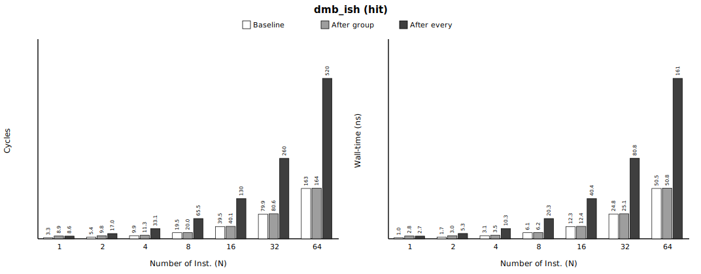
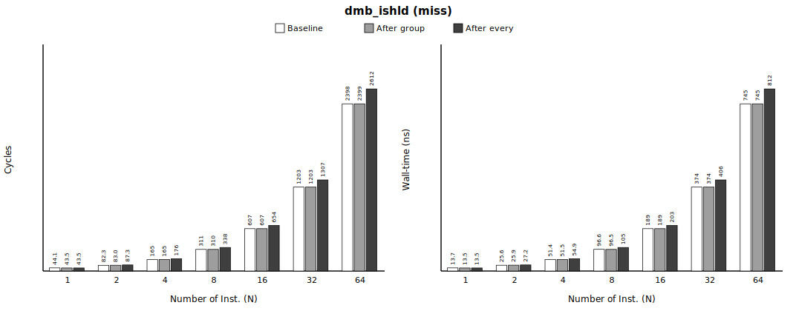
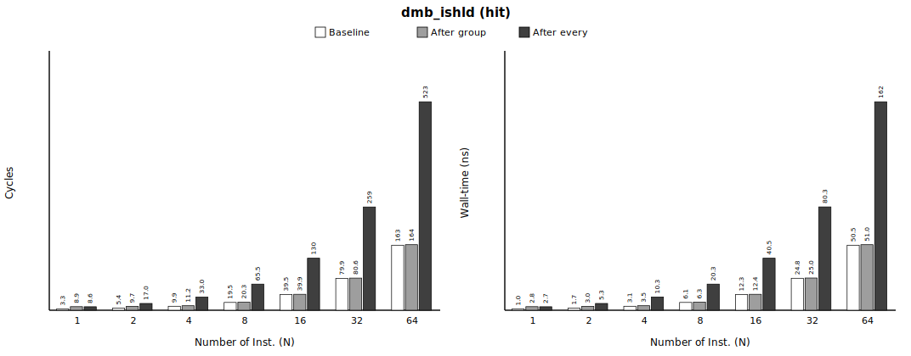
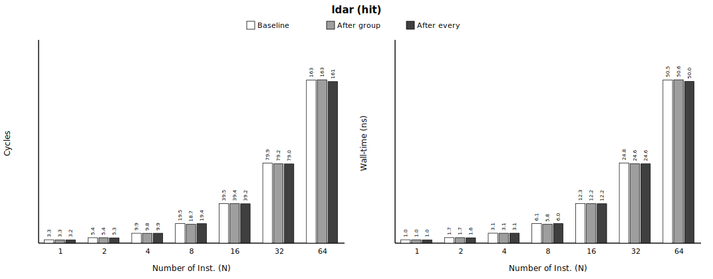
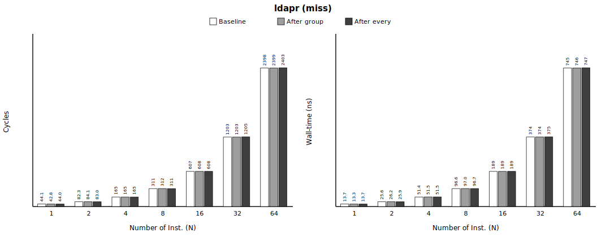
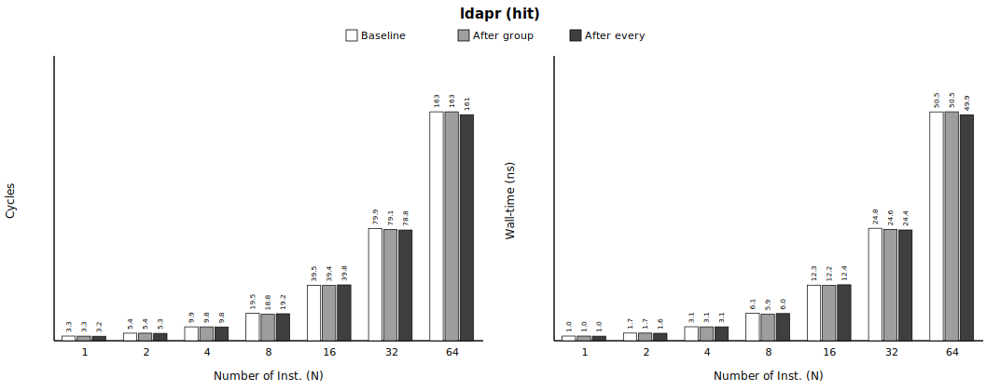

# Group 2 — load-side ordering (fences + load-acquire) (`2_load_side`)

> **Status** — 6 treatments · single-thread sweep **168/168 gate-clean** · paired, 1M iters · regenerated 2026-06-11.

**Pair with** — methodology spec [`../METHODOLOGY.md`](../METHODOLOGY.md) · master report [`../README.md`](../README.md) · integrated data [`processed/2_load_side_incremental.csv`](processed/2_load_side_incremental.csv) · raw per-repeat PMU in each `<treatment>/out/bench.csv`.

**Contents**
1. [At a glance](#at-a-glance)
2. [Metadata](#metadata)
3. [What this measures](#what-this-measures)
4. [Number Repeated Runs](#number-repeated-runs)
5. [Cache resident / miss validation](#cache-resident--miss-validation)
6. [Baseline cost (no memory-ordered op)](#baseline-cost-no-memory-ordered-op)
7. [Result](#result)
8. [Summary](#summary)
9. [Verdict](#verdict)

## At a glance

Headline Δ of the memory-ordered op — the deepest sweep point (**`after_every` · N=64**), `miss` vs `hit`; values exactly as in the *Result* tables (per-iteration, `*` = within baseline margin). Full sweep below.


| memory-ordered instruction | **Δ `miss`** (after_every·N=64) | **Δ `hit`** | gate |
|---|---|---|---|
| `dmb_ish` | +213.5 cyc (+66.3 ns) | +356.7 cyc (+110.6 ns) | PASS ✓ |
| `dmb_sy` | +213.3 cyc (+66.2 ns) | +359.8 cyc (+111.6 ns) | PASS ✓ |
| `dmb_ishld` | +213.4 cyc (+66.3 ns) | +359.6 cyc (+111.5 ns) | PASS ✓ |
| `dmb_ld` | +213.3 cyc (+66.2 ns) | +359.7 cyc (+111.5 ns) | PASS ✓ |
| `ldar` | +4.3* cyc (+1.4* ns) | -1.6* cyc (-0.5* ns) | PASS ✓ |
| `ldapr` | +4.3* cyc (+1.3* ns) | -2.1* cyc (-0.6* ns) | PASS ✓ |

> A **load** barrier is far cheaper than a store fence — ~+3 cyc/load (flat in N); the independent load misses keep their MLP across the barrier. Load-acquire `ldar`/`ldapr` in an **isolated single-thread** load stream is ≈0 — there is no po-older `stlr` to wait on, so the completion stall does not arise (its **contended** cost is Group 3).

## Metadata

Machine / environment:

| field | value |
|---|---|
| Node | `rg-uwing-1` (CRNCH), reached from `rg-login` via `srun --jobid=<J>` |
| Arch/CPU | aarch64, **ARM Neoverse-V2** (Grace), 72 cores |
| Clock | **3.375 GHz fixed**, governor `performance` (1 cyc ≈ 0.296 ns) |
| Cache | line 64 B; L1d 64 KiB/core; L2 1 MiB/core; L3 ~114 MiB shared |
| NUMA | node 0 = 72 cores + 490 GB local (**membind here**); node 1 = GPU HBM (avoid) |
| ISA | **LSE atomics** + **RCpc `ldapr`**, SVE2 |
| Kernel | 6.8.0-1051-nvidia-64k |
| Compiler | gcc 11.4.0, `-O2 -march=native -pthread` |
| PMU | `perf_event_open()` (perf CLI broken): cycles, instructions, l1d_refill(0x03), l2d_refill(0x17), ll_miss_rd(0x37), mem_access(0x13), stall_be_mem(0x4005) + SW noise |

Experiment variables:

| field | value |
|---|---|
| treatments | `dmb_ish`, `dmb_sy`, `dmb_ishld`, `dmb_ld`, `ldar`, `ldapr` |
| placements | `after_group`, `after_every` |
| conditions | miss, hit |
| N (loads/group) | 1, 2, 4, 8, 16, 32, 64 |
| miss: iters / working-set / repeats | 1,000,000 / 536,870,912 B / 10 |
| hit: iters / working-set / repeats | 1,000,000 / 2,048 B / 10 |
| measurement | PAIRED: baseline + treatment interleaved in ONE process per repeat; PMU cycles + independent CLOCK_MONOTONIC_RAW wall-time |
| build `dmb_ish` | sha256 `71fde1d6b1f092a4…`, gcc 11 |
| build `dmb_sy` | sha256 `447221510cb699df…`, gcc 11 |
| build `dmb_ishld` | sha256 `2329d6f15774f0c1…`, gcc 11 |
| build `dmb_ld` | sha256 `b556befe235fee4e…`, gcc 11 |
| build `ldar` | sha256 `0473c3794129531b…`, gcc 11 |
| build `ldapr` | sha256 `0602ff66591aa026…`, gcc 11 |

## What this measures

Cost of a load-side memory-ordered instruction inserted into a **load** stream — a `dmb` barrier (full `dmb ish`/`sy`, load-only `dmb ishld`/`ld`) **or a load-acquire `ldar` (RCsc) / `ldapr` (RCpc)** (LDAR vs LDR vs LDAPR). **Window:** load issue → load completion. **Stream:** independent random **loads** (register-hash, no pointer chase, prefetcher-defeated) ⇒ load-MLP (`miss` = 512 MiB working set, `hit` = small resident set, warmed). Reported as median over repeats; baseline subtracted PAIRED. Credible source: `processed/2_load_side_incremental.csv` + this README; raw per-repeat PMU in each `<treatment>/out/bench.csv`.

> **Paper claim this measures** — *"whereas **load-acquire instructions may conservatively squash and replay speculative loads** following invalidations. This conservative handling introduces unnecessary serialization"* (paper §1; Fig 5 illustrates the load-side case). This group measures the **load-side cost floor**: the Δ of a load-side `dmb` / `ldar` / `ldapr` in an independent load-MLP stream. Single-thread, so no invalidations arrive — the squash/replay trigger is absent by construction; the contended load-acquire case is **Group 3**.

## Number Repeated Runs

Single-thread sweep — repeat counts that passed ALL validity gates (multiplexing + OS-noise + anti-elision + cache-condition + exposed-latency), per pass. Counts, not cost.

| treatment | configs | base runs PASS/total | treat runs PASS/total |
|---|---|---|---|
| `dmb_ish` | 28 | 280/280 | 280/280 |
| `dmb_sy` | 28 | 280/280 | 280/280 |
| `dmb_ishld` | 28 | 280/280 | 280/280 |
| `dmb_ld` | 28 | 280/280 | 280/280 |
| `ldar` | 28 | 280/280 | 280/280 |
| `ldapr` | 28 | 280/280 | 280/280 |

## Cache resident / miss validation

Median baseline counters per condition — proof the intended cache state held. **MISS**: l1_refill/acc ≈ 1 (every access misses L1), ll_miss_rd/acc high (reaches the LL cache / DRAM), stall % high (miss latency exposed ⇒ prefetcher defeated). **HIT**: l1_refill/acc ≈ 0 (resident). Both: mux = 1.000 (no PMU multiplexing), cs/mig/pf = 0 (no OS noise). Gate thresholds: miss l1≥0.90 / ll≥0.50 / stall≥10%; hit l1≤0.02; mux≥0.999.

| condition | l1_refill/acc | l2_refill/acc | ll_miss_rd/acc | mem/acc | stall %cyc | mux | cs/mig/pf | verdict |
|---|---|---|---|---|---|---|---|---|
| miss | 1.00 | 1.00 | 1.02 | 1.50 | 94% | 1.000 | 0/0/0 | PASS ✓ |
| hit | 0.00 | 0.00 | 0.00 | 1.50 | 0% | 1.000 | 0/0/0 | PASS ✓ |

## Baseline cost (no memory-ordered op)

*(Every individual baseline measurement — each treatment × placement × repeat — is preserved by condition × N in `processed/2_load_side_baselines.csv` for error-margin / CI work.)*

All per-iteration **averages** (= total ÷ iters per repeat). **Reference** = median over **all** pooled baseline samples for that condition×N — every treatment × placement × repeat (the **n** column below); **margin = furthest pooled sample from the reference** = max(|max−ref|, |ref−min|). **A treatment whose Δ ≤ this margin (or is negative) is statistically EQUAL to the baseline** — the apparent value is run-to-run fluctuation (within boundary), not a real cost. (σ = 1 standard deviation, for reference.)

| condition | N | n | ref cyc | min–max cyc | σ cyc | **margin ±cyc** | ref ns | min–max ns | σ ns | **margin ±ns** |
|---|---|---|---|---|---|---|---|---|---|---|
| miss | 1 | 120 | 44.1 | 34.0–56.8 | 4.6 | **12.7** | 13.7 | 10.6–17.7 | 1.4 | **4.0** |
| miss | 2 | 120 | 82.3 | 76.6–96.0 | 4.4 | **13.7** | 25.6 | 23.9–29.9 | 1.4 | **4.3** |
| miss | 4 | 120 | 165.1 | 160.5–178.5 | 5.1 | **13.4** | 51.4 | 49.9–55.6 | 1.6 | **4.2** |
| miss | 8 | 120 | 310.6 | 304.4–338.2 | 11.1 | **27.5** | 96.6 | 94.6–105.3 | 3.5 | **8.7** |
| miss | 16 | 120 | 607.4 | 604.2–656.6 | 18.9 | **49.2** | 188.8 | 187.9–204.3 | 5.9 | **15.5** |
| miss | 32 | 120 | 1203.1 | 1201.2–1302.1 | 42.0 | **99.0** | 374.0 | 373.3–405.1 | 13.1 | **31.1** |
| miss | 64 | 120 | 2398.5 | 2394.2–2592.4 | 88.5 | **193.9** | 745.5 | 744.0–806.2 | 27.5 | **60.7** |
| hit | 1 | 120 | 3.3 | 3.2–3.4 | 0.0 | **0.1** | 1.0 | 1.0–1.1 | 0.0 | **0.1** |
| hit | 2 | 120 | 5.4 | 5.1–5.8 | 0.2 | **0.5** | 1.7 | 1.6–1.8 | 0.1 | **0.2** |
| hit | 4 | 120 | 9.9 | 9.7–10.7 | 0.4 | **0.9** | 3.1 | 3.0–3.3 | 0.1 | **0.3** |
| hit | 8 | 120 | 19.5 | 19.2–21.5 | 0.9 | **2.0** | 6.1 | 6.0–6.7 | 0.3 | **0.7** |
| hit | 16 | 120 | 39.5 | 39.3–42.8 | 1.5 | **3.3** | 12.3 | 12.2–13.3 | 0.5 | **1.0** |
| hit | 32 | 120 | 79.9 | 79.5–86.6 | 3.0 | **6.7** | 24.8 | 24.7–26.9 | 0.9 | **2.1** |
| hit | 64 | 120 | 162.9 | 159.7–175.2 | 6.1 | **12.3** | 50.5 | 49.6–54.4 | 1.9 | **3.9** |

## Result

- **Tested** — a load-side memory-ordered instruction inserted into a **load** stream — a `dmb` barrier (full `dmb ish`/`sy`, load-only `dmb ishld`/`ld`) **or a load-acquire `ldar` (RCsc) / `ldapr` (RCpc)** (LDAR vs LDR vs LDAPR); `miss` = 512 MiB prefetcher-defeated stream, `hit` = 2 KiB resident; swept by placement × condition × N.
- **Compared** — the same stream **without** the memory-ordered op (baseline) vs **with** it (treatment) — interleaved in ONE process per repeat (paired).
- **Result value** — **Δ = treatment − baseline** = the memory-ordered op's incremental cost, median over 10 repeats, per group-iteration, in BOTH cycles and ns.

How to read each table:

| column | meaning |
|---|---|
| `placement` | `after_group` = one memory-ordered op per group of N loads · `after_every` = one per load |
| `N` | loads per group (pressure built up before the memory-ordered op) |
| `base avg cyc` / `base avg ns` | baseline cost per iteration — pooled-median reference (its margin: *Baseline cost (no memory-ordered op)* above) |
| `var avg cyc` / `var avg ns` | with-treatment cost per iteration (= base + Δ) |
| **`Δ cyc` / `Δ ns`** | **the incremental cost (paired median) — the result** |
| `*` | Δ ≤ baseline margin (or negative) ⇒ within run-to-run fluctuation ⇒ statistically **zero** |

Per treatment below: a short note, the objdump opcode proof, then the cost tables.

### `dmb_ish`

objdump (emitted opcode):
```
3114:	d5033bbf 	dmb	ish
31b8:	d5033bbf 	dmb	ish
```
build `sha256=71fde1d6b1f092a4…`, gcc 11.


**miss** — median over repeats (column meanings above; raw per-repeat PMU in `out/bench.csv`):

| placement | N | base avg cyc | base avg ns | var avg cyc | var avg ns | **Δ cyc** | **Δ ns** |
|---|---|---|---|---|---|---|---|
| after_group | 1 | 44.1 | 13.7 | 44.2 | 13.8 | **+0.1*** | **+0.0*** |
| after_group | 2 | 82.3 | 25.6 | 83.2 | 25.9 | **+0.9*** | **+0.3*** |
| after_group | 4 | 165.1 | 51.4 | 165.5 | 51.5 | **+0.4*** | **+0.1*** |
| after_group | 8 | 310.6 | 96.6 | 310.5 | 96.5 | **-0.1*** | **-0.1*** |
| after_group | 16 | 607.4 | 188.8 | 607.4 | 188.8 | **+0.0*** | **-0.0*** |
| after_group | 32 | 1203.1 | 374.0 | 1203.4 | 374.1 | **+0.2*** | **+0.1*** |
| after_group | 64 | 2398.5 | 745.5 | 2398.7 | 745.5 | **+0.2*** | **+0.1*** |
| after_every | 1 | 44.1 | 13.7 | 43.5 | 13.5 | **-0.6*** | **-0.2*** |
| after_every | 2 | 82.3 | 25.6 | 87.4 | 27.2 | **+5.1*** | **+1.6*** |
| after_every | 4 | 165.1 | 51.4 | 176.8 | 55.0 | **+11.7*** | **+3.6*** |
| after_every | 8 | 310.6 | 96.6 | 338.2 | 105.2 | **+27.5** | **+8.6** |
| after_every | 16 | 607.4 | 188.8 | 654.0 | 203.3 | **+46.7*** | **+14.5*** |
| after_every | 32 | 1203.1 | 374.0 | 1306.5 | 406.2 | **+103.3** | **+32.2** |
| after_every | 64 | 2398.5 | 745.5 | 2611.9 | 811.8 | **+213.5** | **+66.3** |



**hit** — median over repeats (column meanings above; raw per-repeat PMU in `out/bench.csv`):

| placement | N | base avg cyc | base avg ns | var avg cyc | var avg ns | **Δ cyc** | **Δ ns** |
|---|---|---|---|---|---|---|---|
| after_group | 1 | 3.3 | 1.0 | 8.9 | 2.8 | **+5.6** | **+1.7** |
| after_group | 2 | 5.4 | 1.7 | 9.8 | 3.0 | **+4.4** | **+1.4** |
| after_group | 4 | 9.9 | 3.1 | 11.3 | 3.5 | **+1.4** | **+0.4** |
| after_group | 8 | 19.5 | 6.1 | 20.0 | 6.2 | **+0.4*** | **+0.1*** |
| after_group | 16 | 39.5 | 12.3 | 40.1 | 12.4 | **+0.6*** | **+0.2*** |
| after_group | 32 | 79.9 | 24.8 | 80.6 | 25.1 | **+0.7*** | **+0.2*** |
| after_group | 64 | 162.9 | 50.5 | 163.8 | 50.8 | **+1.0*** | **+0.3*** |
| after_every | 1 | 3.3 | 1.0 | 8.6 | 2.7 | **+5.3** | **+1.7** |
| after_every | 2 | 5.4 | 1.7 | 17.0 | 5.3 | **+11.6** | **+3.6** |
| after_every | 4 | 9.9 | 3.1 | 33.1 | 10.3 | **+23.2** | **+7.2** |
| after_every | 8 | 19.5 | 6.1 | 65.5 | 20.3 | **+45.9** | **+14.2** |
| after_every | 16 | 39.5 | 12.3 | 130.4 | 40.4 | **+90.8** | **+28.2** |
| after_every | 32 | 79.9 | 24.8 | 260.3 | 80.8 | **+180.4** | **+56.0** |
| after_every | 64 | 162.9 | 50.5 | 519.6 | 161.1 | **+356.7** | **+110.6** |

*\* Δ ≤ baseline margin (or negative): within the baseline's run-to-run fluctuation (within boundary) → statistically equal to baseline, no measurable load-side cost.*

### `dmb_sy`

objdump (emitted opcode):
```
3114:	d5033fbf 	dmb	sy
31b8:	d5033fbf 	dmb	sy
```
build `sha256=447221510cb699df…`, gcc 11.


**miss** — median over repeats (column meanings above; raw per-repeat PMU in `out/bench.csv`):

| placement | N | base avg cyc | base avg ns | var avg cyc | var avg ns | **Δ cyc** | **Δ ns** |
|---|---|---|---|---|---|---|---|
| after_group | 1 | 44.1 | 13.7 | 43.4 | 13.5 | **-0.7*** | **-0.2*** |
| after_group | 2 | 82.3 | 25.6 | 83.0 | 25.8 | **+0.7*** | **+0.2*** |
| after_group | 4 | 165.1 | 51.4 | 165.5 | 51.5 | **+0.4*** | **+0.1*** |
| after_group | 8 | 310.6 | 96.6 | 310.7 | 96.6 | **+0.1*** | **+0.0*** |
| after_group | 16 | 607.4 | 188.8 | 607.3 | 188.8 | **-0.0*** | **+0.0*** |
| after_group | 32 | 1203.1 | 374.0 | 1203.4 | 374.1 | **+0.3*** | **+0.1*** |
| after_group | 64 | 2398.5 | 745.5 | 2398.6 | 745.5 | **+0.1*** | **-0.0*** |
| after_every | 1 | 44.1 | 13.7 | 43.5 | 13.5 | **-0.6*** | **-0.2*** |
| after_every | 2 | 82.3 | 25.6 | 87.3 | 27.2 | **+5.0*** | **+1.6*** |
| after_every | 4 | 165.1 | 51.4 | 176.8 | 55.0 | **+11.7*** | **+3.6*** |
| after_every | 8 | 310.6 | 96.6 | 338.4 | 105.2 | **+27.7** | **+8.6** |
| after_every | 16 | 607.4 | 188.8 | 654.0 | 203.4 | **+46.7*** | **+14.6*** |
| after_every | 32 | 1203.1 | 374.0 | 1306.5 | 406.1 | **+103.3** | **+32.1** |
| after_every | 64 | 2398.5 | 745.5 | 2611.7 | 811.7 | **+213.3** | **+66.2** |


**hit** — median over repeats (column meanings above; raw per-repeat PMU in `out/bench.csv`):

| placement | N | base avg cyc | base avg ns | var avg cyc | var avg ns | **Δ cyc** | **Δ ns** |
|---|---|---|---|---|---|---|---|
| after_group | 1 | 3.3 | 1.0 | 8.9 | 2.8 | **+5.6** | **+1.7** |
| after_group | 2 | 5.4 | 1.7 | 9.7 | 3.0 | **+4.4** | **+1.4** |
| after_group | 4 | 9.9 | 3.1 | 11.2 | 3.5 | **+1.3** | **+0.4** |
| after_group | 8 | 19.5 | 6.1 | 20.0 | 6.2 | **+0.4*** | **+0.1*** |
| after_group | 16 | 39.5 | 12.3 | 40.0 | 12.4 | **+0.5*** | **+0.1*** |
| after_group | 32 | 79.9 | 24.8 | 80.5 | 25.0 | **+0.6*** | **+0.2*** |
| after_group | 64 | 162.9 | 50.5 | 164.4 | 51.0 | **+1.6*** | **+0.5*** |
| after_every | 1 | 3.3 | 1.0 | 8.6 | 2.7 | **+5.3** | **+1.7** |
| after_every | 2 | 5.4 | 1.7 | 17.0 | 5.3 | **+11.6** | **+3.6** |
| after_every | 4 | 9.9 | 3.1 | 33.0 | 10.3 | **+23.1** | **+7.2** |
| after_every | 8 | 19.5 | 6.1 | 64.8 | 20.1 | **+45.2** | **+14.0** |
| after_every | 16 | 39.5 | 12.3 | 130.3 | 40.4 | **+90.8** | **+28.2** |
| after_every | 32 | 79.9 | 24.8 | 260.4 | 80.8 | **+180.5** | **+56.0** |
| after_every | 64 | 162.9 | 50.5 | 522.7 | 162.1 | **+359.8** | **+111.6** |

*\* Δ ≤ baseline margin (or negative): within the baseline's run-to-run fluctuation (within boundary) → statistically equal to baseline, no measurable load-side cost.*

### `dmb_ishld`

objdump (emitted opcode):
```
3114:	d50339bf 	dmb	ishld
31b8:	d50339bf 	dmb	ishld
```
build `sha256=2329d6f15774f0c1…`, gcc 11.



**miss** — median over repeats (column meanings above; raw per-repeat PMU in `out/bench.csv`):

| placement | N | base avg cyc | base avg ns | var avg cyc | var avg ns | **Δ cyc** | **Δ ns** |
|---|---|---|---|---|---|---|---|
| after_group | 1 | 44.1 | 13.7 | 43.5 | 13.5 | **-0.7*** | **-0.2*** |
| after_group | 2 | 82.3 | 25.6 | 83.0 | 25.9 | **+0.7*** | **+0.3*** |
| after_group | 4 | 165.1 | 51.4 | 165.3 | 51.5 | **+0.2*** | **+0.1*** |
| after_group | 8 | 310.6 | 96.6 | 310.4 | 96.5 | **-0.2*** | **-0.1*** |
| after_group | 16 | 607.4 | 188.8 | 607.3 | 188.8 | **-0.1*** | **-0.0*** |
| after_group | 32 | 1203.1 | 374.0 | 1203.4 | 374.1 | **+0.3*** | **+0.1*** |
| after_group | 64 | 2398.5 | 745.5 | 2398.7 | 745.5 | **+0.2*** | **-0.0*** |
| after_every | 1 | 44.1 | 13.7 | 43.5 | 13.5 | **-0.6*** | **-0.2*** |
| after_every | 2 | 82.3 | 25.6 | 87.3 | 27.2 | **+5.0*** | **+1.6*** |
| after_every | 4 | 165.1 | 51.4 | 176.5 | 54.9 | **+11.3*** | **+3.5*** |
| after_every | 8 | 310.6 | 96.6 | 338.1 | 105.1 | **+27.5*** | **+8.5*** |
| after_every | 16 | 607.4 | 188.8 | 654.1 | 203.4 | **+46.7*** | **+14.6*** |
| after_every | 32 | 1203.1 | 374.0 | 1306.5 | 406.1 | **+103.4** | **+32.1** |
| after_every | 64 | 2398.5 | 745.5 | 2611.9 | 811.8 | **+213.4** | **+66.3** |



**hit** — median over repeats (column meanings above; raw per-repeat PMU in `out/bench.csv`):

| placement | N | base avg cyc | base avg ns | var avg cyc | var avg ns | **Δ cyc** | **Δ ns** |
|---|---|---|---|---|---|---|---|
| after_group | 1 | 3.3 | 1.0 | 8.9 | 2.8 | **+5.6** | **+1.7** |
| after_group | 2 | 5.4 | 1.7 | 9.7 | 3.0 | **+4.3** | **+1.3** |
| after_group | 4 | 9.9 | 3.1 | 11.2 | 3.5 | **+1.4** | **+0.4** |
| after_group | 8 | 19.5 | 6.1 | 20.3 | 6.3 | **+0.7*** | **+0.2*** |
| after_group | 16 | 39.5 | 12.3 | 39.9 | 12.4 | **+0.4*** | **+0.1*** |
| after_group | 32 | 79.9 | 24.8 | 80.6 | 25.0 | **+0.7*** | **+0.2*** |
| after_group | 64 | 162.9 | 50.5 | 164.3 | 51.0 | **+1.4*** | **+0.5*** |
| after_every | 1 | 3.3 | 1.0 | 8.6 | 2.7 | **+5.3** | **+1.7** |
| after_every | 2 | 5.4 | 1.7 | 17.0 | 5.3 | **+11.7** | **+3.6** |
| after_every | 4 | 9.9 | 3.1 | 33.0 | 10.3 | **+23.1** | **+7.2** |
| after_every | 8 | 19.5 | 6.1 | 65.5 | 20.3 | **+45.9** | **+14.2** |
| after_every | 16 | 39.5 | 12.3 | 130.4 | 40.5 | **+90.9** | **+28.2** |
| after_every | 32 | 79.9 | 24.8 | 258.8 | 80.3 | **+178.9** | **+55.5** |
| after_every | 64 | 162.9 | 50.5 | 522.5 | 162.1 | **+359.6** | **+111.5** |

*\* Δ ≤ baseline margin (or negative): within the baseline's run-to-run fluctuation (within boundary) → statistically equal to baseline, no measurable load-side cost.*

### `dmb_ld`

objdump (emitted opcode):
```
3114:	d5033dbf 	dmb	ld
31b8:	d5033dbf 	dmb	ld
```
build `sha256=b556befe235fee4e…`, gcc 11.


**miss** — median over repeats (column meanings above; raw per-repeat PMU in `out/bench.csv`):

| placement | N | base avg cyc | base avg ns | var avg cyc | var avg ns | **Δ cyc** | **Δ ns** |
|---|---|---|---|---|---|---|---|
| after_group | 1 | 44.1 | 13.7 | 43.5 | 13.6 | **-0.6*** | **-0.2*** |
| after_group | 2 | 82.3 | 25.6 | 83.2 | 25.9 | **+0.8*** | **+0.3*** |
| after_group | 4 | 165.1 | 51.4 | 165.4 | 51.5 | **+0.3*** | **+0.1*** |
| after_group | 8 | 310.6 | 96.6 | 310.6 | 96.6 | **-0.1*** | **-0.0*** |
| after_group | 16 | 607.4 | 188.8 | 607.4 | 188.8 | **+0.0*** | **-0.0*** |
| after_group | 32 | 1203.1 | 374.0 | 1203.5 | 374.1 | **+0.4*** | **+0.1*** |
| after_group | 64 | 2398.5 | 745.5 | 2398.8 | 745.6 | **+0.3*** | **+0.1*** |
| after_every | 1 | 44.1 | 13.7 | 43.5 | 13.6 | **-0.6*** | **-0.2*** |
| after_every | 2 | 82.3 | 25.6 | 87.3 | 27.2 | **+5.0*** | **+1.6*** |
| after_every | 4 | 165.1 | 51.4 | 176.8 | 55.0 | **+11.7*** | **+3.6*** |
| after_every | 8 | 310.6 | 96.6 | 338.1 | 105.1 | **+27.5*** | **+8.6*** |
| after_every | 16 | 607.4 | 188.8 | 654.0 | 203.3 | **+46.6*** | **+14.5*** |
| after_every | 32 | 1203.1 | 374.0 | 1306.6 | 406.2 | **+103.5** | **+32.2** |
| after_every | 64 | 2398.5 | 745.5 | 2611.7 | 811.7 | **+213.3** | **+66.2** |


**hit** — median over repeats (column meanings above; raw per-repeat PMU in `out/bench.csv`):

| placement | N | base avg cyc | base avg ns | var avg cyc | var avg ns | **Δ cyc** | **Δ ns** |
|---|---|---|---|---|---|---|---|
| after_group | 1 | 3.3 | 1.0 | 8.8 | 2.8 | **+5.5** | **+1.7** |
| after_group | 2 | 5.4 | 1.7 | 9.6 | 3.0 | **+4.3** | **+1.3** |
| after_group | 4 | 9.9 | 3.1 | 11.3 | 3.5 | **+1.4** | **+0.4** |
| after_group | 8 | 19.5 | 6.1 | 20.0 | 6.2 | **+0.4*** | **+0.1*** |
| after_group | 16 | 39.5 | 12.3 | 39.9 | 12.4 | **+0.4*** | **+0.1*** |
| after_group | 32 | 79.9 | 24.8 | 80.6 | 25.0 | **+0.7*** | **+0.2*** |
| after_group | 64 | 162.9 | 50.5 | 163.8 | 50.8 | **+0.9*** | **+0.3*** |
| after_every | 1 | 3.3 | 1.0 | 8.6 | 2.7 | **+5.3** | **+1.7** |
| after_every | 2 | 5.4 | 1.7 | 16.9 | 5.3 | **+11.6** | **+3.6** |
| after_every | 4 | 9.9 | 3.1 | 33.1 | 10.3 | **+23.2** | **+7.2** |
| after_every | 8 | 19.5 | 6.1 | 65.5 | 20.4 | **+46.0** | **+14.3** |
| after_every | 16 | 39.5 | 12.3 | 130.4 | 40.5 | **+90.9** | **+28.2** |
| after_every | 32 | 79.9 | 24.8 | 260.2 | 80.7 | **+180.3** | **+55.9** |
| after_every | 64 | 162.9 | 50.5 | 522.6 | 162.1 | **+359.7** | **+111.5** |

*\* Δ ≤ baseline margin (or negative): within the baseline's run-to-run fluctuation (within boundary) → statistically equal to baseline, no measurable load-side cost.*

### `ldar`

**Load-acquire, RCsc (`ldar`), LDAR vs LDR** — the ordered load is emitted as `ldar` instead of `ldr`. In an **isolated single-thread** load stream the Δ is **≈0**: the load-acquire completion stall only arises when a **po-older `stlr`** must drain first, and there is none here. That ≈0 is the finding that *uncontended* acquire is cheap; the **contended** `ldar` cost (where its completion waits on a contended `stlr` drain) is **Group 3**.

objdump (emitted opcode):
```
3134:	c8dffc63 	ldar	x3, [x3]
31d0:	c8dffc63 	ldar	x3, [x3]
```
build `sha256=0473c3794129531b…`, gcc 11.


**miss** — median over repeats (column meanings above; raw per-repeat PMU in `out/bench.csv`):

| placement | N | base avg cyc | base avg ns | var avg cyc | var avg ns | **Δ cyc** | **Δ ns** |
|---|---|---|---|---|---|---|---|
| after_group | 1 | 44.1 | 13.7 | 42.9 | 13.4 | **-1.2*** | **-0.4*** |
| after_group | 2 | 82.3 | 25.6 | 84.1 | 26.2 | **+1.8*** | **+0.5*** |
| after_group | 4 | 165.1 | 51.4 | 165.4 | 51.5 | **+0.3*** | **+0.1*** |
| after_group | 8 | 310.6 | 96.6 | 311.9 | 97.0 | **+1.3*** | **+0.4*** |
| after_group | 16 | 607.4 | 188.8 | 607.6 | 188.8 | **+0.2*** | **+0.0*** |
| after_group | 32 | 1203.1 | 374.0 | 1202.8 | 373.9 | **-0.3*** | **-0.1*** |
| after_group | 64 | 2398.5 | 745.5 | 2398.8 | 745.7 | **+0.4*** | **+0.2*** |
| after_every | 1 | 44.1 | 13.7 | 44.0 | 13.7 | **-0.1*** | **-0.0*** |
| after_every | 2 | 82.3 | 25.6 | 83.0 | 25.9 | **+0.7*** | **+0.2*** |
| after_every | 4 | 165.1 | 51.4 | 165.3 | 51.4 | **+0.2*** | **+0.1*** |
| after_every | 8 | 310.6 | 96.6 | 310.9 | 96.7 | **+0.2*** | **+0.1*** |
| after_every | 16 | 607.4 | 188.8 | 608.4 | 189.2 | **+1.0*** | **+0.4*** |
| after_every | 32 | 1203.1 | 374.0 | 1205.7 | 374.9 | **+2.6*** | **+0.8*** |
| after_every | 64 | 2398.5 | 745.5 | 2402.7 | 746.9 | **+4.3*** | **+1.4*** |



**hit** — median over repeats (column meanings above; raw per-repeat PMU in `out/bench.csv`):

| placement | N | base avg cyc | base avg ns | var avg cyc | var avg ns | **Δ cyc** | **Δ ns** |
|---|---|---|---|---|---|---|---|
| after_group | 1 | 3.3 | 1.0 | 3.3 | 1.0 | **-0.0*** | **-0.0*** |
| after_group | 2 | 5.4 | 1.7 | 5.4 | 1.7 | **+0.0*** | **+0.0*** |
| after_group | 4 | 9.9 | 3.1 | 9.8 | 3.1 | **-0.1*** | **-0.0*** |
| after_group | 8 | 19.5 | 6.1 | 18.7 | 5.8 | **-0.8*** | **-0.3*** |
| after_group | 16 | 39.5 | 12.3 | 39.4 | 12.2 | **-0.1*** | **-0.0*** |
| after_group | 32 | 79.9 | 24.8 | 79.2 | 24.6 | **-0.8*** | **-0.2*** |
| after_group | 64 | 162.9 | 50.5 | 163.1 | 50.6 | **+0.2*** | **+0.0*** |
| after_every | 1 | 3.3 | 1.0 | 3.2 | 1.0 | **-0.1*** | **-0.0*** |
| after_every | 2 | 5.4 | 1.7 | 5.3 | 1.6 | **-0.1*** | **-0.0*** |
| after_every | 4 | 9.9 | 3.1 | 9.9 | 3.1 | **+0.0*** | **+0.0*** |
| after_every | 8 | 19.5 | 6.1 | 19.4 | 6.0 | **-0.1*** | **-0.0*** |
| after_every | 16 | 39.5 | 12.3 | 39.2 | 12.2 | **-0.3*** | **-0.1*** |
| after_every | 32 | 79.9 | 24.8 | 79.0 | 24.6 | **-0.9*** | **-0.3*** |
| after_every | 64 | 162.9 | 50.5 | 161.3 | 50.0 | **-1.6*** | **-0.5*** |

*\* Δ ≤ baseline margin (or negative): within the baseline's run-to-run fluctuation (within boundary) → statistically equal to baseline, no measurable load-side cost.*

### `ldapr`

**Load-acquire, RCpc (`ldapr`)** — a weaker acquire than `ldar` (RCpc vs RCsc). Same isolated-stream **≈0**; the point of `ldapr` is that it **skips the store-release-drain wait** even under contention — the `ldar`−`ldapr` gap in **Group 3** is exactly the load-acquire completion stall `ldar` pays and `ldapr` avoids.

objdump (emitted opcode):
```
3134:	f8bfc063 	ldapr	x3, [x3]
31d0:	f8bfc063 	ldapr	x3, [x3]
```
build `sha256=0602ff66591aa026…`, gcc 11.



**miss** — median over repeats (column meanings above; raw per-repeat PMU in `out/bench.csv`):

| placement | N | base avg cyc | base avg ns | var avg cyc | var avg ns | **Δ cyc** | **Δ ns** |
|---|---|---|---|---|---|---|---|
| after_group | 1 | 44.1 | 13.7 | 42.8 | 13.3 | **-1.3*** | **-0.4*** |
| after_group | 2 | 82.3 | 25.6 | 84.1 | 26.2 | **+1.8*** | **+0.5*** |
| after_group | 4 | 165.1 | 51.4 | 165.4 | 51.5 | **+0.3*** | **+0.1*** |
| after_group | 8 | 310.6 | 96.6 | 312.0 | 97.0 | **+1.4*** | **+0.4*** |
| after_group | 16 | 607.4 | 188.8 | 607.6 | 188.9 | **+0.3*** | **+0.1*** |
| after_group | 32 | 1203.1 | 374.0 | 1202.9 | 374.0 | **-0.3*** | **-0.0*** |
| after_group | 64 | 2398.5 | 745.5 | 2399.1 | 745.7 | **+0.6*** | **+0.2*** |
| after_every | 1 | 44.1 | 13.7 | 44.0 | 13.7 | **-0.1*** | **-0.0*** |
| after_every | 2 | 82.3 | 25.6 | 83.0 | 25.9 | **+0.7*** | **+0.2*** |
| after_every | 4 | 165.1 | 51.4 | 165.4 | 51.5 | **+0.3*** | **+0.1*** |
| after_every | 8 | 310.6 | 96.6 | 311.1 | 96.7 | **+0.5*** | **+0.1*** |
| after_every | 16 | 607.4 | 188.8 | 608.4 | 189.1 | **+1.1*** | **+0.3*** |
| after_every | 32 | 1203.1 | 374.0 | 1205.5 | 374.7 | **+2.3*** | **+0.7*** |
| after_every | 64 | 2398.5 | 745.5 | 2402.8 | 746.8 | **+4.3*** | **+1.3*** |



**hit** — median over repeats (column meanings above; raw per-repeat PMU in `out/bench.csv`):

| placement | N | base avg cyc | base avg ns | var avg cyc | var avg ns | **Δ cyc** | **Δ ns** |
|---|---|---|---|---|---|---|---|
| after_group | 1 | 3.3 | 1.0 | 3.3 | 1.0 | **-0.0*** | **-0.0*** |
| after_group | 2 | 5.4 | 1.7 | 5.4 | 1.7 | **+0.0*** | **+0.0*** |
| after_group | 4 | 9.9 | 3.1 | 9.8 | 3.1 | **-0.1*** | **-0.0*** |
| after_group | 8 | 19.5 | 6.1 | 18.8 | 5.9 | **-0.8*** | **-0.2*** |
| after_group | 16 | 39.5 | 12.3 | 39.4 | 12.2 | **-0.1*** | **-0.0*** |
| after_group | 32 | 79.9 | 24.8 | 79.1 | 24.6 | **-0.8*** | **-0.2*** |
| after_group | 64 | 162.9 | 50.5 | 162.9 | 50.5 | **+0.0*** | **+0.0*** |
| after_every | 1 | 3.3 | 1.0 | 3.2 | 1.0 | **-0.1*** | **-0.0*** |
| after_every | 2 | 5.4 | 1.7 | 5.3 | 1.6 | **-0.1*** | **-0.0*** |
| after_every | 4 | 9.9 | 3.1 | 9.8 | 3.1 | **-0.1*** | **-0.0*** |
| after_every | 8 | 19.5 | 6.1 | 19.2 | 6.0 | **-0.3*** | **-0.1*** |
| after_every | 16 | 39.5 | 12.3 | 39.8 | 12.4 | **+0.3*** | **+0.1*** |
| after_every | 32 | 79.9 | 24.8 | 78.8 | 24.4 | **-1.1*** | **-0.4*** |
| after_every | 64 | 162.9 | 50.5 | 160.8 | 49.9 | **-2.1*** | **-0.6*** |

*\* Δ ≤ baseline margin (or negative): within the baseline's run-to-run fluctuation (within boundary) → statistically equal to baseline, no measurable load-side cost.*

## Summary

| treatment | unit | `miss` · after_group (N=1→64) | `miss` · after_every (N=1→64) | `hit` · after_group (N=1→64) | `hit` · after_every (N=1→64) |
|---|---|---|---|---|---|
| `dmb_ish` | Δ cyc/iter | +0.1* → +0.2* | -0.6* → +213.5 | +5.6 → +1.0* | +5.3 → +356.7 |
| | Δ ns/iter | +0.0* → +0.1* | -0.2* → +66.3 | +1.7 → +0.3* | +1.7 → +110.6 |
| `dmb_sy` | Δ cyc/iter | -0.7* → +0.1* | -0.6* → +213.3 | +5.6 → +1.6* | +5.3 → +359.8 |
| | Δ ns/iter | -0.2* → -0.0* | -0.2* → +66.2 | +1.7 → +0.5* | +1.7 → +111.6 |
| `dmb_ishld` | Δ cyc/iter | -0.7* → +0.2* | -0.6* → +213.4 | +5.6 → +1.4* | +5.3 → +359.6 |
| | Δ ns/iter | -0.2* → -0.0* | -0.2* → +66.3 | +1.7 → +0.5* | +1.7 → +111.5 |
| `dmb_ld` | Δ cyc/iter | -0.6* → +0.3* | -0.6* → +213.3 | +5.5 → +0.9* | +5.3 → +359.7 |
| | Δ ns/iter | -0.2* → +0.1* | -0.2* → +66.2 | +1.7 → +0.3* | +1.7 → +111.5 |
| `ldar` | Δ cyc/iter | -1.2* → +0.4* | -0.1* → +4.3* | -0.0* → +0.2* | -0.1* → -1.6* |
| | Δ ns/iter | -0.4* → +0.2* | -0.0* → +1.4* | -0.0* → +0.0* | -0.0* → -0.5* |
| `ldapr` | Δ cyc/iter | -1.3* → +0.6* | -0.1* → +4.3* | -0.0* → +0.0* | -0.1* → -2.1* |
| | Δ ns/iter | -0.4* → +0.2* | -0.0* → +1.3* | -0.0* → +0.0* | -0.0* → -0.6* |

- **`dmb_ish` / `dmb_sy` / `dmb_ishld` / `dmb_ld`** — the four barriers behave identically: full ≈ load-only, so the barrier's scope is irrelevant on the load side. The `miss` cost stays near zero because the independent load misses **keep their memory-level parallelism across the barrier** — unlike a store stream, there is no merge-buffer state the barrier must wait to drain, so nothing serializes.
- The `hit` · after_every cell is the one place a load barrier shows its bare cost: with a barrier after **every** load there is no independent work in between to hide its fixed pipeline bubble, so the per-iteration total just accumulates one bubble per load. Give the core a group of loads per barrier (`after_group`) and the same bubble is swallowed by the in-flight loads — it costs nothing.
- **`ldar` / `ldapr`** — zero in every cell, RCsc and RCpc alike: a load-acquire only ever waits on a **po-older `stlr` drain** or an **incoming invalidation**, and an isolated single-thread stream has neither. The precondition for the acquire's cost simply does not exist here — this is the uncontended floor.
- **Overall** — the mirror image of Group 1: store-side ordering serializes the very thing the core parallelizes (pending store misses), load-side ordering barely touches load-MLP, and acquire semantics are free until someone else contends the line — that contended case is **Group 3**.

### Paper alignment

**Claim** (paper §1): *"whereas **load-acquire instructions may conservatively squash and replay speculative loads** following invalidations. This conservative handling introduces unnecessary serialization."*

**Measured**: in this **single-thread** stream — where no invalidations ever arrive — load-side ordering is nearly free (table above): `dmb` ~+3 cyc/load flat, `ldar`/`ldapr` ≈ 0 everywhere.

**Alignment**: **consistent with the claim's mechanism** — it locates the load-side cost where the paper says it is: *not* in the instruction itself but in the invalidation-triggered squash/replay and the po-older-release wait, which require cross-thread traffic. This group establishes the ≈0 uncontended floor; **Group 3** shows the same `ldar` exploding to +358 cyc/op once a contended `stlr` drain is in front of it.

## Verdict

### Why `hit` + `after_group` collapses to baseline as N grows

One `dmb ishld` per group of N loads costs the full ordering latency **only at N=1**; as N grows the single barrier is hidden behind the independent in-flight loads. Decomposed with a base+treat PMU probe ([`tools/g2_decompose.c`](tools/g2_decompose.c); `dmb_ishld`, `hit`, 1M × 15 — data: [`verdict_probe.csv`](verdict_probe.csv)):

| N | Δcyc/op | Δins/op | Δmem/op | stall |
|---|---|---|---|---|
| 1  | +5.576 | +1.000 | 0.000 | 0% |
| 4  | +0.323 | +0.250 | 0.000 | 0% |
| 8  | +0.061 | +0.125 | 0.000 | 0% |
| 64 | +0.022 | +0.016 | 0.000 | 0% |

- Adds **only the one `dmb`** (`Δins/op = 1/N`), **no extra memory** (`Δmem/op = 0`), **no stall** (`hit` → nothing to drain) → Δ is purely that barrier's ordering bubble.
- ~5.6 cyc when alone (N=1); **overlapped by the N independent loads** at large N → ≈0.
- **Not codegen** (`Δmem = 0`; objdump: `dmb` hoisted out of the inner loop). Counter: `after_every` (one `dmb` per load) stays ~5.6 cyc/op (+5.349 at N=1, +5.619 at N=64) — no independent work to hide it.


---

*Auto-generated by `lib/parse_group.py` from the locked `out/` sweep on 2026-06-11. **Numbers** → `processed/2_load_side_*.csv` (+ per-treatment `<t>/out/bench.csv`). **Method** → [`../METHODOLOGY.md`](../METHODOLOGY.md). **Up** → [`../README.md`](../README.md).*
