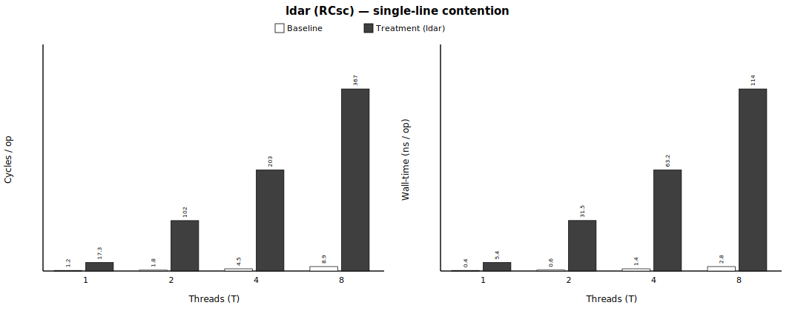
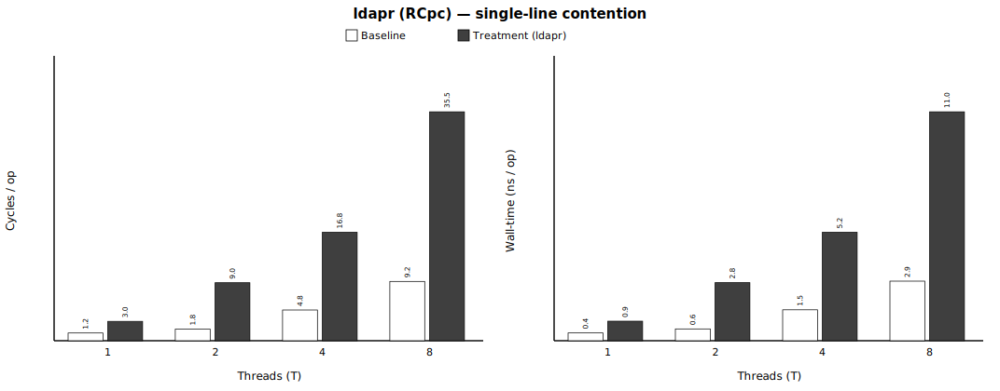
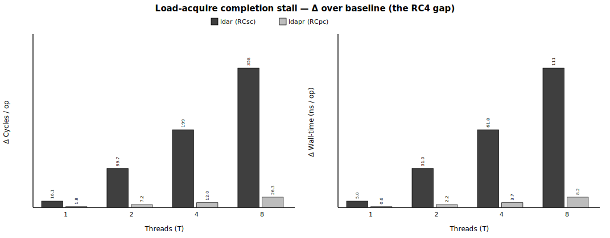

# Group 3 — release / acquire under single-line contention (`3_contention`)

> **Status** — single-line contention **T=1/2/4/8**, **8/8 gate-clean** (pin+overlap) · paired, 1M iters · regenerated 2026-06-11.

**Pair with** — methodology spec [`../METHODOLOGY.md`](../METHODOLOGY.md) · master report [`../README.md`](../README.md) · integrated data [`processed/3_contention_incremental.csv`](processed/3_contention_incremental.csv) · contention data [`_contention/out/contention.csv`](_contention/out/contention.csv) · raw per-repeat PMU in each `<treatment>/out/bench.csv`.

**Contents**
1. [At a glance](#at-a-glance)
2. [Metadata](#metadata)
3. [What this measures](#what-this-measures)
4. [Number Repeated Runs](#number-repeated-runs)
5. [Contention validation](#contention-validation)
6. [Baseline cost (paired no-ordering phase)](#baseline-cost-paired-no-ordering-phase)
7. [Result](#result)
8. [Summary](#summary)

## At a glance

Single shared line, T threads on distinct cores; per-op, median over 15 repeats. T = 1, 2, 4, 8 (T=1 = uncontended reference). **baseline** = `str(L); ldr(L)`; **memory-ordered** = `stlr(L); ldar/ldapr(L)` (values exactly as in the *Result* table; the gap row is the difference between the two acquire flavors).


| memory-ordered instruction | baseline /op (T1→T8) | **memory-ordered /op (T1→T8)** | trend | gate |
|---|---|---|---|---|
| `ldar` | 1.19 → 8.94 cyc (0.377 → 2.795 ns) | **17.34 → 366.50 cyc (5.388 → 113.731 ns)** | ↑ with contention | PASS ✓ |
| `ldapr` | 1.19 → 9.19 cyc (0.376 → 2.866 ns) | **3.00 → 35.45 cyc (0.939 → 11.019 ns)** | ↑ with contention | PASS ✓ |
| **gap (`ldar` − `ldapr`)** | +0.00 → -0.25 cyc (+0.000 → -0.071 ns) | **+14.34 → +331.05 cyc (+4.449 → +102.712 ns)** | ↑ with contention | — |

> **Load-acquire completion stall** (paper Table 1, RC4) — `ldar` (RCsc) completion is gated on the po-older `stlr` drain, so under single-line contention its cost explodes (+16 → +358 cyc/op, T=1→8) while `ldapr` (RCpc) skips it (+1.8 → +26). The `ldar`−`ldapr` gap **is** this cost.

## Metadata

Machine / environment:

| field | value |
|---|---|
| Node | `rg-uwing-1` (CRNCH), reached from `rg-login` via `srun --jobid=<J>` |
| Arch/CPU | aarch64, **ARM Neoverse-V2** (Grace), 72 cores |
| Clock | **3.375 GHz fixed**, governor `performance` (1 cyc ≈ 0.296 ns) |
| Cache | line 64 B; L1d 64 KiB/core; L2 1 MiB/core; L3 ~114 MiB shared |
| NUMA | node 0 = 72 cores + 490 GB local (**membind here**); node 1 = GPU HBM (avoid) |
| ISA | **LSE atomics** + **RCpc `ldapr`**, SVE2 |
| Kernel | 6.8.0-1051-nvidia-64k |
| Compiler | gcc 11.4.0, `-O2 -march=native -pthread` |
| PMU | `perf_event_open()` (perf CLI broken): cycles, instructions, l1d_refill(0x03), l2d_refill(0x17), ll_miss_rd(0x37), mem_access(0x13), stall_be_mem(0x4005) + SW noise |

Experiment variables:

| field | value |
|---|---|
| treatments | `ldar`, `ldapr` |
| contention | single shared cache-line; T threads pinned to distinct cores |
| threads (T) | 1, 2, 4, 8 (T=1 = uncontended reference) |
| contention iters / repeats | 1,000,000 / 15 |
| measurement | PAIRED: baseline + treatment interleaved in ONE process per repeat; PMU cycles + independent CLOCK_MONOTONIC_RAW wall-time |
| build `_contention` | sha256 `d44b3fdca7592b39…`, gcc 11 |

## What this measures

Cost of release→acquire ordering under **single-line contention** — a `stlr` publish followed by an `ldar`/`ldapr` consume on **one shared line** — characterizing how contention on that line changes `ldar` (RCsc) vs `ldapr` (RCpc) latency. **Window:** load-acquire **completion**, held until the po-older store-release **drains** — measured **cross-thread** under single-line contention (the **load-acquire completion stall**, paper Table 1, RC4). **Stream:** single shared line, all `T` threads `stlr(L); ldar/ldapr(L)` (baseline `str(L); ldr(L)`), T=1..8. Reported as median over repeats; treatment vs the **paired no-ordering phase**, at **T = 1 (uncontended reference) → 8**, threads pinned to distinct cores. Credible source: `_contention/out/contention.csv` + this README.

> **Paper claim this measures** — for LDAR (RCsc acquire), *"as opposed to the weaker LDAPR/RCpc acquire, **a load-acquire's completion signal is also held until any po-older store-release entries drain; RCpc load-acquire does not impose that additional completion delay**"* (paper §4.1; the Table 1 **RC4** constraint). This group measures exactly that delta — `ldar` (pays the wait) vs `ldapr` (skips it) — and how single-line contention, by slowing the po-older `stlr` drain, amplifies it.

**Why this group is cross-thread only.** The *single-thread* cost of these instructions lives in their measurement-window group: store-release `stlr` (STLR vs STR, store issue→retire) is **Group 1**, and load-acquire `ldar`/`ldapr` (LDAR vs LDR vs LDAPR, both cache conditions) is **Group 2** — and both read **≈0 uncontended**, because the load-acquire completion stall only appears when a *contended* po-older `stlr` drain is slow. This group isolates exactly that: how **single-line contention** changes `ldar` (RCsc) vs `ldapr` (RCpc) latency (the load-acquire completion stall, paper Table 1, RC4). `T=1` is the uncontended reference.

## Number Repeated Runs

Single-line **contention** sweep — **`T=1` is the uncontended reference, `T≥2` is contended** (the one shared line bounces between cores). Each run is **15 repeats**; the gate is distinct-core pinning + temporal overlap (see *Contention validation*).

| treatment | regime | T | runs | repeats/run | gate (pin+overlap) PASS/total |
|---|---|---|---|---|---|
| `ldar` | uncontended | 1 | 1 | 15 | 1/1 |
| `ldar` | contended | 2/4/8 | 3 | 15 | 3/3 |
| `ldapr` | uncontended | 1 | 1 | 15 | 1/1 |
| `ldapr` | contended | 2/4/8 | 3 | 15 | 3/3 |

## Contention validation

**Implementation.** `T` threads are pinned to **distinct cores** (`sched_setaffinity` to core0+t, each verified by `sched_getcpu()`), released together by a `pthread_barrier`, all hammering **one** shared cache-line-aligned word `L`. Each thread loops `stlr(L,i); ldar/ldapr(L)` (baseline `str(L,i); ldr(L)`). Thread 0 (core 0) is the PMU-measured one; the other T−1 threads supply the contention. A coherence PMU group is read (no multiplexing): CPU_CYCLES, L1D_REFILL(0x03), LL_MISS_RD(0x37), MEM_ACCESS(0x13), STALL_BACKEND_MEM(0x4005), REMOTE_ACCESS(0x31).

**The rise with `T` is contention, not total issue volume.** The reported `cyc/op` divides **thread 0's** cycles by **thread 0's own ops — fixed at 1M regardless of `T`** — so the helpers' issues enter neither numerator nor denominator; and the paired same-`T` no-ordering phase subtracts the generic coherence traffic common to both phases, leaving Δ = the ordering cost at that contention level. In-data control: the `ldar` and `ldapr` phases issue the **identical** instruction sequence (`stlr` + one load-acquire per iteration) at the same `T` — if issue volume drove the rise they would read the same, yet Δ differs ~14× at T=8 (RCsc-vs-RCpc semantics, not volume).

Per (treatment, T): the **contention gate** — distinct-core pinning, temporal overlap (threads truly ran at once), no PMU multiplexing, and the coherence signal (L1D_REFILL/op rising vs the T=1 reference as the single line bounces between core L1s). **Gate PASS** = `pin_ok=1` AND `overlap_ok=1` AND `mux≥0.999` AND (for T≥2) `L1D_REFILL/op > the T=1 value`. REMOTE_ACCESS(0x31)/op ≈ 0 on single-socket Grace, so L1D_REFILL/op is the coherence signal; `stall%cyc` is the exposed drain/coherence wait. pin_ok = every thread's `sched_getcpu()` == its intended distinct core; overlap_ok = max(start) < min(stop) across threads.

| treatment | T | pin_ok | overlap_ok | mux | L1D_REFILL/op | REMOTE/op | stall%cyc | verdict |
|---|---|---|---|---|---|---|---|---|
| `ldar` | 1 | ✓ | ✓ | 1.000 | 0.000 | 0.000 | 0% | PASS ✓ |
| `ldar` | 2 | ✓ | ✓ | 1.000 | 0.172 | 0.000 | 79% | PASS ✓ |
| `ldar` | 4 | ✓ | ✓ | 1.000 | 0.213 | 0.000 | 88% | PASS ✓ |
| `ldar` | 8 | ✓ | ✓ | 1.000 | 0.165 | 0.000 | 94% | PASS ✓ |
| `ldapr` | 1 | ✓ | ✓ | 1.000 | 0.000 | 0.000 | 0% | PASS ✓ |
| `ldapr` | 2 | ✓ | ✓ | 1.000 | 0.016 | 0.000 | 61% | PASS ✓ |
| `ldapr` | 4 | ✓ | ✓ | 1.000 | 0.016 | 0.000 | 79% | PASS ✓ |
| `ldapr` | 8 | ✓ | ✓ | 1.000 | 0.015 | 0.000 | 90% | PASS ✓ |

## Baseline cost (paired no-ordering phase)

The baseline of record for the *Result* below — **not** a single-thread sweep. `base ref cyc/op` is the median over the repeats of the **no-ordering** phase (`str(L); ldr(L)` for release-acquire, the `relaxed` RMW for atomics), measured in the SAME process at the SAME `T` as the treatment; **margin = max(|max−ref|, |ref−min|)** over those repeats. A treatment Δ within this margin is statistically equal to baseline.

| treatment | T | n | base ref cyc/op | min–max cyc | σ cyc | **margin ±cyc** | base ref ns/op | min–max ns | σ ns | **margin ±ns** |
|---|---|---|---|---|---|---|---|---|---|---|
| `ldar` | 1 | 15 | 1.19 | 1.19–1.19 | 0.00 | **0.00** | 0.377 | 0.376–0.379 | 0.001 | **0.002** |
| `ldar` | 2 | 15 | 1.84 | 1.83–1.84 | 0.01 | **0.01** | 0.579 | 0.577–0.582 | 0.002 | **0.003** |
| `ldar` | 4 | 15 | 4.46 | 4.15–4.58 | 0.10 | **0.31** | 1.392 | 1.299–1.434 | 0.030 | **0.093** |
| `ldar` | 8 | 15 | 8.94 | 8.67–9.05 | 0.11 | **0.26** | 2.795 | 2.709–2.821 | 0.034 | **0.087** |
| `ldapr` | 1 | 15 | 1.19 | 1.19–1.19 | 0.00 | **0.00** | 0.376 | 0.375–0.379 | 0.001 | **0.002** |
| `ldapr` | 2 | 15 | 1.81 | 1.80–1.82 | 0.01 | **0.01** | 0.569 | 0.566–0.575 | 0.002 | **0.006** |
| `ldapr` | 4 | 15 | 4.76 | 4.57–4.81 | 0.06 | **0.19** | 1.487 | 1.436–1.509 | 0.018 | **0.051** |
| `ldapr` | 8 | 15 | 9.19 | 9.03–9.32 | 0.09 | **0.16** | 2.866 | 2.814–2.908 | 0.028 | **0.051** |

## Result

*Load-acquire completion stall — `ldar` vs `ldapr`, single-line contention.*

All `T` threads (distinct cores) hammer **one** shared line `L`: `stlr(L,i) ; acc ^= ldar/ldapr(L)`; baseline `str(L,i) ; ldr(L)`. The acquire is po-after this thread's own `stlr`, so it pays the **load-acquire completion stall** (paper Table 1, RC4): its completion is **held until the po-older store-release drains**. RCsc `ldar` pays it; RCpc `ldapr` skips it. As `T` grows the single line bounces between cores, the `stlr` drain slows, and the `ldar` wait grows — Δ(ldar) − Δ(ldapr) = the completion-stall gap. T=1 = uncontended reference.

- **Tested** — a load-acquire (`ldar` RCsc / `ldapr` RCpc) consuming the line this thread's own `stlr` just published — all `T` threads hammering **ONE shared cache line**, T swept 1 → 8.
- **Compared** — the no-ordering phase (`str(L); ldr(L)`, baseline) vs the memory-ordered phase (`stlr(L); ldar/ldapr(L)`, treatment) — back-to-back per repeat on the SAME threads/cores (paired).
- **Result value** — **Δ = treatment − baseline** per op = the load-acquire completion stall on the contended line, median over 15 repeats.

How to read each table:

| column | meaning |
|---|---|
| `kind` | the acquire flavor: `RCsc` = `ldar`, `RCpc` = `ldapr` |
| `T` | threads hammering the one shared line (`T=1` = uncontended reference) |
| `base cyc/op` / `base ns/op` | the paired no-ordering phase, per op |
| `treat cyc/op` / `treat ns/op` | the memory-ordered instruction, per op |
| **`Δ cyc/op` / `Δ ns/op`** | **the ordering cost (= treat − base) — the result** |
| `l1_refill/op` | coherence signal: the shared line bouncing between core L1s |
| `remote/op` | cross-socket accesses (≈0 on single-socket Grace) |
| gate | distinct-core pin + temporal overlap (see *Contention validation*) |

Per treatment below: the objdump opcode proof, then the cost-by-T table.

### `ldar`

objdump (emitted opcode):
```
1fdc:	c8dffca3 	ldar	x3, [x5]
2398:	c8dfff02 	ldar	x2, [x24]
```


| kind | T | base cyc/op | treat cyc/op | **Δ cyc/op** | base ns/op | treat ns/op | **Δ ns/op** | l1_refill/op | remote/op | gate |
|---|---|---|---|---|---|---|---|---|---|---|
| RCsc | 1 | 1.19 | 17.34 | **+16.15** | 0.377 | 5.388 | **+5.010** | 0.000 | 0.000 | PASS ✓ |
| RCsc | 2 | 1.84 | 101.56 | **+99.73** | 0.579 | 31.544 | **+30.964** | 0.172 | 0.000 | PASS ✓ |
| RCsc | 4 | 4.46 | 203.47 | **+199.18** | 1.392 | 63.151 | **+61.817** | 0.213 | 0.000 | PASS ✓ |
| RCsc | 8 | 8.94 | 366.50 | **+357.54** | 2.795 | 113.731 | **+110.943** | 0.165 | 0.000 | PASS ✓ |

### `ldapr`

objdump (emitted opcode):
```
1fe4:	f8bfc0a3 	ldapr	x3, [x5]
23a0:	f8bfc302 	ldapr	x2, [x24]
```


| kind | T | base cyc/op | treat cyc/op | **Δ cyc/op** | base ns/op | treat ns/op | **Δ ns/op** | l1_refill/op | remote/op | gate |
|---|---|---|---|---|---|---|---|---|---|---|
| RCpc | 1 | 1.19 | 3.00 | **+1.81** | 0.376 | 0.939 | **+0.563** | 0.000 | 0.000 | PASS ✓ |
| RCpc | 2 | 1.81 | 8.99 | **+7.17** | 0.569 | 2.797 | **+2.225** | 0.016 | 0.000 | PASS ✓ |
| RCpc | 4 | 4.76 | 16.79 | **+12.03** | 1.487 | 5.221 | **+3.735** | 0.016 | 0.000 | PASS ✓ |
| RCpc | 8 | 9.19 | 35.45 | **+26.34** | 2.866 | 11.019 | **+8.187** | 0.015 | 0.000 | PASS ✓ |

**Δ over baseline — `ldar` vs `ldapr` (the gap that grows with contention):**



**Result (Neoverse-V2, 1M × 15 repeats, gate-clean pin+overlap):** the completion-stall gap `ldar − ldapr` **grows monotonically with single-line contention** — ≈14 cyc/op at T=1 (uncontended), then **93 (T=2) → 187 (T=4) → 331 (T=8)**. `ldar` (RCsc) blows up (+16 → +358 cyc/op) as its completion waits ever longer for the contended `stlr` to drain (L1D_REFILL/op 0.00→0.17, backend-memory stall 0→0.94), while `ldapr` (RCpc) stays modest (+1.8 → +26). This is direct hardware evidence of the load-acquire completion-stall cost and its contention-vs-latency curve.

## Summary

| treatment | unit | T=1 | T=2 | T=4 | T=8 |
|---|---|---|---|---|---|
| `ldar` (RCsc) | Δ cyc/op | +16.15 | +99.73 | +199.18 | +357.54 |
|  | Δ ns/op | +5.010 | +30.964 | +61.817 | +110.943 |
| `ldapr` (RCpc) | Δ cyc/op | +1.81 | +7.17 | +12.03 | +26.34 |
|  | Δ ns/op | +0.563 | +2.225 | +3.735 | +8.187 |
| **gap (`ldar` − `ldapr`)** | Δ cyc/op | **+14.34** | **+92.56** | **+187.16** | **+331.19** |
|  | Δ ns/op | **+4.448** | **+28.739** | **+58.083** | **+102.757** |

- Each thread runs the **publish→consume** pattern on the one shared line: `stlr(L)` publishes a value, the immediately-following `ldar`/`ldapr` consumes it. The acquire is po-after the thread's **own** `stlr` — so an RCsc consume must wait for that publish to drain, and the table is a direct readout of how long that wait is.
- At **T=1** the line stays resident and the publish drains immediately — the small `ldar` Δ is the fast-drain floor of the completion stall, and `ldapr`'s near-zero shows the stall is *specifically* the po-older-release wait, not a general acquire overhead.
- At **T≥2** the shared line bounces between cores, so every publish's drain now includes a coherence round-trip; the RCsc consume inherits that entire delay (its completion is gated on the drain), while the RCpc consume pays only its own share of the coherence traffic. That is why `ldar` scales with contention and `ldapr` barely moves.
- The **gap row is the load-acquire completion stall itself**, isolated: both flavors see identical contention, so subtracting them cancels the coherence cost and leaves only the drain-wait that RCsc imposes and RCpc skips — growing monotonically because the publish drain gets slower the more cores fight for the line.

### Paper alignment

**Claim** (paper §4.1; Table 1 **RC4**): for LDAR (RCsc acquire), *"**a load-acquire's completion signal is also held until any po-older store-release entries drain; RCpc load-acquire does not impose that additional completion delay**."*

**Measured**: the table above is that sentence in numbers — `ldar` (held) pays the publish-drain wait and scales with how slow the drain is, `ldapr` (not held) does not; the gap exists already at T=1 (≈14 cyc/op) and is amplified ~23× by T=8 single-line contention (≈331 cyc/op).

**Alignment**: **directly confirms RC4** on real Neoverse-V2 hardware — both the asymmetry the paper predicts (RCsc pays, RCpc skips) and the mechanism (the cost tracks the po-older `stlr` drain time, evidenced by the L1D_REFILL/op and backend-stall rise in *Contention validation*).


---

*Auto-generated by `lib/parse_group.py` from the locked `out/` sweep on 2026-06-11. **Numbers** → `processed/3_contention_*.csv` (+ per-treatment `<t>/out/bench.csv`). **Method** → [`../METHODOLOGY.md`](../METHODOLOGY.md). **Up** → [`../README.md`](../README.md).*
