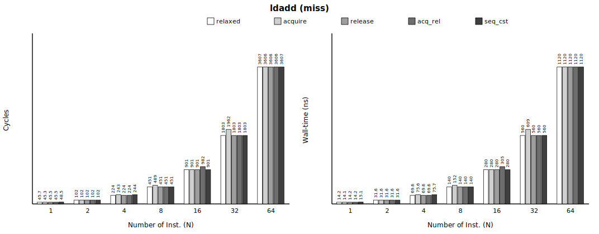
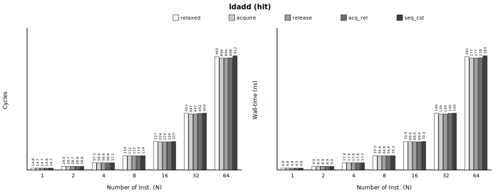
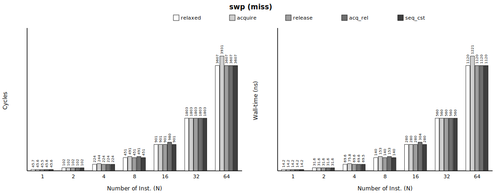
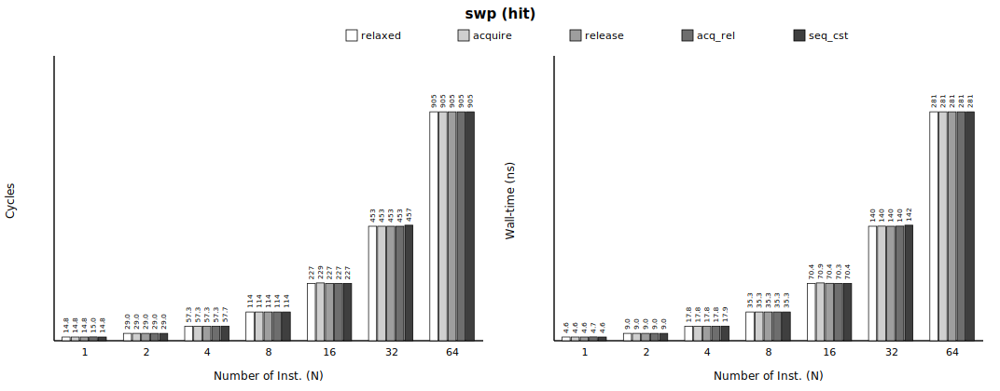
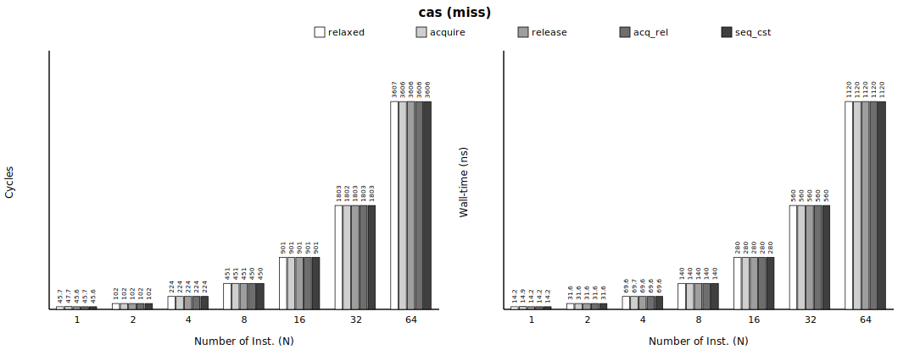
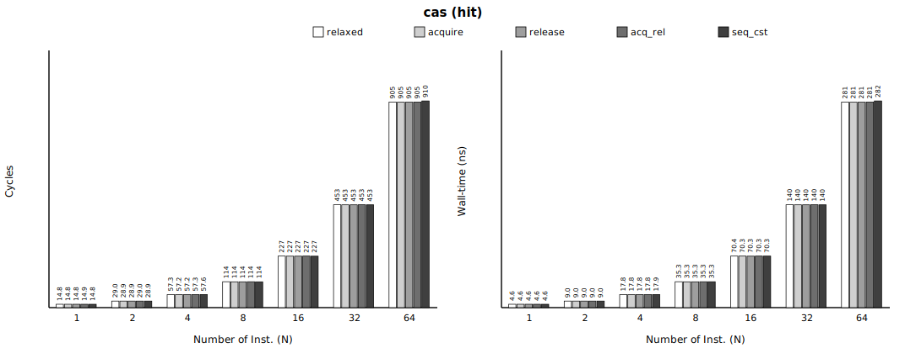
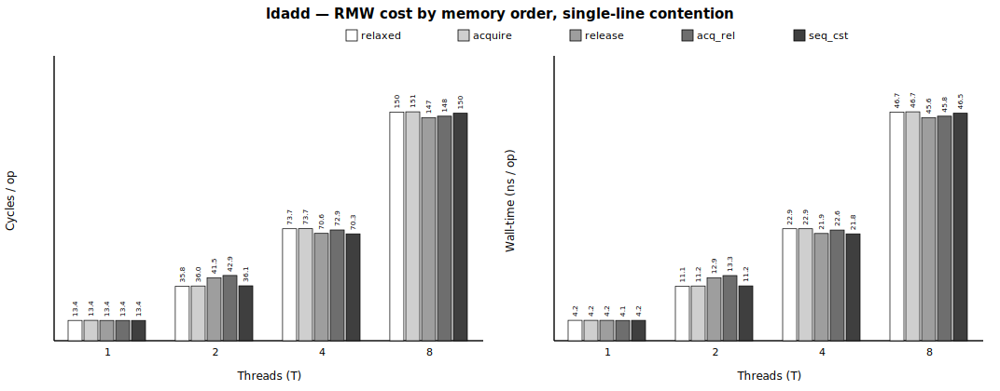
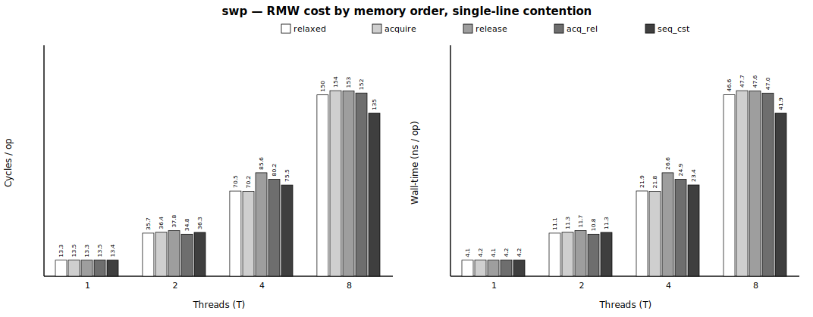
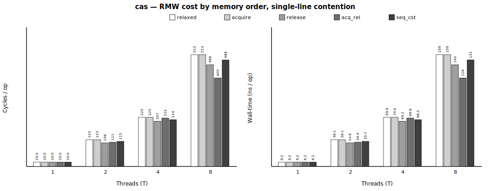
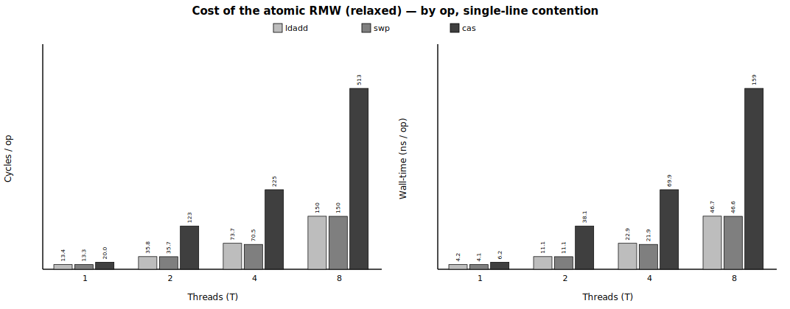

# Group 4 — LSE atomics × memory order (`4_atomics`)

> **Status** — 3 treatments · single-thread sweep **168/168 gate-clean** · single-line contention **T=1/2/4/8**, **48/48 gate-clean** (pin+overlap) · paired, 1M iters · regenerated 2026-06-10.

**Pair with** — methodology spec [`../METHODOLOGY.md`](../METHODOLOGY.md) · master report [`../README.md`](../README.md) · integrated data [`processed/4_atomics_incremental.csv`](processed/4_atomics_incremental.csv) · contention data [`_contention/out/contention.csv`](_contention/out/contention.csv) · raw per-repeat PMU in each `<treatment>/out/bench.csv`.

**Contents**
1. [At a glance](#at-a-glance)
2. [Metadata](#metadata)
3. [Part A — single-thread, cache hit/miss stream](#part-a--single-thread-cache-hitmiss-stream)
    - [What this measures](#what-this-measures)
    - [Number Repeated Runs](#number-repeated-runs)
    - [Cache resident / miss validation](#cache-resident--miss-validation)
    - [Baseline cost (no memory-ordered op)](#baseline-cost-no-memory-ordered-op)
    - [Result](#result)
    - [Summary](#summary)
4. [Part B — single shared line, by thread count](#part-b--single-shared-line-by-thread-count)
    - [What this measures](#what-this-measures-1)
    - [Number Repeated Runs](#number-repeated-runs-1)
    - [Contention validation](#contention-validation)
    - [Baseline cost (paired no-ordering phase)](#baseline-cost-paired-no-ordering-phase)
    - [Result](#result-1)
    - [Summary](#summary-1)
5. [Verdict](#verdict)

## At a glance

### A · single-thread, cache hit/miss stream

Single thread over a hit/miss stream, at the deepest sweep point (N=64); values exactly as in the *Result* tables (per-iteration; the per-op equivalent `incr_cyc_op` is also in the CSV; `*` = within baseline margin). **baseline** = the relaxed RMW; **worst memory-ordered Δ** = the largest-|Δ| memory order, cyc and ns from that same order's row (isolated artifact cells are flagged in the *Result*/Verdict).


| op | baseline (miss·N=64) | baseline (hit·N=64) | **worst memory-ordered Δ** (miss / hit, N=64) | gate |
|---|---|---|---|---|
| `ldadd` | 3606.7 cyc (1120.2 ns) | 905.1 cyc (280.7 ns) | -0.8* cyc (-0.2* ns) / -11.5* cyc (-3.5* ns) | PASS ✓ |
| `swp` | 3606.7 cyc (1120.2 ns) | 905.1 cyc (280.7 ns) | +324.5 cyc (+100.7 ns) / +0.0* cyc (-0.0* ns) | PASS ✓ |
| `cas` | 3606.7 cyc (1120.2 ns) | 905.1 cyc (280.7 ns) | -1.1* cyc (-0.4* ns) / +5.0* cyc (+1.6* ns) | PASS ✓ |

### B · single shared line, by thread count

Single shared line, T threads on distinct cores; per-op, median over 15 repeats. T = 1, 2, 4, 8 (T=1 = uncontended reference). **baseline** = the relaxed RMW; **memory-ordered** = the worst-order RMW (values exactly as in the *Result* tables).


| op | baseline /op (T1→T8) | **memory-ordered /op (worst order, T1→T8)** | trend | gate |
|---|---|---|---|---|
| `ldadd` | 13.38 → 146.85 cyc (4.156 → 45.582 ns) | **13.38 → 146.79 cyc (4.157 → 45.568 ns)** | ordered ≈ baseline at every T | PASS ✓ |
| `swp` | 13.28 → 150.03 cyc (4.126 → 46.584 ns) | **13.47 → 153.56 cyc (4.186 → 47.656 ns)** | ordered ≈ baseline at every T | PASS ✓ |
| `cas` | 20.00 → 512.70 cyc (6.210 → 159.070 ns) | **20.00 → 512.67 cyc (6.210 → 159.070 ns)** | ordered ≈ baseline at every T | PASS ✓ |

> **The cost of an atomic is the RMW instruction itself**, not the ordering suffix: `cas`~20 > `ldadd`≈`swp`~13 cyc/op uncontended, scaling steeply under single-line contention (`cas` 20→**488** cyc/op at T=8). The acquire/release/acq_rel/seq_cst suffix adds **≈0** on top — an LSE RMW already owns the line. (Per paper §4.4 an atomic's *directional* ordering cost follows the store-release / load-acquire rules — characterized in Group 1 / Group 3, not re-measured here.)

## Metadata

Machine / environment:

| field | value |
|---|---|
| Node | `rg-uwing-1` (CRNCH), reached from `rg-login` via `srun --jobid=<J>` |
| Arch/CPU | aarch64, **ARM Neoverse-V2** (Grace), 72 cores |
| Clock | **3.375 GHz fixed**, governor `performance` (1 cyc ≈ 0.296 ns) |
| Cache | line 64 B; L1d 64 KiB/core; L2 1 MiB/core; L3 ~114 MiB shared |
| NUMA | node 0 = 72 cores + 490 GB local (**membind here**); node 1 = GPU HBM (avoid) |
| ISA | **LSE atomics** + **RCpc `ldapr`**, SVE2 |
| Kernel | 6.8.0-1051-nvidia-64k |
| Compiler | gcc 11.4.0, `-O2 -march=native -pthread` |
| PMU | `perf_event_open()` (perf CLI broken): cycles, instructions, l1d_refill(0x03), l2d_refill(0x17), ll_miss_rd(0x37), mem_access(0x13), stall_be_mem(0x4005) + SW noise |

Experiment variables:

| field | value |
|---|---|
| treatments | `ldadd`, `swp`, `cas` |
| placements | `acquire`, `release`, `acqrel`, `seqcst` |
| conditions | miss, hit |
| N (atomics/group) | 1, 2, 4, 8, 16, 32, 64 |
| miss: iters / working-set / repeats | 1,000,000 / 536,870,912 B / 10 |
| hit: iters / working-set / repeats | 1,000,000 / 2,048 B / 10 |
| contention | single shared cache-line; T threads pinned to distinct cores |
| threads (T) | 1, 2, 4, 8 (T=1 = uncontended reference) |
| contention iters / repeats | 1,000,000 / 15 |
| measurement | PAIRED: baseline + treatment interleaved in ONE process per repeat; PMU cycles + independent CLOCK_MONOTONIC_RAW wall-time |
| build `ldadd` | sha256 `c85c1d3c4b2cd288…`, gcc 11 |
| build `swp` | sha256 `075f0dc4fb213c59…`, gcc 11 |
| build `cas` | sha256 `16c863bf0d77c67e…`, gcc 11 |
| build `_contention` | sha256 `b2b6d1fd54138c73…`, gcc 11 |

## Part A — single-thread, cache hit/miss stream

*One thread; each atomic targets a **different** hash-addressed line over a **512 MiB (`miss`) / 2 KiB (`hit`)** stream, swept by N. Uncontended — the cost is dominated by the many-line cache miss/hit.*

### What this measures

Cost of an LSE atomic RMW (`ldadd`/`swp`/`cas`) under a memory order vs the relaxed atomic. **Window:** atomic RMW issue → **completion** (per-op): the RMW **instruction's own cost** — uncontended (`cas`>`ldadd`≈`swp`) and under **single-line contention** (T-scaling) — plus the ordering-suffix surcharge over `relaxed` (≈0 in this window; the directional ordering cost is G1/G3's — see below). **Stream:** single shared line, all `T` threads RMW it; baseline `relaxed`, treatment the memory-ordered form, T=1..8 (`miss` = 512 MiB working set, `hit` = small resident set, warmed). Reported as median over repeats; baseline subtracted PAIRED. Credible source: `processed/4_atomics_incremental.csv` + this README; raw per-repeat PMU in each `<treatment>/out/bench.csv`.

> **Paper claim this measures** — *"**TEMPO does not alter the baseline atomicity mechanism** of read-modify-write operations; it only maps their ordering attributes to the same enforcement rules. Relaxed atomics use the current ordering tag. **Acquire atomics follow load-acquire** retirement and retirement-time hazardous-load replay rules, **release atomics follow store-release** tag/completion rules, and **acq_rel (or stronger) atomics apply both**"* (paper §4.4, Atomics (CAS/AMO)). This part verifies the premise **uncontended**: the ordering suffix itself adds ≈0 on a bare RMW — the directional costs live where those rules point (store-release → **Group 1**, load-acquire → **Group 3**).

### Number Repeated Runs

Single-thread sweep — repeat counts that passed ALL validity gates (multiplexing + OS-noise + anti-elision + cache-condition + exposed-latency), per pass. Counts, not cost.

| treatment | configs | base runs PASS/total | treat runs PASS/total |
|---|---|---|---|
| `ldadd` | 56 | 560/560 | 560/560 |
| `swp` | 56 | 560/560 | 560/560 |
| `cas` | 56 | 560/560 | 560/560 |

### Cache resident / miss validation

Median baseline counters per condition — proof the intended cache state held. **MISS**: l1_refill/acc ≈ 1 (every access misses L1), ll_miss_rd/acc high (reaches the LL cache / DRAM), stall % high (miss latency exposed ⇒ prefetcher defeated). **HIT**: l1_refill/acc ≈ 0 (resident). Both: mux = 1.000 (no PMU multiplexing), cs/mig/pf = 0 (no OS noise). Gate thresholds: miss l1≥0.90 / ll≥0.50 / stall≥10%; hit l1≤0.02; mux≥0.999.

| condition | l1_refill/acc | l2_refill/acc | ll_miss_rd/acc | mem/acc | stall %cyc | mux | cs/mig/pf | verdict |
|---|---|---|---|---|---|---|---|---|
| miss | 1.00 | 1.00 | 1.00 | 3.00 | 92% | 1.000 | 0/0/0 | PASS ✓ |
| hit | 0.00 | 0.00 | 0.00 | 3.00 | 0% | 1.000 | 0/0/0 | PASS ✓ |

### Baseline cost (no memory-ordered op)

*(Every individual baseline measurement — each treatment × placement × repeat — is preserved by condition × N in `processed/4_atomics_baselines.csv` for error-margin / CI work.)*

All per-iteration **averages** (= total ÷ iters per repeat). (per-op `incr_cyc_op` also in the CSV) **Reference** = median over **all** pooled baseline samples for that condition×N — every treatment × placement × repeat (the **n** column below); **margin = furthest pooled sample from the reference** = max(|max−ref|, |ref−min|). **A treatment whose Δ ≤ this margin (or is negative) is statistically EQUAL to the baseline** — the apparent value is run-to-run fluctuation (within boundary), not a real cost. (σ = 1 standard deviation, for reference.)

| condition | N | n | ref cyc | min–max cyc | σ cyc | **margin ±cyc** | ref ns | min–max ns | σ ns | **margin ±ns** |
|---|---|---|---|---|---|---|---|---|---|---|
| miss | 1 | 120 | 45.7 | 36.7–71.2 | 6.5 | **25.4** | 14.2 | 11.4–22.2 | 2.0 | **7.9** |
| miss | 2 | 120 | 101.8 | 97.0–129.0 | 7.1 | **27.1** | 31.6 | 30.1–40.2 | 2.2 | **8.5** |
| miss | 4 | 120 | 224.0 | 223.4–244.4 | 7.4 | **20.4** | 69.6 | 69.4–76.0 | 2.3 | **6.4** |
| miss | 8 | 120 | 450.7 | 450.0–470.8 | 7.9 | **20.1** | 140.0 | 139.8–146.4 | 2.5 | **6.4** |
| miss | 16 | 120 | 901.5 | 900.9–920.8 | 7.7 | **19.3** | 280.0 | 279.8–286.2 | 2.4 | **6.2** |
| miss | 32 | 120 | 1803.1 | 1802.4–1811.9 | 3.5 | **8.8** | 560.1 | 559.7–563.1 | 1.2 | **3.0** |
| miss | 64 | 120 | 3606.7 | 3596.4–3610.2 | 4.8 | **10.3** | 1120.2 | 1117.2–1121.4 | 1.4 | **3.1** |
| hit | 1 | 120 | 14.8 | 14.5–16.0 | 0.6 | **1.2** | 4.6 | 4.5–5.0 | 0.2 | **0.4** |
| hit | 2 | 120 | 29.0 | 28.6–31.5 | 1.3 | **2.5** | 9.0 | 8.9–9.8 | 0.4 | **0.8** |
| hit | 4 | 120 | 57.3 | 56.8–62.4 | 2.5 | **5.2** | 17.8 | 17.6–19.4 | 0.8 | **1.7** |
| hit | 8 | 120 | 113.8 | 113.1–124.5 | 5.2 | **10.7** | 35.3 | 35.1–38.7 | 1.6 | **3.4** |
| hit | 16 | 120 | 226.8 | 225.5–248.5 | 10.5 | **21.7** | 70.4 | 69.9–77.2 | 3.3 | **6.8** |
| hit | 32 | 120 | 452.9 | 450.9–496.4 | 20.9 | **43.5** | 140.5 | 139.8–154.1 | 6.5 | **13.6** |
| hit | 64 | 120 | 905.1 | 901.8–992.0 | 41.8 | **87.0** | 280.7 | 279.6–307.8 | 13.0 | **27.1** |

### Result

- **Tested** — a **memory-ordered** LSE atomic RMW (`ldadd`, `swp`, `cas` under `acquire`/`release`/`acq_rel`/`seq_cst`) over the hit/miss stream, swept by order × condition × N.
- **Compared** — the **`relaxed`** RMW (baseline) vs the **memory-ordered** form (treatment) — same stream, interleaved in ONE process per repeat (paired).
- **Result value** — **Δ = memory-ordered − relaxed** = the ordering-suffix surcharge, median over 10 repeats, per group-iteration, in BOTH cycles and ns.

How to read each table:

| column | meaning |
|---|---|
| `placement` | the **memory order** of the treatment RMW (the baseline is always `relaxed`) |
| `N` | atomics per group-iteration |
| `base avg cyc` / `base avg ns` | baseline cost per iteration — pooled-median reference (its margin: *Baseline cost (no memory-ordered op)* above) |
| `var avg cyc` / `var avg ns` | with-treatment cost per iteration (= base + Δ) |
| **`Δ cyc` / `Δ ns`** | **the incremental cost (paired median) — the result** |
| `*` | Δ ≤ baseline margin (or negative) ⇒ within run-to-run fluctuation ⇒ statistically **zero** |

Per treatment below: a short note, the objdump opcode proof, then the cost tables.

#### `ldadd`

objdump (emitted opcode):
```
2d80:	f8ad0086 	ldadda	x13, x6, [x4]
3160:	f86d0086 	ldaddl	x13, x6, [x4]
3228:	f8ed0086 	ldaddal	x13, x6, [x4]
32f0:	f8ed0086 	ldaddal	x13, x6, [x4]
33b8:	f82d0086 	ldadd	x13, x6, [x4]
```
build `sha256=c85c1d3c4b2cd288…`, gcc 11.



**miss** — median over repeats (column meanings above; raw per-repeat PMU in `out/bench.csv`):

| placement | N | base avg cyc | base avg ns | var avg cyc | var avg ns | **Δ cyc** | **Δ ns** |
|---|---|---|---|---|---|---|---|
| acquire | 1 | 45.7 | 14.2 | 45.3 | 14.1 | **-0.4*** | **-0.1*** |
| acquire | 2 | 101.8 | 31.6 | 101.7 | 31.6 | **-0.1*** | **-0.0*** |
| acquire | 4 | 224.0 | 69.6 | 243.5 | 75.6 | **+19.5*** | **+6.0*** |
| acquire | 8 | 450.7 | 140.0 | 489.1 | 151.9 | **+38.4** | **+11.9** |
| acquire | 16 | 901.5 | 280.0 | 901.2 | 280.0 | **-0.2*** | **-0.1*** |
| acquire | 32 | 1803.1 | 560.1 | 1962.2 | 609.5 | **+159.2** | **+49.4** |
| acquire | 64 | 3606.7 | 1120.2 | 3606.2 | 1120.1 | **-0.5*** | **-0.2*** |
| release | 1 | 45.7 | 14.2 | 45.5 | 14.2 | **-0.2*** | **-0.1*** |
| release | 2 | 101.8 | 31.6 | 101.6 | 31.6 | **-0.2*** | **-0.1*** |
| release | 4 | 224.0 | 69.6 | 224.0 | 69.6 | **-0.0*** | **-0.0*** |
| release | 8 | 450.7 | 140.0 | 450.6 | 140.0 | **-0.1*** | **-0.0*** |
| release | 16 | 901.5 | 280.0 | 901.2 | 280.0 | **-0.2*** | **-0.0*** |
| release | 32 | 1803.1 | 560.1 | 1802.9 | 560.0 | **-0.2*** | **-0.1*** |
| release | 64 | 3606.7 | 1120.2 | 3605.9 | 1120.0 | **-0.8*** | **-0.2*** |
| acqrel | 1 | 45.7 | 14.2 | 45.5 | 14.2 | **-0.2*** | **-0.1*** |
| acqrel | 2 | 101.8 | 31.6 | 101.5 | 31.6 | **-0.3*** | **-0.1*** |
| acqrel | 4 | 224.0 | 69.6 | 223.9 | 69.6 | **-0.1*** | **-0.0*** |
| acqrel | 8 | 450.7 | 140.0 | 450.6 | 140.0 | **-0.1*** | **-0.0*** |
| acqrel | 16 | 901.5 | 280.0 | 982.4 | 305.2 | **+80.9** | **+25.1** |
| acqrel | 32 | 1803.1 | 560.1 | 1802.8 | 560.0 | **-0.3*** | **-0.1*** |
| acqrel | 64 | 3606.7 | 1120.2 | 3606.3 | 1120.2 | **-0.3*** | **-0.1*** |
| seqcst | 1 | 45.7 | 14.2 | 48.5 | 15.1 | **+2.7*** | **+0.8*** |
| seqcst | 2 | 101.8 | 31.6 | 101.6 | 31.6 | **-0.2*** | **-0.1*** |
| seqcst | 4 | 224.0 | 69.6 | 243.7 | 75.7 | **+19.7*** | **+6.1*** |
| seqcst | 8 | 450.7 | 140.0 | 450.7 | 140.0 | **-0.0*** | **-0.0*** |
| seqcst | 16 | 901.5 | 280.0 | 901.4 | 280.1 | **-0.1*** | **+0.0*** |
| seqcst | 32 | 1803.1 | 560.1 | 1803.0 | 560.1 | **-0.1*** | **+0.1*** |
| seqcst | 64 | 3606.7 | 1120.2 | 3606.7 | 1120.1 | **-0.0*** | **-0.1*** |



**hit** — median over repeats (column meanings above; raw per-repeat PMU in `out/bench.csv`):

| placement | N | base avg cyc | base avg ns | var avg cyc | var avg ns | **Δ cyc** | **Δ ns** |
|---|---|---|---|---|---|---|---|
| acquire | 1 | 14.8 | 4.6 | 14.7 | 4.6 | **-0.1*** | **-0.0*** |
| acquire | 2 | 29.0 | 9.0 | 28.7 | 8.9 | **-0.3*** | **-0.1*** |
| acquire | 4 | 57.3 | 17.8 | 56.6 | 17.6 | **-0.7*** | **-0.2*** |
| acquire | 8 | 113.8 | 35.3 | 112.4 | 34.9 | **-1.4*** | **-0.4*** |
| acquire | 16 | 226.8 | 70.4 | 223.9 | 69.5 | **-2.9*** | **-0.9*** |
| acquire | 32 | 452.9 | 140.5 | 447.2 | 138.7 | **-5.7*** | **-1.8*** |
| acquire | 64 | 905.1 | 280.7 | 893.6 | 277.2 | **-11.5*** | **-3.5*** |
| release | 1 | 14.8 | 4.6 | 14.7 | 4.6 | **-0.1*** | **-0.0*** |
| release | 2 | 29.0 | 9.0 | 28.7 | 8.9 | **-0.3*** | **-0.1*** |
| release | 4 | 57.3 | 17.8 | 56.6 | 17.6 | **-0.7*** | **-0.2*** |
| release | 8 | 113.8 | 35.3 | 112.4 | 34.9 | **-1.4*** | **-0.4*** |
| release | 16 | 226.8 | 70.4 | 223.9 | 69.5 | **-2.9*** | **-0.9*** |
| release | 32 | 452.9 | 140.5 | 447.2 | 138.7 | **-5.7*** | **-1.8*** |
| release | 64 | 905.1 | 280.7 | 893.6 | 277.1 | **-11.5*** | **-3.6*** |
| acqrel | 1 | 14.8 | 4.6 | 14.6 | 4.5 | **-0.2*** | **-0.1*** |
| acqrel | 2 | 29.0 | 9.0 | 28.6 | 8.9 | **-0.3*** | **-0.1*** |
| acqrel | 4 | 57.3 | 17.8 | 56.6 | 17.6 | **-0.6*** | **-0.2*** |
| acqrel | 8 | 113.8 | 35.3 | 112.6 | 34.9 | **-1.2*** | **-0.4*** |
| acqrel | 16 | 226.8 | 70.4 | 224.4 | 69.6 | **-2.4*** | **-0.8*** |
| acqrel | 32 | 452.9 | 140.5 | 451.8 | 140.1 | **-1.1*** | **-0.3*** |
| acqrel | 64 | 905.1 | 280.7 | 895.9 | 277.9 | **-9.2*** | **-2.8*** |
| seqcst | 1 | 14.8 | 4.6 | 14.7 | 4.6 | **-0.1*** | **-0.0*** |
| seqcst | 2 | 29.0 | 9.0 | 28.8 | 9.0 | **-0.1*** | **-0.0*** |
| seqcst | 4 | 57.3 | 17.8 | 57.1 | 17.7 | **-0.2*** | **-0.1*** |
| seqcst | 8 | 113.8 | 35.3 | 113.6 | 35.3 | **-0.2*** | **-0.1*** |
| seqcst | 16 | 226.8 | 70.4 | 226.7 | 70.3 | **-0.1*** | **-0.0*** |
| seqcst | 32 | 452.9 | 140.5 | 452.9 | 140.5 | **+0.0*** | **+0.0*** |
| seqcst | 64 | 905.1 | 280.7 | 911.7 | 282.8 | **+6.7*** | **+2.1*** |

*\* Δ ≤ baseline margin (or negative): within the baseline's run-to-run fluctuation (within boundary) → statistically equal to baseline, no measurable LSE cost.*

#### `swp`

objdump (emitted opcode):
```
2d88:	f8a58087 	swpa	x5, x7, [x4]
3168:	f8658087 	swpl	x5, x7, [x4]
3228:	f8e58087 	swpal	x5, x7, [x4]
32e8:	f8e58087 	swpal	x5, x7, [x4]
33a8:	f8258087 	swp	x5, x7, [x4]
```
build `sha256=075f0dc4fb213c59…`, gcc 11.



**miss** — median over repeats (column meanings above; raw per-repeat PMU in `out/bench.csv`):

| placement | N | base avg cyc | base avg ns | var avg cyc | var avg ns | **Δ cyc** | **Δ ns** |
|---|---|---|---|---|---|---|---|
| acquire | 1 | 45.7 | 14.2 | 45.6 | 14.2 | **-0.1*** | **-0.1*** |
| acquire | 2 | 101.8 | 31.6 | 101.7 | 31.6 | **-0.1*** | **-0.1*** |
| acquire | 4 | 224.0 | 69.6 | 244.1 | 75.8 | **+20.1*** | **+6.2*** |
| acquire | 8 | 450.7 | 140.0 | 491.5 | 152.6 | **+40.8** | **+12.6** |
| acquire | 16 | 901.5 | 280.0 | 901.3 | 279.9 | **-0.1*** | **-0.1*** |
| acquire | 32 | 1803.1 | 560.1 | 1803.1 | 560.1 | **-0.0*** | **+0.0*** |
| acquire | 64 | 3606.7 | 1120.2 | 3931.2 | 1220.9 | **+324.5** | **+100.7** |
| release | 1 | 45.7 | 14.2 | 45.5 | 14.2 | **-0.2*** | **-0.1*** |
| release | 2 | 101.8 | 31.6 | 101.7 | 31.6 | **-0.1*** | **-0.1*** |
| release | 4 | 224.0 | 69.6 | 224.0 | 69.6 | **-0.0*** | **-0.0*** |
| release | 8 | 450.7 | 140.0 | 450.7 | 140.0 | **-0.0*** | **+0.0*** |
| release | 16 | 901.5 | 280.0 | 901.4 | 280.0 | **-0.0*** | **+0.0*** |
| release | 32 | 1803.1 | 560.1 | 1803.1 | 560.1 | **+0.0*** | **+0.0*** |
| release | 64 | 3606.7 | 1120.2 | 3606.8 | 1120.3 | **+0.1*** | **+0.0*** |
| acqrel | 1 | 45.7 | 14.2 | 45.6 | 14.2 | **-0.2*** | **-0.1*** |
| acqrel | 2 | 101.8 | 31.6 | 101.5 | 31.6 | **-0.3*** | **-0.1*** |
| acqrel | 4 | 224.0 | 69.6 | 224.0 | 69.6 | **+0.0*** | **-0.0*** |
| acqrel | 8 | 450.7 | 140.0 | 491.0 | 152.6 | **+40.4** | **+12.6** |
| acqrel | 16 | 901.5 | 280.0 | 980.1 | 304.4 | **+78.7** | **+24.4** |
| acqrel | 32 | 1803.1 | 560.1 | 1803.1 | 560.2 | **-0.0*** | **+0.1*** |
| acqrel | 64 | 3606.7 | 1120.2 | 3606.8 | 1120.3 | **+0.1*** | **+0.1*** |
| seqcst | 1 | 45.7 | 14.2 | 45.6 | 14.2 | **-0.1*** | **-0.1*** |
| seqcst | 2 | 101.8 | 31.6 | 101.6 | 31.6 | **-0.2*** | **-0.1*** |
| seqcst | 4 | 224.0 | 69.6 | 223.9 | 69.5 | **-0.1*** | **-0.1*** |
| seqcst | 8 | 450.7 | 140.0 | 450.6 | 140.0 | **-0.0*** | **+0.0*** |
| seqcst | 16 | 901.5 | 280.0 | 901.5 | 280.0 | **+0.0*** | **-0.0*** |
| seqcst | 32 | 1803.1 | 560.1 | 1803.0 | 560.1 | **-0.1*** | **+0.0*** |
| seqcst | 64 | 3606.7 | 1120.2 | 3606.8 | 1120.3 | **+0.1*** | **+0.1*** |



**hit** — median over repeats (column meanings above; raw per-repeat PMU in `out/bench.csv`):

| placement | N | base avg cyc | base avg ns | var avg cyc | var avg ns | **Δ cyc** | **Δ ns** |
|---|---|---|---|---|---|---|---|
| acquire | 1 | 14.8 | 4.6 | 14.8 | 4.6 | **-0.0*** | **+0.0*** |
| acquire | 2 | 29.0 | 9.0 | 29.0 | 9.0 | **+0.0*** | **-0.0*** |
| acquire | 4 | 57.3 | 17.8 | 57.3 | 17.8 | **-0.0*** | **-0.0*** |
| acquire | 8 | 113.8 | 35.3 | 113.8 | 35.3 | **-0.0*** | **-0.0*** |
| acquire | 16 | 226.8 | 70.4 | 228.7 | 70.9 | **+1.8*** | **+0.6*** |
| acquire | 32 | 452.9 | 140.5 | 452.9 | 140.5 | **+0.0*** | **+0.0*** |
| acquire | 64 | 905.1 | 280.7 | 905.1 | 280.7 | **+0.0*** | **-0.0*** |
| release | 1 | 14.8 | 4.6 | 14.8 | 4.6 | **-0.0*** | **-0.0*** |
| release | 2 | 29.0 | 9.0 | 29.0 | 9.0 | **-0.0*** | **-0.0*** |
| release | 4 | 57.3 | 17.8 | 57.3 | 17.8 | **+0.0*** | **-0.0*** |
| release | 8 | 113.8 | 35.3 | 113.8 | 35.3 | **+0.0*** | **-0.0*** |
| release | 16 | 226.8 | 70.4 | 226.8 | 70.4 | **+0.0*** | **+0.0*** |
| release | 32 | 452.9 | 140.5 | 452.9 | 140.5 | **+0.0*** | **-0.0*** |
| release | 64 | 905.1 | 280.7 | 905.1 | 280.7 | **+0.0*** | **+0.0*** |
| acqrel | 1 | 14.8 | 4.6 | 15.0 | 4.7 | **+0.1*** | **+0.0*** |
| acqrel | 2 | 29.0 | 9.0 | 29.0 | 9.0 | **+0.0*** | **+0.0*** |
| acqrel | 4 | 57.3 | 17.8 | 57.3 | 17.8 | **+0.0*** | **+0.0*** |
| acqrel | 8 | 113.8 | 35.3 | 113.8 | 35.3 | **-0.0*** | **+0.0*** |
| acqrel | 16 | 226.8 | 70.4 | 226.8 | 70.3 | **-0.0*** | **-0.0*** |
| acqrel | 32 | 452.9 | 140.5 | 452.9 | 140.5 | **-0.0*** | **+0.0*** |
| acqrel | 64 | 905.1 | 280.7 | 905.1 | 280.7 | **+0.0*** | **-0.0*** |
| seqcst | 1 | 14.8 | 4.6 | 14.8 | 4.6 | **-0.0*** | **-0.0*** |
| seqcst | 2 | 29.0 | 9.0 | 29.0 | 9.0 | **-0.0*** | **-0.0*** |
| seqcst | 4 | 57.3 | 17.8 | 57.7 | 17.9 | **+0.5*** | **+0.1*** |
| seqcst | 8 | 113.8 | 35.3 | 113.8 | 35.3 | **-0.0*** | **+0.0*** |
| seqcst | 16 | 226.8 | 70.4 | 226.8 | 70.4 | **+0.0*** | **-0.0*** |
| seqcst | 32 | 452.9 | 140.5 | 456.9 | 141.7 | **+4.0*** | **+1.2*** |
| seqcst | 64 | 905.1 | 280.7 | 905.1 | 280.7 | **-0.0*** | **-0.0*** |

*\* Δ ≤ baseline margin (or negative): within the baseline's run-to-run fluctuation (within boundary) → statistically equal to baseline, no measurable LSE cost.*

#### `cas`

objdump (emitted opcode):
```
2d6c:	c8a4fcc8 	casl	x4, x8, [x6]
317c:	c8e4fcc8 	casal	x4, x8, [x6]
324c:	c8e4fcc8 	casal	x4, x8, [x6]
331c:	c8a47cc8 	cas	x4, x8, [x6]
33ec:	c8e47cc8 	casa	x4, x8, [x6]
```
build `sha256=16c863bf0d77c67e…`, gcc 11.



**miss** — median over repeats (column meanings above; raw per-repeat PMU in `out/bench.csv`):

| placement | N | base avg cyc | base avg ns | var avg cyc | var avg ns | **Δ cyc** | **Δ ns** |
|---|---|---|---|---|---|---|---|
| acquire | 1 | 45.7 | 14.2 | 47.7 | 14.9 | **+2.0*** | **+0.7*** |
| acquire | 2 | 101.8 | 31.6 | 101.6 | 31.6 | **-0.2*** | **-0.1*** |
| acquire | 4 | 224.0 | 69.6 | 224.3 | 69.7 | **+0.3*** | **+0.1*** |
| acquire | 8 | 450.7 | 140.0 | 450.6 | 140.0 | **-0.0*** | **+0.0*** |
| acquire | 16 | 901.5 | 280.0 | 901.2 | 279.9 | **-0.2*** | **-0.1*** |
| acquire | 32 | 1803.1 | 560.1 | 1802.5 | 560.0 | **-0.6*** | **-0.1*** |
| acquire | 64 | 3606.7 | 1120.2 | 3605.7 | 1119.9 | **-1.0*** | **-0.3*** |
| release | 1 | 45.7 | 14.2 | 45.6 | 14.2 | **-0.1*** | **-0.1*** |
| release | 2 | 101.8 | 31.6 | 101.6 | 31.6 | **-0.3*** | **-0.1*** |
| release | 4 | 224.0 | 69.6 | 223.9 | 69.6 | **-0.1*** | **-0.0*** |
| release | 8 | 450.7 | 140.0 | 450.6 | 140.0 | **-0.1*** | **-0.0*** |
| release | 16 | 901.5 | 280.0 | 901.3 | 280.1 | **-0.2*** | **+0.0*** |
| release | 32 | 1803.1 | 560.1 | 1803.1 | 560.0 | **-0.0*** | **-0.0*** |
| release | 64 | 3606.7 | 1120.2 | 3606.3 | 1120.1 | **-0.4*** | **-0.1*** |
| acqrel | 1 | 45.7 | 14.2 | 45.7 | 14.2 | **-0.0*** | **-0.0*** |
| acqrel | 2 | 101.8 | 31.6 | 101.6 | 31.6 | **-0.2*** | **-0.0*** |
| acqrel | 4 | 224.0 | 69.6 | 224.0 | 69.6 | **+0.0*** | **+0.0*** |
| acqrel | 8 | 450.7 | 140.0 | 450.4 | 139.9 | **-0.3*** | **-0.1*** |
| acqrel | 16 | 901.5 | 280.0 | 901.2 | 279.9 | **-0.3*** | **-0.1*** |
| acqrel | 32 | 1803.1 | 560.1 | 1802.6 | 559.9 | **-0.5*** | **-0.2*** |
| acqrel | 64 | 3606.7 | 1120.2 | 3605.8 | 1120.0 | **-0.9*** | **-0.2*** |
| seqcst | 1 | 45.7 | 14.2 | 45.6 | 14.2 | **-0.2*** | **-0.1*** |
| seqcst | 2 | 101.8 | 31.6 | 101.7 | 31.6 | **-0.2*** | **-0.1*** |
| seqcst | 4 | 224.0 | 69.6 | 224.0 | 69.6 | **-0.0*** | **+0.0*** |
| seqcst | 8 | 450.7 | 140.0 | 450.5 | 140.0 | **-0.2*** | **-0.0*** |
| seqcst | 16 | 901.5 | 280.0 | 901.3 | 280.0 | **-0.2*** | **-0.1*** |
| seqcst | 32 | 1803.1 | 560.1 | 1802.6 | 559.9 | **-0.5*** | **-0.2*** |
| seqcst | 64 | 3606.7 | 1120.2 | 3605.5 | 1119.8 | **-1.1*** | **-0.4*** |



**hit** — median over repeats (column meanings above; raw per-repeat PMU in `out/bench.csv`):

| placement | N | base avg cyc | base avg ns | var avg cyc | var avg ns | **Δ cyc** | **Δ ns** |
|---|---|---|---|---|---|---|---|
| acquire | 1 | 14.8 | 4.6 | 14.8 | 4.6 | **-0.0*** | **-0.0*** |
| acquire | 2 | 29.0 | 9.0 | 28.9 | 9.0 | **-0.0*** | **-0.0*** |
| acquire | 4 | 57.3 | 17.8 | 57.2 | 17.8 | **-0.0*** | **-0.0*** |
| acquire | 8 | 113.8 | 35.3 | 113.8 | 35.3 | **-0.1*** | **-0.0*** |
| acquire | 16 | 226.8 | 70.4 | 226.6 | 70.3 | **-0.2*** | **-0.1*** |
| acquire | 32 | 452.9 | 140.5 | 452.6 | 140.4 | **-0.3*** | **-0.1*** |
| acquire | 64 | 905.1 | 280.7 | 904.5 | 280.5 | **-0.6*** | **-0.2*** |
| release | 1 | 14.8 | 4.6 | 14.8 | 4.6 | **-0.0*** | **-0.0*** |
| release | 2 | 29.0 | 9.0 | 28.9 | 9.0 | **-0.0*** | **-0.0*** |
| release | 4 | 57.3 | 17.8 | 57.2 | 17.8 | **-0.0*** | **-0.0*** |
| release | 8 | 113.8 | 35.3 | 113.8 | 35.3 | **-0.1*** | **-0.0*** |
| release | 16 | 226.8 | 70.4 | 226.6 | 70.3 | **-0.2*** | **-0.1*** |
| release | 32 | 452.9 | 140.5 | 452.6 | 140.4 | **-0.3*** | **-0.1*** |
| release | 64 | 905.1 | 280.7 | 904.5 | 280.5 | **-0.6*** | **-0.2*** |
| acqrel | 1 | 14.8 | 4.6 | 14.9 | 4.6 | **+0.1*** | **+0.0*** |
| acqrel | 2 | 29.0 | 9.0 | 29.0 | 9.0 | **-0.0*** | **-0.0*** |
| acqrel | 4 | 57.3 | 17.8 | 57.3 | 17.8 | **-0.0*** | **-0.0*** |
| acqrel | 8 | 113.8 | 35.3 | 113.8 | 35.3 | **+0.0*** | **+0.0*** |
| acqrel | 16 | 226.8 | 70.4 | 226.8 | 70.3 | **+0.0*** | **-0.0*** |
| acqrel | 32 | 452.9 | 140.5 | 452.9 | 140.5 | **+0.0*** | **+0.0*** |
| acqrel | 64 | 905.1 | 280.7 | 905.1 | 280.7 | **+0.0*** | **+0.0*** |
| seqcst | 1 | 14.8 | 4.6 | 14.8 | 4.6 | **-0.0*** | **-0.0*** |
| seqcst | 2 | 29.0 | 9.0 | 28.9 | 9.0 | **-0.0*** | **-0.0*** |
| seqcst | 4 | 57.3 | 17.8 | 57.6 | 17.9 | **+0.3*** | **+0.1*** |
| seqcst | 8 | 113.8 | 35.3 | 113.8 | 35.3 | **-0.1*** | **-0.0*** |
| seqcst | 16 | 226.8 | 70.4 | 226.6 | 70.3 | **-0.2*** | **-0.1*** |
| seqcst | 32 | 452.9 | 140.5 | 452.6 | 140.4 | **-0.3*** | **-0.1*** |
| seqcst | 64 | 905.1 | 280.7 | 910.1 | 282.2 | **+5.0*** | **+1.6*** |

*\* Δ ≤ baseline margin (or negative): within the baseline's run-to-run fluctuation (within boundary) → statistically equal to baseline, no measurable LSE cost.*

### Summary

| op | condition | unit | `acquire` (N=1→64) | `release` (N=1→64) | `acqrel` (N=1→64) | `seqcst` (N=1→64) |
|---|---|---|---|---|---|---|
| `ldadd` | miss | Δ cyc/iter | -0.4* → -0.5* | -0.2* → -0.8* | -0.2* → -0.3* | +2.7* → -0.0* |
| | | Δ ns/iter | -0.1* → -0.2* | -0.1* → -0.2* | -0.1* → -0.1* | +0.8* → -0.1* |
| `ldadd` | hit | Δ cyc/iter | -0.1* → -11.5* | -0.1* → -11.5* | -0.2* → -9.2* | -0.1* → +6.7* |
| | | Δ ns/iter | -0.0* → -3.5* | -0.0* → -3.6* | -0.1* → -2.8* | -0.0* → +2.1* |
| `swp` | miss | Δ cyc/iter | -0.1* → +324.5 | -0.2* → +0.1* | -0.2* → +0.1* | -0.1* → +0.1* |
| | | Δ ns/iter | -0.1* → +100.7 | -0.1* → +0.0* | -0.1* → +0.1* | -0.1* → +0.1* |
| `swp` | hit | Δ cyc/iter | -0.0* → +0.0* | -0.0* → +0.0* | +0.1* → +0.0* | -0.0* → -0.0* |
| | | Δ ns/iter | +0.0* → -0.0* | -0.0* → +0.0* | +0.0* → -0.0* | -0.0* → -0.0* |
| `cas` | miss | Δ cyc/iter | +2.0* → -1.0* | -0.1* → -0.4* | -0.0* → -0.9* | -0.2* → -1.1* |
| | | Δ ns/iter | +0.7* → -0.3* | -0.1* → -0.1* | -0.0* → -0.2* | -0.1* → -0.4* |
| `cas` | hit | Δ cyc/iter | -0.0* → -0.6* | -0.0* → -0.6* | +0.1* → +0.0* | -0.0* → +5.0* |
| | | Δ ns/iter | -0.0* → -0.2* | -0.0* → -0.2* | +0.0* → +0.0* | -0.0* → +1.6* |

- The ordering suffix is **statistically zero in essentially every cell**, for every op, both conditions, weak and strong orders alike — because a bare RMW gives the suffix nothing to do: there is no po-older store for a release to drain and no exposed younger work for an acquire to gate. The RMW's cost is set entirely by the stream (the line fill at `miss`, the bare instruction latency at `hit`), which baseline and treatment pay equally — so it cancels out of Δ.
- The few cells that break the pattern (`swp` acquire·miss at N=64 in this table; `ldadd` acquire·miss at N=32 in the full Result sweep) are **layout artifacts, not ordering cost**: a real acquire cost would have to appear at least as large under the strictly-stronger `seqcst` (`al`) — and `seqcst` reads zero at those same cells. See the *Verdict* caveat for the mechanism (separately-compiled per-order functions).

#### Paper alignment

**Claim** (paper §4.4, Atomics (CAS/AMO)): *"**TEMPO does not alter the baseline atomicity mechanism** of read-modify-write operations; it only maps their ordering attributes to the same enforcement rules. … **Acquire atomics follow load-acquire** … rules, **release atomics follow store-release** … rules, and **acq_rel (or stronger) atomics apply both**."*

**Measured**: uncontended, the order annotation itself costs ≈0 on every op (table above) — there is no separate "atomic-ordering machinery" to pay for.

**Alignment**: **confirms the premise** behind §4.4 — an atomic's ordering cost is not in the suffix but in the directional rules it maps to: the release-side drain is **Group 1**'s measured mechanism, the acquire-side completion stall is **Group 3**'s.

## Part B — single shared line, by thread count

*All `T` threads hammer **ONE shared, resident** cache line, swept by thread count (`T=1` = uncontended reference → `T=8` contended). The `T=1` here ≈ the bare-RMW latency on one hot line — a different measurement from Part A's many-line cache stream.*

### What this measures

Cost of an LSE atomic RMW (`ldadd`/`swp`/`cas`) under a memory order vs the relaxed atomic. **Window:** atomic RMW issue → **completion** (per-op): the RMW **instruction's own cost** — uncontended (`cas`>`ldadd`≈`swp`) and under **single-line contention** (T-scaling) — plus the ordering-suffix surcharge over `relaxed` (≈0 in this window; the directional ordering cost is G1/G3's — see below). **Stream:** single shared line, all `T` threads RMW it; baseline `relaxed`, treatment the memory-ordered form, T=1..8. Reported as median over repeats; treatment vs the **paired no-ordering phase**, at **T = 1 (uncontended reference) → 8**, threads pinned to distinct cores. Credible source: `_contention/out/contention.csv` + this README.

> **Paper claim this measures** — *"**TEMPO does not alter the baseline atomicity mechanism** of read-modify-write operations; it only maps their ordering attributes to the same enforcement rules. Relaxed atomics use the current ordering tag. **Acquire atomics follow load-acquire** retirement and retirement-time hazardous-load replay rules, **release atomics follow store-release** tag/completion rules, and **acq_rel (or stronger) atomics apply both**"* (paper §4.4, Atomics (CAS/AMO)). This part verifies the premise **under contention**: even at T=8 the suffix adds ≈0 on top of the contended RMW — the RMW's own coherence/ownership cost dominates, so the order annotation stays free.

**What this group measures (and what it delegates).** G4 measures the **atomic RMW instruction's cost** — the per-op instruction latency uncontended (`cas` > `ldadd` ≈ `swp`) and the **contended-RMW cost** (T threads on one shared line; the classic “atomics are expensive” story). The **ordering suffix** (acquire/release/acq_rel/seq_cst) adds **≈0** over `relaxed` in this window — a bare/contended RMW has no po-older store to drain and no po-younger work to gate, and an LSE RMW already owns the line. The atomic's *directional* ordering cost is **not re-measured here**; the paper (§4.4) fixes it: *“TEMPO does not alter the baseline atomicity mechanism … it only maps their ordering attributes to the same enforcement rules. Acquire atomics follow load-acquire … rules, release atomics follow store-release … rules, and acq_rel … apply both.”* So a **release** atomic's store-side drain is **Group 1**'s mechanism and an **acquire** atomic's completion-stall is **Group 3**'s (`ldar`) — measured directionally there.

### Number Repeated Runs

Single-line **contention** sweep — **`T=1` is the uncontended reference, `T≥2` is contended** (the one shared line bounces between cores). Each run is **15 repeats**; the gate is distinct-core pinning + temporal overlap (see *Contention validation*).

| treatment | regime | T | runs | repeats/run | gate (pin+overlap) PASS/total |
|---|---|---|---|---|---|
| `ldadd` | uncontended | 1 | 4 | 15 | 4/4 |
| `ldadd` | contended | 2/4/8 | 12 | 15 | 12/12 |
| `swp` | uncontended | 1 | 4 | 15 | 4/4 |
| `swp` | contended | 2/4/8 | 12 | 15 | 12/12 |
| `cas` | uncontended | 1 | 4 | 15 | 4/4 |
| `cas` | contended | 2/4/8 | 12 | 15 | 12/12 |

### Contention validation

**Implementation.** `T` threads are pinned to **distinct cores** (`sched_setaffinity` to core0+t, each verified by `sched_getcpu()`), released together by a `pthread_barrier`, all hammering **one** shared cache-line-aligned variable with the same RMW (`ldadd`/`swp`/`cas`). Baseline phase = the **relaxed** form, treatment phase = the **memory-ordered** form, back-to-back per repeat (paired). Thread 0 (core 0) is the PMU-measured one; the other T−1 supply the contention. Coherence PMU group (no multiplexing): CPU_CYCLES, L1D_REFILL(0x03), LL_MISS_RD(0x37), MEM_ACCESS(0x13), STALL_BACKEND_MEM(0x4005), REMOTE_ACCESS(0x31).

**The rise with `T` is contention, not total issue volume.** The reported `cyc/op` divides **thread 0's** cycles by **thread 0's own ops — fixed at 1M regardless of `T`** — so the helpers' issues enter neither numerator nor denominator; and the paired same-`T` `relaxed` phase subtracts the generic coherence traffic common to both phases, leaving Δ = the ordering surcharge at that contention level. In-data control: the relaxed **base** RMW explodes with `T` (`cas` 20→488 cyc/op — that *is* the contention cost of the bare RMW) while the ordering **Δ stays ≈0 at every `T`**; a volume artifact would inflate Δ too.

Per (treatment, T): the **contention gate** — distinct-core pinning, temporal overlap (threads truly ran at once), no PMU multiplexing, and the coherence signal (L1D_REFILL/op rising vs the T=1 reference as the single line bounces between core L1s). **Gate PASS** = `pin_ok=1` AND `overlap_ok=1` AND `mux≥0.999` AND (for T≥2) `L1D_REFILL/op > the T=1 value`. REMOTE_ACCESS(0x31)/op ≈ 0 on single-socket Grace, so L1D_REFILL/op is the coherence signal; `stall%cyc` is the exposed drain/coherence wait. pin_ok = every thread's `sched_getcpu()` == its intended distinct core; overlap_ok = max(start) < min(stop) across threads.

| treatment | T | pin_ok | overlap_ok | mux | L1D_REFILL/op | REMOTE/op | stall%cyc | verdict |
|---|---|---|---|---|---|---|---|---|
| `ldadd` | 1 | ✓ | ✓ | 1.000 | 0.000 | 0.000 | 0% | PASS ✓ |
| `ldadd` | 2 | ✓ | ✓ | 1.000 | 0.098 | 0.000 | 56% | PASS ✓ |
| `ldadd` | 4 | ✓ | ✓ | 1.000 | 0.100 | 0.000 | 78% | PASS ✓ |
| `ldadd` | 8 | ✓ | ✓ | 1.000 | 0.108 | 0.000 | 89% | PASS ✓ |
| `swp` | 1 | ✓ | ✓ | 1.000 | 0.000 | 0.000 | 0% | PASS ✓ |
| `swp` | 2 | ✓ | ✓ | 1.000 | 0.085 | 0.000 | 57% | PASS ✓ |
| `swp` | 4 | ✓ | ✓ | 1.000 | 0.091 | 0.000 | 77% | PASS ✓ |
| `swp` | 8 | ✓ | ✓ | 1.000 | 0.110 | 0.000 | 89% | PASS ✓ |
| `cas` | 1 | ✓ | ✓ | 1.000 | 0.000 | 0.000 | 0% | PASS ✓ |
| `cas` | 2 | ✓ | ✓ | 1.000 | 0.249 | 0.000 | 79% | PASS ✓ |
| `cas` | 4 | ✓ | ✓ | 1.000 | 0.214 | 0.000 | 89% | PASS ✓ |
| `cas` | 8 | ✓ | ✓ | 1.000 | 0.300 | 0.000 | 95% | PASS ✓ |
(One row per (treatment, T) — the contention gate is independent of the memory order, so order-variants are collapsed; the per-order treat/base costs are in the result table below.)

### Baseline cost (paired no-ordering phase)

The baseline of record for the *Result* below — **not** a single-thread sweep. `base ref cyc/op` is the median over the repeats of the **no-ordering** phase (`str(L); ldr(L)` for release-acquire, the `relaxed` RMW for atomics), measured in the SAME process at the SAME `T` as the treatment; **margin = max(|max−ref|, |ref−min|)** over those repeats. A treatment Δ within this margin is statistically equal to baseline.

| treatment | T | n | base ref cyc/op | min–max cyc | σ cyc | **margin ±cyc** | base ref ns/op | min–max ns | σ ns | **margin ±ns** |
|---|---|---|---|---|---|---|---|---|---|---|
| `ldadd` | 1 | 15 | 13.38 | 13.25–13.50 | 0.07 | **0.12** | 4.157 | 4.119–4.203 | 0.025 | **0.046** |
| `ldadd` | 2 | 15 | 35.83 | 35.14–36.35 | 0.34 | **0.69** | 11.120 | 10.908–11.283 | 0.105 | **0.213** |
| `ldadd` | 4 | 15 | 73.67 | 73.42–73.75 | 0.09 | **0.25** | 22.865 | 22.787–22.894 | 0.031 | **0.078** |
| `ldadd` | 8 | 15 | 150.39 | 146.82–151.60 | 1.25 | **3.57** | 46.677 | 45.569–47.093 | 0.396 | **1.108** |
| `swp` | 1 | 15 | 13.28 | 13.28–13.28 | 0.00 | **0.00** | 4.126 | 4.125–4.131 | 0.002 | **0.004** |
| `swp` | 2 | 15 | 35.66 | 35.63–35.66 | 0.01 | **0.03** | 11.068 | 11.066–11.085 | 0.006 | **0.016** |
| `swp` | 4 | 15 | 70.53 | 70.43–70.61 | 0.05 | **0.10** | 21.891 | 21.861–21.914 | 0.016 | **0.030** |
| `swp` | 8 | 15 | 150.03 | 149.68–150.29 | 0.19 | **0.35** | 46.584 | 46.454–46.643 | 0.056 | **0.130** |
| `cas` | 1 | 15 | 20.00 | 20.00–20.00 | 0.00 | **0.00** | 6.210 | 6.208–6.221 | 0.004 | **0.011** |
| `cas` | 2 | 15 | 122.69 | 122.44–122.73 | 0.10 | **0.25** | 38.062 | 38.001–38.071 | 0.021 | **0.061** |
| `cas` | 4 | 15 | 225.47 | 225.36–225.53 | 0.05 | **0.11** | 69.949 | 69.917–69.971 | 0.015 | **0.031** |
| `cas` | 8 | 15 | 512.70 | 512.35–513.12 | 0.19 | **0.42** | 159.070 | 158.975–159.258 | 0.067 | **0.188** |

(For atomics: `base` is the `relaxed` phase, identical across the four orders, so one row per (op, T); each order's paired Δ is in the *Result*.)

### Result

*Atomic ordering & single-line contention.*

`T` threads (distinct cores) RMW **ONE** shared line; baseline = the **relaxed** atomic, treatment = the memory-ordered variant (same op). Δ = the ordering surcharge on a contended RMW; the line bounces between cores as `T` grows.

- **Tested** — a **memory-ordered** LSE atomic RMW (`ldadd`, `swp`, `cas`) — all `T` threads hammering **ONE shared cache line**, T swept 1 → 8.
- **Compared** — the **`relaxed`** RMW phase (baseline) vs the **memory-ordered** phase (treatment) — back-to-back per repeat on the SAME threads/cores (paired).
- **Result value** — **Δ = memory-ordered − relaxed** per op = the ordering-suffix surcharge on a contended RMW, median over 15 repeats.

How to read each table:

| column | meaning |
|---|---|
| `kind` | the **memory order** of the treatment RMW (the baseline is always `relaxed`) |
| `T` | threads hammering the one shared line (`T=1` = uncontended reference) |
| `base cyc/op` / `base ns/op` | the paired no-ordering phase, per op |
| `treat cyc/op` / `treat ns/op` | the memory-ordered instruction, per op |
| **`Δ cyc/op` / `Δ ns/op`** | **the ordering cost (= treat − base) — the result** |
| `l1_refill/op` | coherence signal: the shared line bouncing between core L1s |
| `remote/op` | cross-socket accesses (≈0 on single-socket Grace) |
| gate | distinct-core pin + temporal overlap (see *Contention validation*) |

Per treatment below: the objdump opcode proof, then the cost-by-T table.

#### `ldadd`

objdump (emitted opcode):
```
2018:	f8e50044 	ldaddal	x5, x4, [x2]
2058:	f8e50044 	ldaddal	x5, x4, [x2]
2098:	f8650044 	ldaddl	x5, x4, [x2]
20d8:	f8a50044 	ldadda	x5, x4, [x2]
2118:	f8250044 	ldadd	x5, x4, [x2]
```


| kind | T | base cyc/op | treat cyc/op | **Δ cyc/op** | base ns/op | treat ns/op | **Δ ns/op** | l1_refill/op | remote/op | gate |
|---|---|---|---|---|---|---|---|---|---|---|
| acquire | 1 | 13.38 | 13.41 | **+0.03** | 4.157 | 4.168 | **+0.006** | 0.000 | 0.000 | PASS ✓ |
| acquire | 2 | 35.83 | 35.99 | **+0.17** | 11.120 | 11.171 | **+0.050** | 0.098 | 0.000 | PASS ✓ |
| acquire | 4 | 73.67 | 73.70 | **+0.05** | 22.865 | 22.874 | **+0.015** | 0.100 | 0.000 | PASS ✓ |
| acquire | 8 | 150.39 | 150.57 | **+0.11** | 46.677 | 46.740 | **+0.068** | 0.108 | 0.000 | PASS ✓ |
| release | 1 | 13.38 | 13.38 | **+0.10** | 4.156 | 4.157 | **+0.016** | 0.000 | 0.000 | PASS ✓ |
| release | 2 | 41.45 | 41.45 | **-0.18** | 12.868 | 12.867 | **-0.057** | 0.122 | 0.000 | PASS ✓ |
| release | 4 | 70.55 | 70.58 | **+0.08** | 21.895 | 21.902 | **+0.026** | 0.084 | 0.000 | PASS ✓ |
| release | 8 | 146.85 | 146.79 | **-0.15** | 45.582 | 45.568 | **-0.017** | 0.083 | 0.000 | PASS ✓ |
| acqrel | 1 | 13.37 | 13.35 | **-0.02** | 4.154 | 4.149 | **-0.002** | 0.000 | 0.000 | PASS ✓ |
| acqrel | 2 | 42.87 | 42.90 | **+0.03** | 13.307 | 13.313 | **+0.008** | 0.129 | 0.000 | PASS ✓ |
| acqrel | 4 | 72.69 | 72.86 | **+0.12** | 22.577 | 22.608 | **+0.037** | 0.082 | 0.000 | PASS ✓ |
| acqrel | 8 | 148.10 | 147.67 | **-0.08** | 45.959 | 45.842 | **-0.018** | 0.103 | 0.000 | PASS ✓ |
| seqcst | 1 | 13.38 | 13.38 | **-0.09** | 4.169 | 4.156 | **-0.024** | 0.000 | 0.000 | PASS ✓ |
| seqcst | 2 | 36.03 | 36.10 | **+0.06** | 11.185 | 11.204 | **+0.004** | 0.084 | 0.000 | PASS ✓ |
| seqcst | 4 | 70.15 | 70.30 | **-0.01** | 21.798 | 21.817 | **-0.001** | 0.076 | 0.000 | PASS ✓ |
| seqcst | 8 | 149.74 | 149.66 | **-0.10** | 46.483 | 46.464 | **-0.031** | 0.100 | 0.000 | PASS ✓ |

#### `swp`

objdump (emitted opcode):
```
1f18:	f8e28064 	swpal	x2, x4, [x3]
1f50:	f8e28064 	swpal	x2, x4, [x3]
1f80:	f8628064 	swpl	x2, x4, [x3]
1fb0:	f8a28064 	swpa	x2, x4, [x3]
1fe0:	f8228064 	swp	x2, x4, [x3]
```


| kind | T | base cyc/op | treat cyc/op | **Δ cyc/op** | base ns/op | treat ns/op | **Δ ns/op** | l1_refill/op | remote/op | gate |
|---|---|---|---|---|---|---|---|---|---|---|
| acquire | 1 | 13.28 | 13.47 | **+0.19** | 4.126 | 4.184 | **+0.058** | 0.000 | 0.000 | PASS ✓ |
| acquire | 2 | 35.66 | 36.39 | **+0.73** | 11.068 | 11.295 | **+0.227** | 0.085 | 0.000 | PASS ✓ |
| acquire | 4 | 70.53 | 70.23 | **-0.29** | 21.891 | 21.799 | **-0.094** | 0.091 | 0.000 | PASS ✓ |
| acquire | 8 | 150.03 | 153.56 | **+3.54** | 46.584 | 47.656 | **+1.102** | 0.110 | 0.000 | PASS ✓ |
| release | 1 | 13.28 | 13.28 | **-0.00** | 4.126 | 4.126 | **+0.001** | 0.000 | 0.000 | PASS ✓ |
| release | 2 | 37.81 | 37.81 | **+0.00** | 11.735 | 11.735 | **+0.000** | 0.091 | 0.000 | PASS ✓ |
| release | 4 | 85.60 | 85.62 | **+0.02** | 26.568 | 26.576 | **+0.001** | 0.143 | 0.000 | PASS ✓ |
| release | 8 | 153.25 | 153.37 | **-0.02** | 47.564 | 47.601 | **-0.001** | 0.111 | 0.000 | PASS ✓ |
| acqrel | 1 | 13.28 | 13.47 | **+0.19** | 4.126 | 4.186 | **+0.059** | 0.000 | 0.000 | PASS ✓ |
| acqrel | 2 | 34.44 | 34.79 | **+0.35** | 10.692 | 10.799 | **+0.107** | 0.083 | 0.000 | PASS ✓ |
| acqrel | 4 | 80.93 | 80.24 | **-0.71** | 25.113 | 24.902 | **-0.225** | 0.125 | 0.000 | PASS ✓ |
| acqrel | 8 | 150.77 | 151.60 | **+0.85** | 46.795 | 47.044 | **+0.261** | 0.100 | 0.000 | PASS ✓ |
| seqcst | 1 | 13.28 | 13.38 | **+0.10** | 4.125 | 4.160 | **+0.028** | 0.000 | 0.000 | PASS ✓ |
| seqcst | 2 | 36.83 | 36.30 | **-0.53** | 11.433 | 11.267 | **-0.165** | 0.081 | 0.000 | PASS ✓ |
| seqcst | 4 | 75.32 | 75.50 | **+0.18** | 23.374 | 23.443 | **+0.077** | 0.111 | 0.000 | PASS ✓ |
| seqcst | 8 | 131.80 | 134.88 | **+3.03** | 40.914 | 41.858 | **+0.942** | 0.073 | 0.000 | PASS ✓ |

#### `cas`

objdump (emitted opcode):
```
1af8:	c8a27c65 	cas	x2, x5, [x3]
1b38:	c8e27c65 	casa	x2, x5, [x3]
1b78:	c8a2fc65 	casl	x2, x5, [x3]
1bb8:	c8e2fc65 	casal	x2, x5, [x3]
1bf8:	c8e2fc65 	casal	x2, x5, [x3]
```


| kind | T | base cyc/op | treat cyc/op | **Δ cyc/op** | base ns/op | treat ns/op | **Δ ns/op** | l1_refill/op | remote/op | gate |
|---|---|---|---|---|---|---|---|---|---|---|
| acquire | 1 | 20.00 | 20.00 | **+0.00** | 6.210 | 6.210 | **+0.000** | 0.000 | 0.000 | PASS ✓ |
| acquire | 2 | 122.69 | 122.72 | **+0.03** | 38.062 | 38.066 | **+0.011** | 0.249 | 0.000 | PASS ✓ |
| acquire | 4 | 225.47 | 225.46 | **+0.00** | 69.949 | 69.956 | **+0.005** | 0.214 | 0.000 | PASS ✓ |
| acquire | 8 | 512.70 | 512.67 | **-0.04** | 159.070 | 159.070 | **-0.011** | 0.300 | 0.000 | PASS ✓ |
| release | 1 | 20.00 | 20.00 | **-0.00** | 6.210 | 6.212 | **+0.001** | 0.000 | 0.000 | PASS ✓ |
| release | 2 | 108.14 | 108.16 | **+0.03** | 33.549 | 33.551 | **+0.005** | 0.173 | 0.000 | PASS ✓ |
| release | 4 | 206.75 | 206.94 | **-0.14** | 64.165 | 64.228 | **-0.050** | 0.166 | 0.000 | PASS ✓ |
| release | 8 | 466.42 | 466.42 | **+0.01** | 144.726 | 144.713 | **+0.005** | 0.214 | 0.000 | PASS ✓ |
| acqrel | 1 | 20.00 | 20.00 | **+0.00** | 6.212 | 6.212 | **+0.001** | 0.000 | 0.000 | PASS ✓ |
| acqrel | 2 | 110.98 | 111.01 | **+0.02** | 34.435 | 34.445 | **+0.010** | 0.182 | 0.000 | PASS ✓ |
| acqrel | 4 | 221.78 | 221.79 | **+0.04** | 68.821 | 68.825 | **-0.005** | 0.251 | 0.000 | PASS ✓ |
| acqrel | 8 | 405.46 | 405.41 | **-0.04** | 125.817 | 125.818 | **-0.001** | 0.168 | 0.000 | PASS ✓ |
| seqcst | 1 | 20.00 | 20.00 | **-0.00** | 6.212 | 6.213 | **+0.000** | 0.000 | 0.000 | PASS ✓ |
| seqcst | 2 | 114.96 | 114.97 | **-0.05** | 35.663 | 35.670 | **-0.010** | 0.211 | 0.000 | PASS ✓ |
| seqcst | 4 | 214.55 | 214.44 | **-0.13** | 66.573 | 66.536 | **-0.053** | 0.185 | 0.000 | PASS ✓ |
| seqcst | 8 | 488.20 | 488.19 | **+0.03** | 151.491 | 151.500 | **+0.007** | 0.250 | 0.000 | PASS ✓ |

**Cost of the atomic RMW itself (relaxed) — `cas` ≫ `swp` ≈ `ldadd`, all scaling with contention:**



**Result (Neoverse-V2, 1M × 15 repeats, gate-clean):** the **cost of a contended atomic is the RMW itself** — the `relaxed` base RMW scales steeply with thread count (`cas` 20→115→214→**488** cyc/op, `ldadd` 13→36→70→**150**; L1D_REFILL/op→~0.2, stall→0.94) as the shared line bounces between cores. The **ordering suffix** (acquire/release/acq_rel/seq_cst) adds **≈0 on top, even at T=8** (|Δ| ≤ ~3.5 cyc/op) — an LSE RMW already takes exclusive ownership of the line, so it has already serialized. Per the paper (§4.4) an atomic's *directional* ordering cost follows store-release / load-acquire rules: the release-side drain is **Group 1**'s mechanism, the acquire-side completion-stall is **Group 3**'s (`ldar`) — not re-measured here. Per-op RMW cost `cas` > `ldadd`≈`swp`.

### Summary

| op | unit | `acquire` (T=1→8) | `release` (T=1→8) | `acqrel` (T=1→8) | `seqcst` (T=1→8) |
|---|---|---|---|---|---|
| `ldadd` | Δ cyc/op | +0.03 → +0.11 | +0.10 → -0.15 | -0.02 → -0.08 | -0.09 → -0.10 |
| | Δ ns/op | +0.006 → +0.068 | +0.016 → -0.017 | -0.002 → -0.018 | -0.024 → -0.031 |
| `swp` | Δ cyc/op | +0.19 → +3.54 | -0.00 → -0.02 | +0.19 → +0.85 | +0.10 → +3.03 |
| | Δ ns/op | +0.058 → +1.102 | +0.001 → -0.001 | +0.059 → +0.261 | +0.028 → +0.942 |
| `cas` | Δ cyc/op | +0.00 → -0.04 | -0.00 → +0.01 | +0.00 → -0.04 | -0.00 → +0.03 |
| | Δ ns/op | +0.000 → -0.011 | +0.001 → +0.005 | +0.001 → -0.001 | +0.000 → +0.007 |

- The ordering suffix stays **≈0 at every thread count** — what contention scales is the **`relaxed` base RMW itself** (see the base columns in the Result tables): the shared line bounces between cores and every RMW pays an exclusive-ownership round-trip, whether ordered or not. Since baseline and treatment fight the same coherence battle, the Δ isolates the suffix — and the suffix has nothing left to add, because **an LSE RMW has already serialized** by taking the line exclusively.
- Contrast **Group 3**: there, the acquire is a *separate* instruction whose completion must wait for a contended store-release to drain, and contention makes that wait explode. Here the ordering rides inside the RMW, which already owns the line — so the same contention that devastates the `ldar`+`stlr` pair leaves the RMW's order annotation free. The cost of a contended atomic is the atomicity, not the ordering.

#### Paper alignment

**Claim** (paper §4.4, Atomics (CAS/AMO)): *"**TEMPO does not alter the baseline atomicity mechanism** of read-modify-write operations; it only maps their ordering attributes to the same enforcement rules."*

**Measured**: under single-line contention the ordered RMW costs the same as the relaxed one at every T (table above) — the contended cost is the atomicity/ownership mechanism itself, which the order annotation does not change.

**Alignment**: **confirms §4.4 under contention** — "atomics are expensive" is the RMW + coherence, not the memory order; the directional ordering costs live in the store-release (**Group 1**) and load-acquire (**Group 3**) rules the paper maps atomics onto.

## Verdict

### Why the ordering surcharge over `relaxed` is ≈0 — and where the real cost is

**Ordering is emitted, not skipped.** objdump confirms the LSE suffix per order — `ldadd`→`ldadda` (acquire) / `ldaddl` (release) / `ldaddal` (acq_rel = seq_cst); `swp`→`swpa`/`swpl`/`swpal`; `cas`→`casa`/`casl`/`casal` (see each op's objdump above). So the ≈0 surcharge is a **measured** result, not a missing instruction.

**Mechanism.** An LSE atomic RMW is a single atomic instruction; the ordering is a **suffix** (`a`/`l`/`al`) on that same instruction.
- **Uncontended**: the tight RMW loop has no po-older store for a release to drain, and no exposed po-younger dependent op for an acquire to gate → the ordering has nothing to serialize → ≈0.
- **Contended**: the RMW's **exclusive-ownership coherence** cost dominates (relaxed `cas` 20→488 cyc/op, T=1→8) and already serializes; the ordering suffix adds nothing on top.

**Paper alignment (§4.4, verbatim).** *"TEMPO does not alter the baseline atomicity mechanism … Acquire atomics follow load-acquire … rules, release atomics follow store-release … rules, and acq_rel … apply both."* So an atomic's **directional** ordering cost is measured where its mechanism lives: the release-side drain is **Group 1**'s (`stlr`), the acquire-side completion stall is **Group 3**'s (`ldar` under contention). G4 reports the RMW instruction cost + contention; the suffix's standalone cost is ≈0.

**Does this meet the goal?** Yes. Pranith's plan asked for atomics **uncontended and under high contention** — both done. The finding *"the cost of an atomic is the RMW instruction + contention, not the ordering annotation; the real ordering tax is the directional drain/stall"* directly supports the paper's thesis that the cost is **directional over-enforcement**, not the atomic's order suffix.

### Caveat — what this bench isolates (and what it does not)

G4 measures the **standalone-RMW** ordering cost: each memory order is a **separate compiled function** (`op_relaxed`/`op_acquire`/…), so the reported Δ = memory-ordered − relaxed *function*, and **code-layout differences between the two functions can leak into the "surcharge."** This surfaces as a few **isolated, deterministic** cells that are **not** ordering cost — e.g. `ldadd`·`acquire`·`miss`·N=32 reads **+159 cyc/iter** and `swp`·`acquire`·`miss`·N=64 reads **+324**, stable across all 10 repeats. They are provably artifacts: at those cells `seqcst` (`al`, strictly stronger than `acquire`) is ≈0 — a real acquire cost would have to appear in `seqcst` too — and each spike is isolated to one (op, N) and non-monotonic in N. **Trust the consistent ≈0 trend across orders / ops / N, not these cells.** A cleaner isolation (same function, suffix-only diff with identical alignment; treat-side PMU) is future work; the directional cost is already covered by G1/G3.


---

*Auto-generated by `lib/parse_group.py` from the locked `out/` sweep on 2026-06-10. **Numbers** → `processed/4_atomics_*.csv` (+ per-treatment `<t>/out/bench.csv`). **Method** → [`../METHODOLOGY.md`](../METHODOLOGY.md). **Up** → [`../README.md`](../README.md).*
