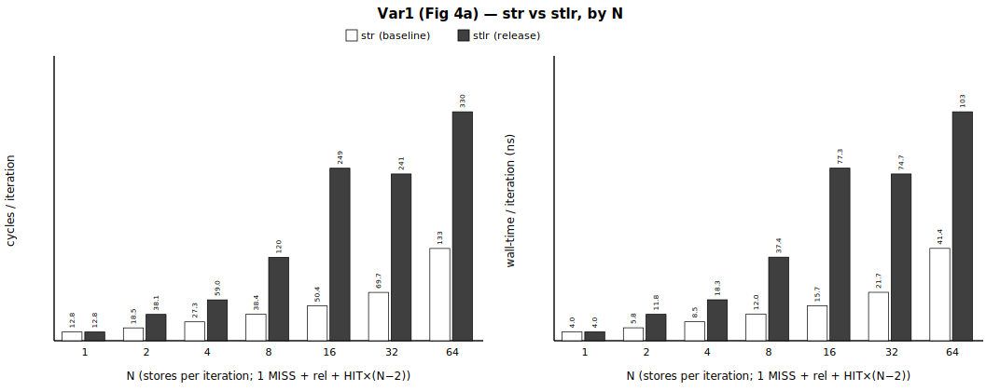
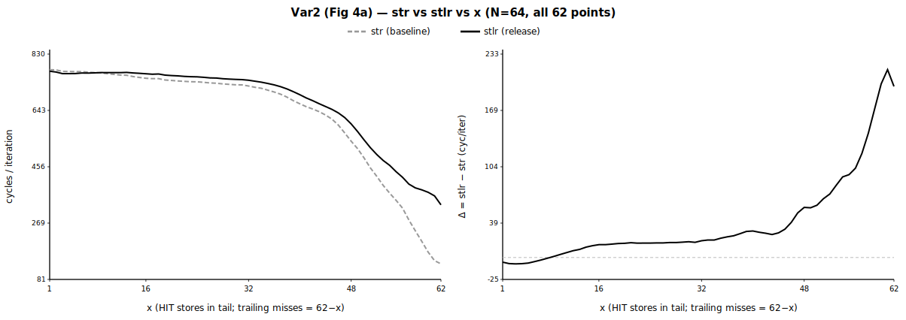

# Group 5 — release serialization (Figure 4 baseline) (`5_release_serialization`)

> **Status** — store-release serialization microbench, **2 variations** (Var1 `N`-sweep + Var2 `x`-sweep), **69/69 gate-clean** (base+treat each 15/15) · paired str-vs-stlr, 1,000,000 iters · regenerated 2026-06-12.

**Pair with** — methodology spec [`../METHODOLOGY.md`](../METHODOLOGY.md) (§9) · master report [`../README.md`](../README.md) · the locked data [`out/release_serial.csv`](out/release_serial.csv) · per-repeat detail + gate reasons [`out/run.log`](out/run.log) · objdump [`out/objdump.snippet`](out/objdump.snippet).

## At a glance

Per-iteration cost `cyc/iter = total_cycles / iters`, median over 15 repeats, **baseline = plain `str`** vs **treatment = store-release `stlr`** at store position 1. **Δ = `stlr` − `str`** is the release's serialization cost. Both variations measure the **Figure 4(a) baseline** (no TEMPO); 4(b) is gem5-only and not hardware-measurable.

**Variation 1 — `N` sweep** (per iter = `[MISS] [rel] [HIT×(N−2)]`; `N=1` = single MISS, no release → floor; **bar chart in *Result*** below):

| N | `str` (base) | `stlr` (treat) | **Δ = stlr−str** | gate |
|---|---|---|---|---|
| 1 | 12.8 cyc (4.0 ns) | 12.8 cyc (4.0 ns) | **-0.0*** cyc (**-0.0*** ns) | PASS ✓ |
| 2 | 18.5 cyc (5.8 ns) | 38.1 cyc (11.8 ns) | **+19.5** cyc (**+6.1** ns) | PASS ✓ |
| 4 | 27.3 cyc (8.5 ns) | 59.0 cyc (18.3 ns) | **+31.6** cyc (**+9.8** ns) | PASS ✓ |
| 8 | 38.4 cyc (12.0 ns) | 120.5 cyc (37.4 ns) | **+82.0** cyc (**+25.5** ns) | PASS ✓ |
| 16 | 50.4 cyc (15.7 ns) | 249.0 cyc (77.3 ns) | **+198.7** cyc (**+61.6** ns) | PASS ✓ |
| 32 | 69.7 cyc (21.7 ns) | 240.7 cyc (74.7 ns) | **+170.9** cyc (**+53.0** ns) | PASS ✓ |
| 64 | 133.1 cyc (41.4 ns) | 330.4 cyc (102.5 ns) | **+197.3** cyc (**+61.2** ns) | PASS ✓ |

**Variation 2 — `x` sweep** (`N=64`, per iter = `[MISS] [rel] [HIT×x] [MISS×(62−x)]`, block layout; representative points — full 62-row sweep + **line graph in *Result*** below):

| x | `str` (base) | `stlr` (treat) | **Δ = stlr−str** | gate |
|---|---|---|---|---|
| 1 | 778.8 cyc (242.2 ns) | 773.5 cyc (240.5 ns) | **-5.3** cyc (**-1.6** ns) | PASS ✓ |
| 2 | 777.8 cyc (241.8 ns) | 770.8 cyc (239.7 ns) | **-7.0** cyc (**-2.1** ns) | PASS ✓ |
| 4 | 772.6 cyc (240.3 ns) | 765.5 cyc (238.0 ns) | **-7.1** cyc (**-2.3** ns) | PASS ✓ |
| 8 | 768.9 cyc (239.1 ns) | 768.1 cyc (238.9 ns) | **-0.8** cyc (**-0.2** ns) | PASS ✓ |
| 16 | 750.2 cyc (233.3 ns) | 765.0 cyc (237.8 ns) | **+14.8** cyc (**+4.5** ns) | PASS ✓ |
| 32 | 724.3 cyc (225.2 ns) | 743.5 cyc (231.2 ns) | **+19.2** cyc (**+6.0** ns) | PASS ✓ |
| 48 | 540.8 cyc (168.1 ns) | 598.3 cyc (185.9 ns) | **+57.5** cyc (**+17.8** ns) | PASS ✓ |
| 62 | 133.1 cyc (41.4 ns) | 329.3 cyc (102.2 ns) | **+196.3** cyc (**+60.9** ns) | PASS ✓ |

> **Take.** A store-release preceded by a cache-missing store **stalls retirement until that po-older store drains**, serializing the stream — a plain `str` retires first and keeps memory-level parallelism (MLP). Var1: Δ **rises off the N=1 floor as N grows** (more independent cross-iteration MLP for the release to destroy) — **+197.3 cyc/iter** at N=64 (peak **+198.7** at N=16). Var2 (N=64): **Δ ∝ x** — ≈0/negative when the tail is miss-saturated (x=1: -5.3) and rising toward its max as the tail loses misses (x=62: +196.3; peak +215.4 at x=61). The po-younger trailing misses drain *during* the release's retirement stall, so they raise the baseline rather than being serialized. At the most-saturated floor (low x) Δ is even slightly **negative** — not noise: at identical cache traffic the release *reduces* backend-memory stall (it throttles store run-ahead, cutting oversubscription), a real PMU-confirmed effect ([`out/floor_probe.csv`](out/floor_probe.csv)). This Var2 direction is intentional (confirmed with the team).

## Metadata

Machine / environment:

| field | value |
|---|---|
| Node | `rg-uwing-1` (CRNCH), reached from `rg-login` via `srun --jobid=<J>` |
| Arch/CPU | aarch64, **ARM Neoverse-V2** (Grace), 72 cores |
| Clock | **3.375 GHz fixed**, governor `performance` (1 cyc ≈ 0.296 ns) |
| Cache | line 64 B; L1d 64 KiB/core; L2 1 MiB/core; L3 ~114 MiB shared |
| NUMA | node 0 = 72 cores + 490 GB local (**membind here**); node 1 = GPU HBM (avoid) |
| ISA | **LSE atomics** + **RCpc `ldapr`**, SVE2 |
| Kernel | 6.8.0-1051-nvidia-64k |
| Compiler | gcc 11.4.0, `-O2 -march=native -pthread` |
| PMU | `perf_event_open()` (perf CLI broken): cycles, instructions, l1d_refill(0x03), l2d_refill(0x17), ll_miss_rd(0x37), mem_access(0x13), stall_be_mem(0x4005) + SW noise |

Experiment variables:

| field | value |
|---|---|
| variations | Var1 (Fig 4a, `N`-sweep) · Var2 (Fig 4a, `x`-sweep, `N=64`, block layout) |
| baseline / treatment | plain `str` / store-release `stlr` at store **position 1** (paired in one process) |
| Var1 axis N | 1, 2, 4, 8, 16, 32, 64 |
| Var2 axis x | 1 … 62 (all 62) at N=64 |
| iters / repeats | 1,000,000 / 15 |
| miss region (`DRAM_WS`) | 512 MiB, register-hash addressing (prefetcher-defeated, register-only) |
| HIT region (`HIT_BYTES`) | 16 KiB resident (≤ L1), warmed |
| measurement | PAIRED: `str` baseline + `stlr` treatment in ONE process per repeat; PMU cycles + independent CLOCK_MONOTONIC_RAW wall-time |
| cpu / numa bind | core 0 / membind 0 |
| build | sha256 `2338878f640c56bf…`, gcc 11, `-O2 -march=native -Wall -Wextra -pthread` |

## What this measures

Cost of a **store-release `stlr`** placed at position 1 of a store stream whose **store 0 is a cache-missing store** (DRAM-resident, register-hash addressed). Per iteration the stream is `[MISS] [rel] [HIT×…] [MISS×…]`; the release's retirement is held until the po-older MISS drains the merge/write buffer, so the stream **serializes** — whereas a plain `str` retires before draining and keeps memory-level parallelism. **Window:** store issue → **retire** (the drain-induced retirement stall). **Metric:** per-iteration `cyc/iter = total_cycles/iters`, **Δ = `stlr` − `str`**, median over 15 repeats. Credible source: [`out/release_serial.csv`](out/release_serial.csv) + this README.

> **Paper claim this measures** — Figure 4(a): *"② cannot retire until the merge-buffer entry of po-older store ① drains. Because retirement is in order, this also prevents ③ from passing ② in the ROB"* and §Motivation: *"the ordering requirements of full fences and store-release instructions are commonly enforced by **draining older stores before retirement, which stalls commit**."* Method spec: [**METHODOLOGY §9**](../METHODOLOGY.md#9-release-serialization-microbench-g5-figure-4-baseline).

> **Both variations are the Figure 4(a) baseline** (conventional hardware). Figure 4(b) is *with TEMPO*, a gem5-only microarchitecture — **not measurable on real silicon**, so no 4(b) number is produced here.

## Number Repeated Runs

Each `(variation, N/x)` point runs **15 repeats** (warmup discarded, median reported). The gate is evaluated on **every** repeat; `base_gate`/`treat_gate` in the CSV count how many of the 15 passed. A point is gate-clean iff both equal 15.

| variation | points | base gate PASS/total | treat gate PASS/total |
|---|---|---|---|
| Var1 (N sweep) | 7 | 105/105 | 105/105 |
| Var2 (x sweep) | 62 | 930/930 | 930/930 |

## Pattern / cache validation

Two measured numbers prove the mixed stream is the designed one: **`l1_refill/iter` = `miss_count`** (exactly the designed misses — no `idx[]`/chase contaminant) and **`ll_miss_rd/iter` ≈ `miss_count`** (those misses genuinely reach DRAM, not a secret L1 hit), both at **`mux = 1.000`** (no PMU multiplexing). This holds on **all 69 rows → 69/69 gate-clean**. (`stall` is **not** a gate — at the saturated floor `treat stall < base stall`, the real stall-reduction of *Summary*; full per-row counters fold below and live in [`out/release_serial.csv`](out/release_serial.csv).)

| check (per iteration) | proves | all rows |
|---|---|---|
| `l1_refill/iter` ≈ `miss_count` | exactly the designed misses, no contaminant traffic | ✓ |
| `ll_miss_rd/iter` ≥ 0.5·`miss_count` | the misses reach DRAM (don't secretly hit) | ✓ |
| `mux` = 1.000 | no PMU multiplexing | ✓ |

<details><summary>Full per-row counters — all 69 rows (miss · l1/iter · ll/iter · mux · gate)</summary>

| variation | N/x | miss/iter | base l1/iter | treat l1/iter | base ll/iter | treat ll/iter | mux | gate |
|---|---|---|---|---|---|---|---|---|
| 1 | 1 | 1 | 1.00 | 1.00 | 1.00 | 1.00 | 1.000 | PASS ✓ |
| 1 | 2 | 1 | 1.00 | 1.00 | 1.00 | 1.00 | 1.000 | PASS ✓ |
| 1 | 4 | 1 | 1.00 | 1.00 | 1.00 | 1.00 | 1.000 | PASS ✓ |
| 1 | 8 | 1 | 1.01 | 1.01 | 1.00 | 1.00 | 1.000 | PASS ✓ |
| 1 | 16 | 1 | 1.01 | 1.01 | 1.00 | 1.00 | 1.000 | PASS ✓ |
| 1 | 32 | 1 | 1.03 | 1.03 | 1.00 | 1.00 | 1.000 | PASS ✓ |
| 1 | 64 | 1 | 1.06 | 1.06 | 1.00 | 1.00 | 1.000 | PASS ✓ |
| 2 | 1 | 62 | 62.14 | 62.17 | 61.92 | 61.93 | 1.000 | PASS ✓ |
| 2 | 2 | 61 | 61.23 | 61.22 | 60.93 | 60.93 | 1.000 | PASS ✓ |
| 2 | 3 | 60 | 60.32 | 60.31 | 59.92 | 59.93 | 1.000 | PASS ✓ |
| 2 | 4 | 59 | 59.37 | 59.36 | 58.92 | 58.93 | 1.000 | PASS ✓ |
| 2 | 5 | 58 | 58.41 | 58.41 | 57.92 | 57.93 | 1.000 | PASS ✓ |
| 2 | 6 | 57 | 57.41 | 57.41 | 56.92 | 56.93 | 1.000 | PASS ✓ |
| 2 | 7 | 56 | 56.49 | 56.49 | 55.93 | 55.93 | 1.000 | PASS ✓ |
| 2 | 8 | 55 | 55.53 | 55.53 | 54.93 | 54.93 | 1.000 | PASS ✓ |
| 2 | 9 | 54 | 54.57 | 54.57 | 53.93 | 53.94 | 1.000 | PASS ✓ |
| 2 | 10 | 53 | 53.61 | 53.61 | 52.93 | 52.94 | 1.000 | PASS ✓ |
| 2 | 11 | 52 | 52.63 | 52.63 | 51.93 | 51.94 | 1.000 | PASS ✓ |
| 2 | 12 | 51 | 51.68 | 51.68 | 50.93 | 50.94 | 1.000 | PASS ✓ |
| 2 | 13 | 50 | 50.70 | 50.70 | 49.94 | 49.94 | 1.000 | PASS ✓ |
| 2 | 14 | 49 | 49.74 | 49.74 | 48.94 | 48.94 | 1.000 | PASS ✓ |
| 2 | 15 | 48 | 48.77 | 48.77 | 47.94 | 47.94 | 1.000 | PASS ✓ |
| 2 | 16 | 47 | 47.79 | 47.80 | 46.94 | 46.94 | 1.000 | PASS ✓ |
| 2 | 17 | 46 | 46.82 | 46.83 | 45.94 | 45.94 | 1.000 | PASS ✓ |
| 2 | 18 | 45 | 45.82 | 45.83 | 44.94 | 44.94 | 1.000 | PASS ✓ |
| 2 | 19 | 44 | 44.88 | 44.88 | 43.94 | 43.95 | 1.000 | PASS ✓ |
| 2 | 20 | 43 | 43.89 | 43.89 | 42.95 | 42.95 | 1.000 | PASS ✓ |
| 2 | 21 | 42 | 42.90 | 42.91 | 41.95 | 41.95 | 1.000 | PASS ✓ |
| 2 | 22 | 41 | 41.92 | 41.92 | 40.95 | 40.95 | 1.000 | PASS ✓ |
| 2 | 23 | 40 | 40.93 | 40.94 | 39.95 | 39.95 | 1.000 | PASS ✓ |
| 2 | 24 | 39 | 39.95 | 39.97 | 38.96 | 38.96 | 1.000 | PASS ✓ |
| 2 | 25 | 38 | 38.96 | 38.97 | 37.95 | 37.95 | 1.000 | PASS ✓ |
| 2 | 26 | 37 | 37.97 | 37.98 | 36.96 | 36.96 | 1.000 | PASS ✓ |
| 2 | 27 | 36 | 36.98 | 36.99 | 35.96 | 35.96 | 1.000 | PASS ✓ |
| 2 | 28 | 35 | 35.99 | 36.00 | 34.96 | 34.96 | 1.000 | PASS ✓ |
| 2 | 29 | 34 | 34.98 | 34.99 | 33.96 | 33.96 | 1.000 | PASS ✓ |
| 2 | 30 | 33 | 34.03 | 34.03 | 32.96 | 32.96 | 1.000 | PASS ✓ |
| 2 | 31 | 32 | 32.99 | 32.99 | 31.96 | 31.96 | 1.000 | PASS ✓ |
| 2 | 32 | 31 | 31.99 | 32.00 | 30.96 | 30.96 | 1.000 | PASS ✓ |
| 2 | 33 | 30 | 31.00 | 31.01 | 29.96 | 29.96 | 1.000 | PASS ✓ |
| 2 | 34 | 29 | 29.98 | 29.98 | 28.97 | 28.97 | 1.000 | PASS ✓ |
| 2 | 35 | 28 | 28.97 | 28.97 | 27.97 | 27.97 | 1.000 | PASS ✓ |
| 2 | 36 | 27 | 27.96 | 27.96 | 26.97 | 26.97 | 1.000 | PASS ✓ |
| 2 | 37 | 26 | 26.96 | 26.96 | 25.97 | 25.97 | 1.000 | PASS ✓ |
| 2 | 38 | 25 | 25.94 | 25.94 | 24.97 | 24.97 | 1.000 | PASS ✓ |
| 2 | 39 | 24 | 24.93 | 24.93 | 23.97 | 23.97 | 1.000 | PASS ✓ |
| 2 | 40 | 23 | 23.92 | 23.92 | 22.97 | 22.97 | 1.000 | PASS ✓ |
| 2 | 41 | 22 | 22.90 | 22.90 | 21.98 | 21.98 | 1.000 | PASS ✓ |
| 2 | 42 | 21 | 21.88 | 21.88 | 20.98 | 20.98 | 1.000 | PASS ✓ |
| 2 | 43 | 20 | 20.85 | 20.85 | 19.98 | 19.98 | 1.000 | PASS ✓ |
| 2 | 44 | 19 | 19.83 | 19.83 | 18.98 | 18.98 | 1.000 | PASS ✓ |
| 2 | 45 | 18 | 18.80 | 18.81 | 17.98 | 17.98 | 1.000 | PASS ✓ |
| 2 | 46 | 17 | 17.77 | 17.77 | 16.98 | 16.98 | 1.000 | PASS ✓ |
| 2 | 47 | 16 | 16.75 | 16.76 | 15.98 | 15.98 | 1.000 | PASS ✓ |
| 2 | 48 | 15 | 15.71 | 15.72 | 14.98 | 14.98 | 1.000 | PASS ✓ |
| 2 | 49 | 14 | 14.68 | 14.68 | 13.98 | 13.98 | 1.000 | PASS ✓ |
| 2 | 50 | 13 | 13.65 | 13.66 | 12.98 | 12.98 | 1.000 | PASS ✓ |
| 2 | 51 | 12 | 12.61 | 12.61 | 11.98 | 11.99 | 1.000 | PASS ✓ |
| 2 | 52 | 11 | 11.57 | 11.57 | 10.99 | 10.99 | 1.000 | PASS ✓ |
| 2 | 53 | 10 | 10.53 | 10.53 | 9.99 | 9.99 | 1.000 | PASS ✓ |
| 2 | 54 | 9 | 9.49 | 9.48 | 8.99 | 8.99 | 1.000 | PASS ✓ |
| 2 | 55 | 8 | 8.44 | 8.44 | 7.99 | 7.99 | 1.000 | PASS ✓ |
| 2 | 56 | 7 | 7.39 | 7.39 | 6.99 | 6.99 | 1.000 | PASS ✓ |
| 2 | 57 | 6 | 6.34 | 6.34 | 5.99 | 5.99 | 1.000 | PASS ✓ |
| 2 | 58 | 5 | 5.29 | 5.29 | 5.00 | 5.00 | 1.000 | PASS ✓ |
| 2 | 59 | 4 | 4.24 | 4.24 | 4.00 | 4.00 | 1.000 | PASS ✓ |
| 2 | 60 | 3 | 3.18 | 3.18 | 3.00 | 3.00 | 1.000 | PASS ✓ |
| 2 | 61 | 2 | 2.12 | 2.12 | 2.00 | 2.00 | 1.000 | PASS ✓ |
| 2 | 62 | 1 | 1.06 | 1.06 | 1.00 | 1.00 | 1.000 | PASS ✓ |

</details>

## Baseline cost (str reference)

The `str` baseline's run-to-run spread per `(variation, N/x)`, over **n = 15** repeats. **ref** = median (the value used in *Result*); **min–max** = the range; **σ** = 1 standard deviation; **margin = max(|max − ref|, |ref − min|)**. A treatment whose **|Δ| ≤ margin** is statistically equal to baseline (flagged `*` in *At a glance* / *Result*). Var1 + Var2, full.

| variation | N/x | n | ref cyc | min–max cyc | σ cyc | margin ±cyc | ref ns | min–max ns | σ ns | margin ±ns |
|---|---|---|---|---|---|---|---|---|---|---|
| 1 | 1 | 15 | 12.8 | 12.7–12.8 | 0.0 | **0.1** | 4.0 | 4.0–4.0 | 0.0 | **0.0** |
| 1 | 2 | 15 | 18.5 | 18.5–18.6 | 0.1 | **0.1** | 5.8 | 5.8–5.8 | 0.0 | **0.0** |
| 1 | 4 | 15 | 27.3 | 27.2–27.4 | 0.1 | **0.1** | 8.5 | 8.5–8.5 | 0.0 | **0.0** |
| 1 | 8 | 15 | 38.4 | 38.3–38.6 | 0.1 | **0.2** | 12.0 | 11.9–12.0 | 0.0 | **0.1** |
| 1 | 16 | 15 | 50.4 | 50.3–50.5 | 0.1 | **0.2** | 15.7 | 15.7–15.7 | 0.0 | **0.1** |
| 1 | 32 | 15 | 69.7 | 69.7–69.8 | 0.0 | **0.1** | 21.7 | 21.7–21.7 | 0.0 | **0.0** |
| 1 | 64 | 15 | 133.1 | 133.1–138.2 | 1.9 | **5.1** | 41.4 | 41.3–42.9 | 0.6 | **1.6** |
| 2 | 1 | 15 | 778.8 | 778.6–779.9 | 0.3 | **1.1** | 242.2 | 242.1–242.6 | 0.1 | **0.4** |
| 2 | 2 | 15 | 777.8 | 777.7–778.0 | 0.1 | **0.2** | 241.8 | 241.8–242.0 | 0.1 | **0.2** |
| 2 | 3 | 15 | 773.0 | 772.9–773.1 | 0.1 | **0.1** | 240.3 | 240.3–240.4 | 0.0 | **0.0** |
| 2 | 4 | 15 | 772.6 | 772.4–772.9 | 0.1 | **0.3** | 240.3 | 240.2–240.4 | 0.1 | **0.2** |
| 2 | 5 | 15 | 772.2 | 772.1–772.6 | 0.1 | **0.3** | 240.2 | 240.1–240.3 | 0.1 | **0.2** |
| 2 | 6 | 15 | 772.2 | 772.1–772.5 | 0.1 | **0.4** | 240.2 | 240.1–240.3 | 0.1 | **0.1** |
| 2 | 7 | 15 | 770.2 | 770.0–770.4 | 0.1 | **0.2** | 239.6 | 239.5–239.7 | 0.1 | **0.1** |
| 2 | 8 | 15 | 768.9 | 768.8–769.1 | 0.1 | **0.2** | 239.1 | 239.1–239.3 | 0.1 | **0.1** |
| 2 | 9 | 15 | 767.8 | 767.2–768.4 | 0.3 | **0.6** | 238.8 | 238.6–239.0 | 0.1 | **0.2** |
| 2 | 10 | 15 | 765.2 | 765.1–765.4 | 0.1 | **0.2** | 238.0 | 237.9–238.1 | 0.1 | **0.1** |
| 2 | 11 | 15 | 763.1 | 762.9–763.3 | 0.1 | **0.2** | 237.3 | 237.2–237.4 | 0.1 | **0.1** |
| 2 | 12 | 15 | 760.8 | 760.7–761.0 | 0.1 | **0.2** | 236.6 | 236.5–236.8 | 0.1 | **0.1** |
| 2 | 13 | 15 | 760.1 | 760.0–760.4 | 0.1 | **0.2** | 236.4 | 236.3–236.5 | 0.1 | **0.1** |
| 2 | 14 | 15 | 755.8 | 755.7–756.1 | 0.1 | **0.3** | 235.1 | 235.0–235.2 | 0.1 | **0.1** |
| 2 | 15 | 15 | 752.9 | 752.9–753.1 | 0.1 | **0.1** | 234.1 | 234.1–234.2 | 0.0 | **0.1** |
| 2 | 16 | 15 | 750.2 | 750.0–750.4 | 0.1 | **0.2** | 233.3 | 233.1–233.4 | 0.1 | **0.1** |
| 2 | 17 | 15 | 748.8 | 748.6–749.0 | 0.1 | **0.2** | 232.8 | 232.7–232.8 | 0.0 | **0.1** |
| 2 | 18 | 15 | 748.9 | 748.8–749.1 | 0.1 | **0.2** | 232.8 | 232.8–233.0 | 0.1 | **0.2** |
| 2 | 19 | 15 | 744.4 | 744.3–744.5 | 0.1 | **0.2** | 231.5 | 231.4–231.6 | 0.0 | **0.1** |
| 2 | 20 | 15 | 742.9 | 742.6–743.3 | 0.2 | **0.4** | 230.9 | 230.9–231.1 | 0.1 | **0.1** |
| 2 | 21 | 15 | 741.1 | 740.8–741.3 | 0.1 | **0.3** | 230.5 | 230.4–230.6 | 0.1 | **0.1** |
| 2 | 22 | 15 | 739.9 | 739.7–740.3 | 0.1 | **0.5** | 230.0 | 230.0–230.3 | 0.1 | **0.2** |
| 2 | 23 | 15 | 738.7 | 738.5–739.0 | 0.1 | **0.3** | 229.8 | 229.6–229.9 | 0.1 | **0.1** |
| 2 | 24 | 15 | 738.3 | 737.5–760.2 | 7.4 | **21.9** | 229.7 | 229.4–236.7 | 2.4 | **7.0** |
| 2 | 25 | 15 | 736.5 | 736.2–737.7 | 0.4 | **1.2** | 229.0 | 228.9–229.3 | 0.1 | **0.3** |
| 2 | 26 | 15 | 734.5 | 734.4–734.8 | 0.1 | **0.2** | 228.4 | 228.3–228.5 | 0.1 | **0.1** |
| 2 | 27 | 15 | 733.7 | 733.5–733.8 | 0.1 | **0.2** | 228.2 | 228.1–228.2 | 0.0 | **0.1** |
| 2 | 28 | 15 | 731.3 | 731.1–731.4 | 0.1 | **0.1** | 227.4 | 227.3–227.5 | 0.0 | **0.1** |
| 2 | 29 | 15 | 729.9 | 729.8–730.0 | 0.1 | **0.1** | 226.9 | 226.8–227.0 | 0.1 | **0.1** |
| 2 | 30 | 15 | 728.3 | 728.0–728.6 | 0.1 | **0.3** | 226.4 | 226.3–226.6 | 0.1 | **0.1** |
| 2 | 31 | 15 | 728.0 | 727.3–730.0 | 0.7 | **1.9** | 226.3 | 226.1–226.9 | 0.2 | **0.6** |
| 2 | 32 | 15 | 724.3 | 724.2–724.5 | 0.1 | **0.2** | 225.2 | 225.1–225.3 | 0.1 | **0.2** |
| 2 | 33 | 15 | 720.2 | 719.9–720.4 | 0.1 | **0.3** | 223.9 | 223.8–224.1 | 0.1 | **0.2** |
| 2 | 34 | 15 | 716.9 | 716.7–717.5 | 0.2 | **0.5** | 222.9 | 222.8–223.1 | 0.1 | **0.2** |
| 2 | 35 | 15 | 710.7 | 710.5–710.8 | 0.1 | **0.2** | 220.9 | 220.9–221.0 | 0.0 | **0.1** |
| 2 | 36 | 15 | 704.4 | 704.2–704.6 | 0.1 | **0.2** | 219.0 | 218.9–219.2 | 0.1 | **0.2** |
| 2 | 37 | 15 | 697.1 | 696.9–697.3 | 0.1 | **0.2** | 216.7 | 216.6–216.8 | 0.1 | **0.1** |
| 2 | 38 | 15 | 687.3 | 687.0–687.8 | 0.2 | **0.5** | 213.7 | 213.5–213.8 | 0.1 | **0.2** |
| 2 | 39 | 15 | 675.4 | 675.2–677.3 | 0.5 | **1.9** | 209.9 | 209.8–210.6 | 0.2 | **0.6** |
| 2 | 40 | 15 | 665.1 | 664.8–665.4 | 0.2 | **0.3** | 206.8 | 206.6–206.9 | 0.1 | **0.1** |
| 2 | 41 | 15 | 655.7 | 655.5–655.9 | 0.1 | **0.2** | 203.8 | 203.7–204.0 | 0.1 | **0.2** |
| 2 | 42 | 15 | 647.8 | 646.8–649.1 | 0.7 | **1.3** | 201.3 | 201.0–201.8 | 0.2 | **0.5** |
| 2 | 43 | 15 | 639.2 | 638.9–639.7 | 0.2 | **0.5** | 198.7 | 198.6–198.8 | 0.1 | **0.1** |
| 2 | 44 | 15 | 628.0 | 627.9–628.3 | 0.2 | **0.3** | 195.2 | 195.1–195.7 | 0.1 | **0.4** |
| 2 | 45 | 15 | 614.3 | 613.2–614.5 | 0.5 | **1.1** | 190.9 | 190.6–191.0 | 0.2 | **0.4** |
| 2 | 46 | 15 | 594.5 | 594.3–594.9 | 0.1 | **0.3** | 184.8 | 184.7–184.9 | 0.1 | **0.1** |
| 2 | 47 | 15 | 568.4 | 568.1–568.7 | 0.2 | **0.3** | 176.7 | 176.6–176.8 | 0.1 | **0.1** |
| 2 | 48 | 15 | 540.8 | 540.6–542.5 | 0.5 | **1.8** | 168.1 | 168.0–168.7 | 0.2 | **0.5** |
| 2 | 49 | 15 | 516.0 | 514.9–516.2 | 0.3 | **1.1** | 160.4 | 160.0–160.4 | 0.1 | **0.4** |
| 2 | 50 | 15 | 485.6 | 485.4–486.3 | 0.2 | **0.6** | 151.0 | 150.9–151.2 | 0.1 | **0.2** |
| 2 | 51 | 15 | 452.1 | 452.0–452.6 | 0.2 | **0.5** | 140.6 | 140.5–140.8 | 0.1 | **0.2** |
| 2 | 52 | 15 | 423.6 | 423.4–424.2 | 0.2 | **0.6** | 131.7 | 131.6–131.9 | 0.1 | **0.2** |
| 2 | 53 | 15 | 393.8 | 393.7–394.1 | 0.1 | **0.3** | 122.4 | 122.4–122.5 | 0.1 | **0.1** |
| 2 | 54 | 15 | 368.2 | 368.1–368.6 | 0.1 | **0.3** | 114.5 | 114.4–114.6 | 0.1 | **0.1** |
| 2 | 55 | 15 | 344.6 | 344.4–345.1 | 0.2 | **0.4** | 107.1 | 107.1–107.3 | 0.1 | **0.2** |
| 2 | 56 | 15 | 318.6 | 318.4–318.7 | 0.1 | **0.2** | 99.0 | 99.0–99.1 | 0.1 | **0.1** |
| 2 | 57 | 15 | 279.0 | 278.9–279.1 | 0.1 | **0.1** | 86.7 | 86.7–87.2 | 0.1 | **0.4** |
| 2 | 58 | 15 | 243.3 | 243.2–243.4 | 0.1 | **0.1** | 75.7 | 75.6–75.7 | 0.0 | **0.1** |
| 2 | 59 | 15 | 208.6 | 208.5–210.2 | 0.4 | **1.5** | 64.9 | 64.8–65.3 | 0.1 | **0.5** |
| 2 | 60 | 15 | 172.0 | 171.8–172.4 | 0.1 | **0.5** | 53.5 | 53.4–53.6 | 0.0 | **0.1** |
| 2 | 61 | 15 | 143.7 | 138.8–146.3 | 2.3 | **4.9** | 44.7 | 43.1–45.5 | 0.7 | **1.6** |
| 2 | 62 | 15 | 133.1 | 133.1–133.1 | 0.0 | **0.0** | 41.4 | 41.3–41.4 | 0.0 | **0.0** |

## Result

- **Tested** — a store-release `stlr` at position 1, preceded by a cache-missing store, over the mixed `[MISS][rel][HIT…][MISS…]` stream; iterations independent (the release itself is the serializer — see METHODOLOGY §9, Construction / Method-evolution).
- **Compared** — the same stream with a plain `str` at position 1 (baseline) vs `stlr` (treatment), interleaved in ONE process per repeat (paired).
- **Result value** — **Δ = `stlr` − `str`** per iteration (`cyc/iter`, `ns/iter`), median over 15 repeats = the release's serialization cost.

**objdump proof** — the release position emits a real `stlr` (treatment); baseline is a plain `str` to the **same dest register + address** (the only difference is the opcode). From [`out/objdump.full`](out/objdump.full) (`stlr present? 1`; the 39 `nop`s are gcc alignment-only — this bench uses no NOP padding):

```
3380:	f900010c 	str	x12, [x8]      // baseline (STR)
3348:	c89ffd0c 	stlr	x12, [x8]      // treatment (STLR)
```
build `sha256=2338878f640c56bf…`, gcc 11.

### Variation 1 (Fig 4a, N sweep)

Per iter = `[MISS] [rel] [HIT×(N−2)]`. `N=1` = single MISS, no release ⇒ `base == treat` floor (Δ≈0, expected). Δ grows as N adds cross-iteration MLP for the release to destroy.

**Bar chart** — `str` vs `stlr` per iteration (cycles & wall-time), grouped by N:



| N | `str` base cyc (ns) | `stlr` treat cyc (ns) | **Δ cyc (ns)** | gate |
|---|---|---|---|---|
| 1 | 12.8 cyc (4.0 ns) | 12.8 cyc (4.0 ns) | **-0.0*** cyc (**-0.0*** ns) | PASS ✓ |
| 2 | 18.5 cyc (5.8 ns) | 38.1 cyc (11.8 ns) | **+19.5** cyc (**+6.1** ns) | PASS ✓ |
| 4 | 27.3 cyc (8.5 ns) | 59.0 cyc (18.3 ns) | **+31.6** cyc (**+9.8** ns) | PASS ✓ |
| 8 | 38.4 cyc (12.0 ns) | 120.5 cyc (37.4 ns) | **+82.0** cyc (**+25.5** ns) | PASS ✓ |
| 16 | 50.4 cyc (15.7 ns) | 249.0 cyc (77.3 ns) | **+198.7** cyc (**+61.6** ns) | PASS ✓ |
| 32 | 69.7 cyc (21.7 ns) | 240.7 cyc (74.7 ns) | **+170.9** cyc (**+53.0** ns) | PASS ✓ |
| 64 | 133.1 cyc (41.4 ns) | 330.4 cyc (102.5 ns) | **+197.3** cyc (**+61.2** ns) | PASS ✓ |

### Variation 2 (Fig 4a, x sweep)

`N=64`, per iter = `[MISS] [rel] [HIT×x] [MISS×(62−x)]` (block). **Δ ∝ x**: the release penalty is largest when the tail has the FEWEST misses (high x) and ≈0 when the tail is miss-saturated (low x) — the po-younger trailing misses drain *during* the release's retirement stall (the release orders po-*older* stores, not po-younger), so they raise the baseline, not the Δ.

**Line graph** — all 62 points: `str` & `stlr` cyc/iter (top) and **Δ = stlr−str** with a 0-line (bottom). Note the negative Δ at the saturated floor (low x) and the crossover:



Full 62-row sweep:

| x | miss/iter | `str` base cyc (ns) | `stlr` treat cyc (ns) | **Δ cyc (ns)** | gate |
|---|---|---|---|---|---|
| 1 | 62 | 778.8 cyc (242.2 ns) | 773.5 cyc (240.5 ns) | **-5.3** cyc (**-1.6** ns) | PASS ✓ |
| 2 | 61 | 777.8 cyc (241.8 ns) | 770.8 cyc (239.7 ns) | **-7.0** cyc (**-2.1** ns) | PASS ✓ |
| 3 | 60 | 773.0 cyc (240.3 ns) | 765.7 cyc (238.1 ns) | **-7.3** cyc (**-2.2** ns) | PASS ✓ |
| 4 | 59 | 772.6 cyc (240.3 ns) | 765.5 cyc (238.0 ns) | **-7.1** cyc (**-2.3** ns) | PASS ✓ |
| 5 | 58 | 772.2 cyc (240.2 ns) | 765.9 cyc (238.2 ns) | **-6.4** cyc (**-2.0** ns) | PASS ✓ |
| 6 | 57 | 772.2 cyc (240.2 ns) | 767.5 cyc (238.7 ns) | **-4.7** cyc (**-1.5** ns) | PASS ✓ |
| 7 | 56 | 770.2 cyc (239.6 ns) | 767.3 cyc (238.7 ns) | **-2.9** cyc (**-0.9** ns) | PASS ✓ |
| 8 | 55 | 768.9 cyc (239.1 ns) | 768.1 cyc (238.9 ns) | **-0.8** cyc (**-0.2** ns) | PASS ✓ |
| 9 | 54 | 767.8 cyc (238.8 ns) | 769.1 cyc (239.1 ns) | **+1.3** cyc (**+0.3** ns) | PASS ✓ |
| 10 | 53 | 765.2 cyc (238.0 ns) | 768.8 cyc (239.1 ns) | **+3.6** cyc (**+1.2** ns) | PASS ✓ |
| 11 | 52 | 763.1 cyc (237.3 ns) | 768.8 cyc (239.1 ns) | **+5.7** cyc (**+1.8** ns) | PASS ✓ |
| 12 | 51 | 760.8 cyc (236.6 ns) | 768.7 cyc (239.0 ns) | **+7.9** cyc (**+2.4** ns) | PASS ✓ |
| 13 | 50 | 760.1 cyc (236.4 ns) | 769.5 cyc (239.3 ns) | **+9.3** cyc (**+2.9** ns) | PASS ✓ |
| 14 | 49 | 755.8 cyc (235.1 ns) | 767.7 cyc (238.8 ns) | **+11.9** cyc (**+3.7** ns) | PASS ✓ |
| 15 | 48 | 752.9 cyc (234.1 ns) | 766.5 cyc (238.3 ns) | **+13.5** cyc (**+4.2** ns) | PASS ✓ |
| 16 | 47 | 750.2 cyc (233.3 ns) | 765.0 cyc (237.8 ns) | **+14.8** cyc (**+4.5** ns) | PASS ✓ |
| 17 | 46 | 748.8 cyc (232.8 ns) | 763.5 cyc (237.3 ns) | **+14.7** cyc (**+4.6** ns) | PASS ✓ |
| 18 | 45 | 748.9 cyc (232.8 ns) | 764.2 cyc (237.6 ns) | **+15.3** cyc (**+4.8** ns) | PASS ✓ |
| 19 | 44 | 744.4 cyc (231.5 ns) | 760.5 cyc (236.4 ns) | **+16.0** cyc (**+5.0** ns) | PASS ✓ |
| 20 | 43 | 742.9 cyc (230.9 ns) | 759.2 cyc (236.1 ns) | **+16.2** cyc (**+5.1** ns) | PASS ✓ |
| 21 | 42 | 741.1 cyc (230.5 ns) | 758.1 cyc (235.7 ns) | **+17.0** cyc (**+5.2** ns) | PASS ✓ |
| 22 | 41 | 739.9 cyc (230.0 ns) | 756.3 cyc (235.2 ns) | **+16.4** cyc (**+5.1** ns) | PASS ✓ |
| 23 | 40 | 738.7 cyc (229.8 ns) | 755.2 cyc (234.8 ns) | **+16.5** cyc (**+5.1** ns) | PASS ✓ |
| 24 | 39 | 738.3 cyc (229.7 ns) | 754.8 cyc (234.8 ns) | **+16.5*** cyc (**+5.1*** ns) | PASS ✓ |
| 25 | 38 | 736.5 cyc (229.0 ns) | 753.2 cyc (234.3 ns) | **+16.8** cyc (**+5.2** ns) | PASS ✓ |
| 26 | 37 | 734.5 cyc (228.4 ns) | 751.3 cyc (233.6 ns) | **+16.7** cyc (**+5.2** ns) | PASS ✓ |
| 27 | 36 | 733.7 cyc (228.2 ns) | 750.8 cyc (233.4 ns) | **+17.1** cyc (**+5.3** ns) | PASS ✓ |
| 28 | 35 | 731.3 cyc (227.4 ns) | 748.5 cyc (232.8 ns) | **+17.2** cyc (**+5.4** ns) | PASS ✓ |
| 29 | 34 | 729.9 cyc (226.9 ns) | 747.4 cyc (232.4 ns) | **+17.6** cyc (**+5.5** ns) | PASS ✓ |
| 30 | 33 | 728.3 cyc (226.4 ns) | 746.4 cyc (232.0 ns) | **+18.1** cyc (**+5.6** ns) | PASS ✓ |
| 31 | 32 | 728.0 cyc (226.3 ns) | 745.5 cyc (231.8 ns) | **+17.4** cyc (**+5.5** ns) | PASS ✓ |
| 32 | 31 | 724.3 cyc (225.2 ns) | 743.5 cyc (231.2 ns) | **+19.2** cyc (**+6.0** ns) | PASS ✓ |
| 33 | 30 | 720.2 cyc (223.9 ns) | 740.2 cyc (230.1 ns) | **+20.1** cyc (**+6.2** ns) | PASS ✓ |
| 34 | 29 | 716.9 cyc (222.9 ns) | 737.0 cyc (229.1 ns) | **+20.1** cyc (**+6.2** ns) | PASS ✓ |
| 35 | 28 | 710.7 cyc (220.9 ns) | 732.8 cyc (227.8 ns) | **+22.1** cyc (**+6.9** ns) | PASS ✓ |
| 36 | 27 | 704.4 cyc (219.0 ns) | 728.0 cyc (226.4 ns) | **+23.7** cyc (**+7.4** ns) | PASS ✓ |
| 37 | 26 | 697.1 cyc (216.7 ns) | 722.0 cyc (224.4 ns) | **+24.9** cyc (**+7.7** ns) | PASS ✓ |
| 38 | 25 | 687.3 cyc (213.7 ns) | 714.6 cyc (222.2 ns) | **+27.3** cyc (**+8.5** ns) | PASS ✓ |
| 39 | 24 | 675.4 cyc (209.9 ns) | 705.3 cyc (219.2 ns) | **+29.9** cyc (**+9.3** ns) | PASS ✓ |
| 40 | 23 | 665.1 cyc (206.8 ns) | 695.5 cyc (216.2 ns) | **+30.4** cyc (**+9.4** ns) | PASS ✓ |
| 41 | 22 | 655.7 cyc (203.8 ns) | 684.7 cyc (212.8 ns) | **+28.9** cyc (**+9.0** ns) | PASS ✓ |
| 42 | 21 | 647.8 cyc (201.3 ns) | 675.7 cyc (210.0 ns) | **+27.9** cyc (**+8.7** ns) | PASS ✓ |
| 43 | 20 | 639.2 cyc (198.7 ns) | 665.6 cyc (206.9 ns) | **+26.4** cyc (**+8.2** ns) | PASS ✓ |
| 44 | 19 | 628.0 cyc (195.2 ns) | 656.3 cyc (204.0 ns) | **+28.2** cyc (**+8.8** ns) | PASS ✓ |
| 45 | 18 | 614.3 cyc (190.9 ns) | 646.7 cyc (201.0 ns) | **+32.5** cyc (**+10.1** ns) | PASS ✓ |
| 46 | 17 | 594.5 cyc (184.8 ns) | 634.9 cyc (197.3 ns) | **+40.3** cyc (**+12.5** ns) | PASS ✓ |
| 47 | 16 | 568.4 cyc (176.7 ns) | 619.5 cyc (192.6 ns) | **+51.1** cyc (**+15.8** ns) | PASS ✓ |
| 48 | 15 | 540.8 cyc (168.1 ns) | 598.3 cyc (185.9 ns) | **+57.5** cyc (**+17.8** ns) | PASS ✓ |
| 49 | 14 | 516.0 cyc (160.4 ns) | 573.0 cyc (178.1 ns) | **+57.0** cyc (**+17.7** ns) | PASS ✓ |
| 50 | 13 | 485.6 cyc (151.0 ns) | 545.6 cyc (169.6 ns) | **+59.9** cyc (**+18.6** ns) | PASS ✓ |
| 51 | 12 | 452.1 cyc (140.6 ns) | 519.4 cyc (161.5 ns) | **+67.3** cyc (**+20.9** ns) | PASS ✓ |
| 52 | 11 | 423.6 cyc (131.7 ns) | 496.5 cyc (154.3 ns) | **+72.8** cyc (**+22.6** ns) | PASS ✓ |
| 53 | 10 | 393.8 cyc (122.4 ns) | 476.7 cyc (148.2 ns) | **+82.9** cyc (**+25.8** ns) | PASS ✓ |
| 54 | 9 | 368.2 cyc (114.5 ns) | 460.7 cyc (143.2 ns) | **+92.5** cyc (**+28.7** ns) | PASS ✓ |
| 55 | 8 | 344.6 cyc (107.1 ns) | 439.6 cyc (136.6 ns) | **+95.0** cyc (**+29.5** ns) | PASS ✓ |
| 56 | 7 | 318.6 cyc (99.0 ns) | 421.1 cyc (130.9 ns) | **+102.5** cyc (**+31.8** ns) | PASS ✓ |
| 57 | 6 | 279.0 cyc (86.7 ns) | 398.4 cyc (123.8 ns) | **+119.3** cyc (**+37.1** ns) | PASS ✓ |
| 58 | 5 | 243.3 cyc (75.7 ns) | 385.7 cyc (119.9 ns) | **+142.4** cyc (**+44.2** ns) | PASS ✓ |
| 59 | 4 | 208.6 cyc (64.9 ns) | 379.3 cyc (117.8 ns) | **+170.7** cyc (**+53.0** ns) | PASS ✓ |
| 60 | 3 | 172.0 cyc (53.5 ns) | 371.0 cyc (115.3 ns) | **+199.1** cyc (**+61.8** ns) | PASS ✓ |
| 61 | 2 | 143.7 cyc (44.7 ns) | 359.2 cyc (111.5 ns) | **+215.4** cyc (**+66.8** ns) | PASS ✓ |
| 62 | 1 | 133.1 cyc (41.4 ns) | 329.3 cyc (102.2 ns) | **+196.3** cyc (**+60.9** ns) | PASS ✓ |

*`*` = |Δ| ≤ the baseline's run-to-run margin (*Baseline cost* above) → statistically equal to baseline (no measurable release cost). A `*`-free small **negative** at the saturated floor is the real stall-reduction effect (below), beyond run-to-run noise — not an artifact.*

## Summary

- **The release is the serializer.** A store-release `stlr` cannot retire until every po-older store ahead of it drains the merge/write buffer; with a cache-missing store ahead, that drain is long, and because retirement is in order the whole stream stalls behind it — the core loses the memory-level parallelism it would otherwise have across iterations. A plain `str` retires before completing, so it keeps that MLP and runs fast. **Δ = `stlr` − `str`** is exactly that lost parallelism.
- **Var1: Δ rises with N off the N=1 floor.** Larger N gives the out-of-order core more independent cross-iteration work that the release's retirement stall destroys, so the per-iteration penalty climbs from the N=1 floor into the high-N range (the Result table has the exact per-N values, including the texture around N=16–64).
- **Var2: Δ ∝ x (intentional).** With `N=64` fixed, increasing x (more HITs, fewer trailing misses) makes the release penalty *larger*. The release's cost is the cross-iteration MLP it destroys, which is only visible when the iteration's own stores don't already saturate memory bandwidth; the po-younger trailing misses drain *during* the release's stall (it orders po-older stores, not po-younger), so they raise the baseline rather than being serialized by it. Hence the penalty grows as the tail loses misses, approaching its maximum at the fewest-miss (high-x) end. Confirmed with the team — not a bug.
- **The saturated floor (low x) is a real, small stall-reduction — not a measurement artifact.** There Δ is slightly **negative** (`stlr` a few cyc/iter *faster* than `str`). A PMU probe ([`out/floor_probe.csv`](out/floor_probe.csv), [`out/floor_warm.csv`](out/floor_warm.csv)) shows it is **invariant to warm flavor, warm presence, and pass order**, and is driven by `treat stall < base stall` at **identical** `l1`/`ll` traffic: the release throttles store run-ahead, cutting backend-memory oversubscription, so the same misses overlap slightly better and the stream costs marginally fewer cycles. As x rises the stall-reduction fades and the release's drain cost takes over (Δ turns positive partway through the sweep). The measurement symmetry hardening (per-repeat warm + ping-pong order) was added and does **not** remove it — confirming it is real, not a first-mover bias (METHODOLOGY §9.6).

## Paper alignment

**Claim** (paper Fig 4(a) / §Motivation): a store-release's retirement is *"enforced by draining older stores before retirement, which stalls commit"* — *"② cannot retire until the merge-buffer entry of po-older store ① drains … prevents ③ from passing ② in the ROB."*

**Measured**: on real Neoverse-V2 hardware, a `stlr` preceded by a cache-missing store costs **Δ = +197.3 cyc/iter at N=64** (Var1) over the identical `str` stream, and the penalty tracks the available cross-iteration MLP (Var2 Δ ∝ x); a plain `str` pays none of it (retires before draining).

**Alignment**: **directly confirms the Figure 4(a) baseline** — the drain-induced retirement stall of a store-release in a cache-missing store stream, on real silicon. **Both variations are the 4(a) baseline**; Figure 4(b) (*with TEMPO*) is a gem5-only microarchitecture and is **not** hardware-measurable, so no 4(b) number is claimed.


---

*Auto-generated by `lib/parse_g5.py` from the locked `out/release_serial.csv` on 2026-06-12. **Numbers** → [`out/release_serial.csv`](out/release_serial.csv) (+ per-repeat gate reasons in `out/run.log`). **Method** → [`../METHODOLOGY.md`](../METHODOLOGY.md) §9. **Up** → [`../README.md`](../README.md).*
