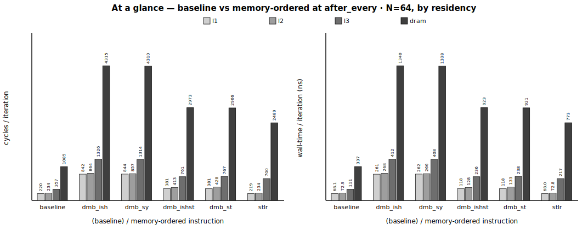
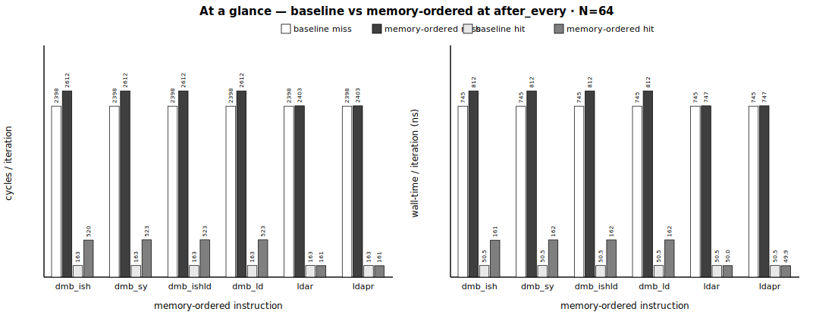
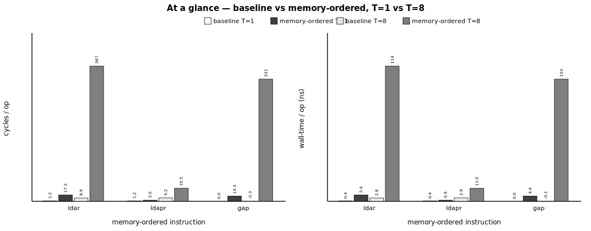
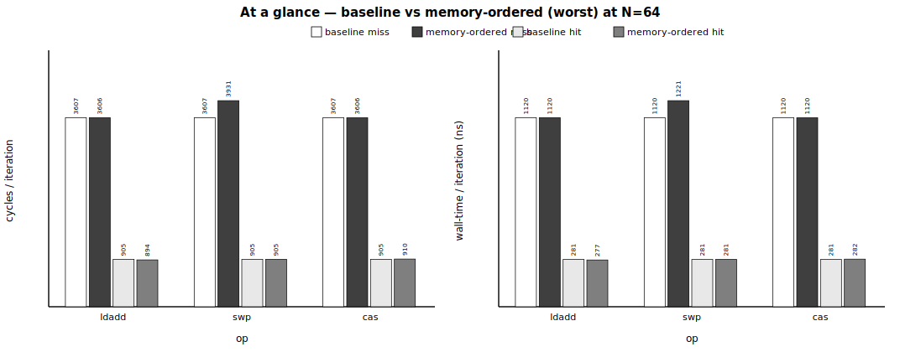
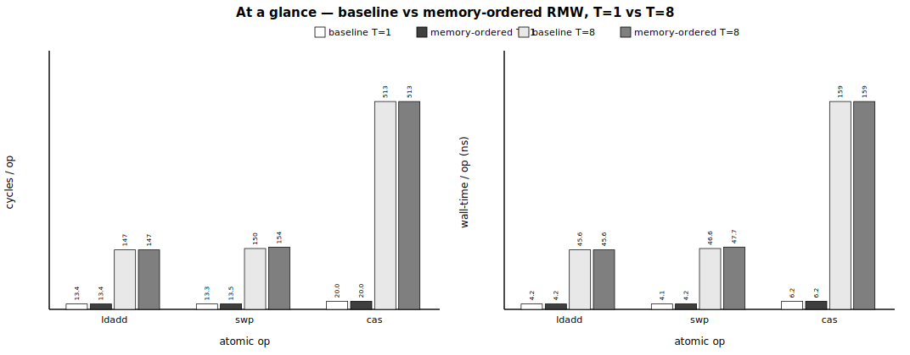

# barrierbench_extend — ARM memory-ordering cost on GH200 Neoverse-V2

Hardware microbenchmarks measuring the cost of memory-ordered instructions (`dmb`,
`stlr`/`ldar`/`ldapr`, LSE atomics) on a conventional weak-memory ARM core —
supporting evidence for the TEMPO paper (`../docs/main.pdf`, MICRO 2026). This is
the **top-level report**: TL;DR + methodology summary (→ [`METHODOLOGY.md`](METHODOLOGY.md))
+ results overview (→ per-group `README.md`) + layout.

## TL;DR

- **What** — cost of ARM memory-ordered instructions on **Neoverse-V2** (`rg-uwing-1`, 3.375 GHz fixed), measured **paired** (baseline + treatment in one process), **1M iters × 10–15 repeats** median, PMU via `perf_event_open`, **objdump-verified**, **gate-clean**.
- **G1 store-side** (miss · after_every · N=64, Δ per 64-store iteration): full `dmb` **+3401…+3858** > store-only `dmb` **+2381…+2400** ≳ store-release `stlr` **+2194** cyc — *a store-side memory-ordered op between cache-missing stores serializes them* (merge-buffer drain). At `hit`, `stlr` is statistically zero and fences keep only their pipeline floor.
- **G2 load-side** (same point): `dmb` **+213.3…+213.5** cyc per 64-load iteration — a load barrier is far cheaper; load-MLP survives. Load-acquire `ldar`/`ldapr` are statistically **zero** in an isolated stream (no po-older `stlr` to wait on; contended cost is G3).
- **G3 — load-acquire completion stall** (`3_contention`) · single-line contention: the **`ldar`−`ldapr` gap grows +14.34 → +92.56 → +187.16 → +331.19 cyc/op** at T=1→8 — RCsc `ldar` completion is gated on the po-older `stlr` drain (+16.15→+357.54); RCpc `ldapr` skips it (+1.81→+26.34).
- **G4 atomics** · uncontended **and** single-line contention: ordering surcharge over `relaxed` **≈ 0** even at T=8 (worst **+3.54** cyc/op — the LSE RMW already owns the line); the cost is the RMW itself, `cas` 20.00→**488.20** > `ldadd` 13.38→**149.74** ≈ `swp` 13.28→**150.77** cyc/op (T=1→8).
- **Status** — 4 groups measured @1M (10 rep single-thread / 15 rep contention); G1 +stlr, G2 +ldar/ldapr single-thread, G3/G4 contention T=1/2/4/8, all gate-clean. Full method → [`METHODOLOGY.md`](METHODOLOGY.md).

> **Methodology** — full normative spec in **[`METHODOLOGY.md`](METHODOLOGY.md)** (§1–13, common → Family A → Family B). Gate-spec
> origin: `../docs/measurement_and_gates.md`. Findings/forensics: `../docs/findings_*.md`.
> Progress: `../docs/To-Do List.txt`.

**Contents**
1. [Purpose](#1-purpose)
2. [Machine & environment](#2-machine--environment)
3. [Methodology summary](#3-methodology-summary) — paired model · gates · dimensions → [`METHODOLOGY.md`](METHODOLOGY.md)
4. [Metadata & evidence](#4-metadata--evidence)
5. [Directory layout](#5-directory-layout)
6. [Results, by group](#6-results-by-group)
7. [Reproduce](#7-reproduce)

---

## 1. Purpose

Measure the cost of memory-ordered instructions (fences, release/acquire, ordered atomics) on the Grace (Neoverse-V2) CPU.
Central question: **does inserting a fence into a stream of cache-missing stores
serialize them by forcing the merge/write buffer to drain, instead of letting the
store misses go outstanding in parallel?** Supporting evidence for the CPU
memory-ordering paper's H200/GH200 evaluation.

---

## 2. Machine & environment

Captured 2026-06-08 from `rg-uwing-1` via `srun --jobid=<J>`; raw files in
`metadata/` (`env_*.txt`, `env_summary.md`).

| Field | Value |
|---|---|
| Node | `rg-uwing-1` (CRNCH), reached from `rg-login` via `srun --jobid=<J>` |
| Arch / CPU | aarch64, **ARM Neoverse-V2** (Grace), 72 cores |
| Kernel | 6.8.0-1051-nvidia-64k |
| Clock | **3.375 GHz fixed**, governor `performance` (1 cycle ≈ 0.296 ns) |
| Cache line | 64 B |
| L1d / L2 / L3 | 64 KiB/core / 1 MiB/core / ~114 MiB shared |
| RAM / NUMA | 601 GB; node 0 = all 72 cores + 490 GB local (bind here). node 1 = GPU HBM (avoid); nodes 2–8 empty |
| ISA features | **LSE atomics** + **RCPC (`ldapr`)**, SVE2 |
| Compiler | gcc 11.4.0 (no clang) |
| **`perf` CLI** | **broken** for this kernel → PMU read via `perf_event_open()` syscall |
| PMU events | cycles, instructions, l1d_refill(0x03), l2d_refill(0x17), ll_miss_rd(0x37), mem_access(0x13), stall_be_mem(0x4005) + SW ctx/mig/pf — 6 generic, no multiplexing |
| mlock | `ulimit -l` unlimited → buffers locked |

---

## 3. Methodology summary

The full normative spec is **[`METHODOLOGY.md`](METHODOLOGY.md)** (§1–13), organized **common →
Family A → Family B**. This is the headline **contract**.

**Common to all groups.** Each treatment times its no-ordering **baseline** and the **treatment**
*interleaved in ONE process per repeat*; `incremental = median(treat − base)` — cancels the
per-invocation drift that made an earlier separate-process design read spurious negatives
(METHODOLOGY.md §2, §6). Reported in **both** cyc/op (PMU `perf_event_open`, user-mode, no
multiplexing) and ns (`CLOCK_MONOTONIC_RAW`), per-iteration averages, **median ± margin** (§3),
**1,000,000 iters/repeat**. Every repeat passes the **common gate** — multiplexing / OS-noise /
anti-elision — plus an **objdump** opcode proof (§5). The suite is **two measurement families**
that differ in stream, swept axis, family gate, and what each reports:

### Family A — single-thread ordering sweep (G1/G2) · METHODOLOGY §7

A store-side or load-side memory-ordered op in a single-thread stream — **the reported measurement for
G1/G2**, grouped by **measurement window** (the paper's store-side / load-side split, Fig 4 / Fig 5):

| dimension | values | what it is |
|---|---|---|
| stream | G1 store-only · G2 load-MLP (register-hash, prefetcher-defeated) | the measured op (§7.1) |
| memory-ordered op | G1: `dmb ish/sy/ishst/st` + **`stlr`** (STLR vs STR) · G2: `dmb ish/sy/ishld/ld` + **`ldar`/`ldapr`** (LDAR vs LDR vs LDAPR) | fence vs instruction-carried release/acquire |
| condition | `hit` · `miss` | cache-resident vs prefetcher-defeated real miss |
| placement × N | `after_group`/`after_every` × N ∈ {0,1,2,4,8,16,32,64} | memory-ordered-op frequency × merge-buffer pressure |
| repeats | **10** (× 2 placements = 20-sample pooled baseline) | median ± margin |
| + family gate | cache hit/miss + exposed-latency (§7.3) | proves the cache state / a real exposed miss |

| group | measures | window |
|---|---|---|
| **G1 store-side** (`1_store_side`) | a `dmb` **or store-release `stlr`** in a cache-missing **store** stream | store issue → **retire** (drain-induced stall) |
| **G2 load-side** (`2_load_side`) | a `dmb` **or load-acquire `ldar`/`ldapr`** in a **load** stream | load issue → **completion** (load-MLP survives) |

(`ldar`/`ldapr` in an *isolated* load stream read ≈0 — no po-older `stlr` to wait on; that is the
finding that **uncontended** acquire is cheap. The **contended** cost is Family B / G3.)

### Family B — single-line contention sweep (G3/G4) · METHODOLOGY §8

All `T` threads hammer **one shared line** — **`T=1` uncontended → `T≥2` contended.** This is the
reported measurement for **G3** (load-acquire `ldar` vs `ldapr` under contention) and one of two
reported run-sets for **G4** (the other being its uncontended single-thread atomic sweep — Pranith's
"uncontended **and** under high contention"; §8.4). *(The single-thread cost of `stlr`/`ldar`/`ldapr`
lives in G1/G2, not here.)*

| dimension | values | what it is |
|---|---|---|
| construction | `T` threads, distinct cores, one shared line `L` | the contended resource (§8.1) |
| regime (axis) | **`T=1` uncontended → `T≥2` contended** (T ∈ {1,2,4,8}) | how contention scales the cost |
| order (G4) | `relaxed` (baseline) · acquire/release/acq_rel/seq_cst | the ordering surcharge |
| repeats | **15 / run** | median ± margin (the `n=15` baselines) |
| + family gate | distinct-core pin + temporal overlap + L1-refill rise (§8.3) | proves the threads truly raced on the line |

| group | measures | window |
|---|---|---|
| **G3 contention** (`3_contention`) | **`ldar` vs `ldapr`** on the contended line (`stlr(L);ldar/ldapr(L)`) | **load-acquire completion stall** (RCsc `ldar` pays, RCpc `ldapr` skips) |
| **G4 atomics** (`4_atomics`) | LSE `ldadd`/`swp`/`cas` × order — uncontended **and** on the contended line | atomic issue → **completion** (RMW cost + ordering surcharge) |

**Where the depth lives** (METHODOLOGY.md): common — §2 paired · §3 numbers · §4 platform · §5
common gates · §6 iteration & method-evolution; **Family A** — §7 (sweep + gate + windows);
**Family B** — §8 (contention + gate + run-sets + windows); back-matter — §9
reproduce · §10 reviewer Q&A.

---

## 4. Metadata & evidence

**File-type policy:** reports = `.md`, result data = `.csv`, raw transcripts =
`.log`. No standalone `.txt` reports — objdump proofs + gate summaries fold into
the group `README.md`.

**Self-contained treatments.** A group is `<group>/`; each treatment (one fence /
ordering instruction / atomic) is its own folder `<group>/<treatment>/` holding
**its own standalone `bench.c`** (the paired baseline+treatment measurement),
**its own `run.sh`** (builds + sweeps that treatment into `out/`), and an `out/`
with `bench.csv` (raw per-repeat, base+treat columns), `compare_paired.csv`
(paired incremental summary), `run.log`, and `objdump.snippet`. There is no
monolithic run-all; **`lib/`** holds only the shared primitives
(`bench_common.h`, `aarch64_ops.h`) and helpers (`run_common.sh`,
`parse_group.py`).

**Two-tier documentation:** master `README.md` (this file) → group
`<group>/README.md` (the single narrative report, **auto-generated by
`lib/parse_group.py`** from the treatments' `out/compare_paired.csv`: per-treatment
sections with objdump proof + build sha256 + gate + paired tables, plus a
cross-treatment headline). `<group>/processed/<group>_incremental.csv` is the
integrated table. **Machine-level** metadata (`metadata/`) is environment-only.

Credible source of truth (per CLAUDE.md): **results** = group `processed/*.csv` +
group `README.md`; **methodology** = the per-treatment `bench.c` + `run.sh` +
`lib/`. Nothing in chat counts.

---

## 5. Directory layout

```
barrierbench_extend/
├── README.md                   # this master document (TL;DR + summary + results overview)
├── METHODOLOGY.md              # normative methodology & validation spec (§1-13: common → Family A → Family B)
├── lib/                        # SHARED ONLY — primitives + helpers (no run-all)
│   ├── bench_common.h          #   alloc/prefault/mlock, register-hash gen, PMU group, gates, CLI/CSV
│   ├── aarch64_ops.h           #   dmb*/str/ldr/stlr/ldar/ldapr/LSE-atomic inline asm
│   ├── run_common.sh           #   pin/membind + paired-bench invoker (sourced by each run.sh)
│   ├── parse_group.py          #   aggregate a group's out/compare_paired.csv -> processed + README
│   └── collect_env.sh          #   machine/env capture -> metadata/
├── 1_store_side/               # GROUP 1 — store-side ordering (dmb + store-release) on a STORE stream
│   ├── dmb_ish/                #   one TREATMENT = self-contained
│   │   ├── bench.c             #     standalone PAIRED bench (baseline + this op, one process)
│   │   ├── run.sh              #     build + sweep placement×condition×N -> out/
│   │   └── out/                #     bench.csv (raw paired) compare_paired.csv run.log objdump.snippet
│   ├── dmb_sy/ dmb_ishst/ dmb_st/ stlr/    (same shape; stlr = STLR vs STR)
│   ├── README.md               #   GROUP report (auto-generated by lib/parse_group.py)
│   ├── processed/1_store_side_incremental.csv
│   └── plots/
├── 2_load_side/                # GROUP 2 — load-side ordering (dmb + load-acquire) on a LOAD stream
│   └── dmb_ish/ dmb_sy/ dmb_ishld/ dmb_ld/ ldar/ ldapr/   each {bench.c, run.sh, out/}  + README.md processed/
├── 3_contention/               # GROUP 3 — load-acquire completion stall under single-line contention (RC4)
│   └── _contention/            #   ldar vs ldapr, all T threads stlr(L);ldar/ldapr(L): bench.c, run.sh, out/contention.csv
│                               #   (single-thread stlr/ldar/ldapr cost lives in G1/G2)
├── 4_atomics/                  # GROUP 4 — LSE atomics × memory order (uncontended + contended)
│   ├── ldadd/ swp/ cas/                       each {bench.c, run.sh, out/}  + README.md processed/  (uncontended sweep)
│   └── _contention/            #   multi-thread contended RMW: bench.c, run.sh, out/contention.csv
├── metadata/                   # MACHINE/ENV ONLY: env_*.txt, env_summary.md
└── tools/                      # rerun_all.sh (full re-measure) + ab_compare.c (paired probe) + selftest/sanity/prefetch probes
```

Each *treatment* is a self-contained unit (its own `bench.c` pairing baseline +
treatment in one process, its own `run.sh`, its own `out/`); `lib/` is shared.

---

## 6. Results, by group

Only gate-PASS data appears. **Every cell below appears verbatim in the group README's
*At a glance* table, which carries the *Result* tables' own values** (single-thread groups:
per-iteration Δ at the deepest sweep point; contention groups: per-op, every T in the group
report). `*` = within the baseline margin (statistically zero), as in the Result tables.
Detailed tables (per-variant, objdump, gate detail) live in each group's `README.md`.

### Harness validation (all groups)
Opcode emit (objdump, gcc 11.4 `-O2 -march=native`): `dmb ish/ishst/ishld/sy/st/ld`,
`str/ldr/stlr/ldar/ldapr`, LSE `ldadd*/swpal`, LL/SC `ldxr/stxr` all emitted, run
without SIGILL. Gate self-test (`logs/gate_selftest.log`): miss→l1_refill/acc=1.00,
hit→0.00, prefetched→auto-FAIL, no multiplexing, zero OS noise.

### 6.1 Group 1 — store-side ordering (fences + store-release)  ✅ (140/140 gate-clean)

Δ per iteration of 64 stores, at the deepest sweep point (after_every · N=64):



| memory-ordered instruction | **Δ `miss`** (after_every·N=64) | **Δ `hit`** | gate |
|---|---|---|---|
| `dmb_ish` | +3401.3 cyc (+1056.1 ns) | +621.5 cyc (+192.8 ns) | PASS ✓ |
| `dmb_sy` | +3857.6 cyc (+1197.5 ns) | +622.3 cyc (+193.0 ns) | PASS ✓ |
| `dmb_ishst` | +2380.7 cyc (+739.4 ns) | +177.6 cyc (+55.1 ns) | PASS ✓ |
| `dmb_st` | +2400.3 cyc (+745.3 ns) | +181.2 cyc (+56.2 ns) | PASS ✓ |
| `stlr` | +2193.7 cyc (+681.4 ns) | +5.2* cyc (+1.6* ns) | PASS ✓ |

A store-side instruction between cache-missing stores **serializes them** (merge-buffer drain
before retirement; the per-instruction share is Δ ÷ 64 — full sweep in the group report); at
`hit` only the pipeline floor remains (`stlr` statistically zero) — **the cost is the pending
drain, not the instruction**. Ranking full > store-only ≳ `stlr`. Report:
[`1_store_side/README.md`](1_store_side/README.md) · data:
[`processed/1_store_side_incremental.csv`](1_store_side/processed/1_store_side_incremental.csv).

### 6.2 Group 2 — load-side ordering (fences + load-acquire)  ✅ (168/168 gate-clean)

Δ per iteration of 64 loads (after_every · N=64):



| memory-ordered instruction | **Δ `miss`** (after_every·N=64) | **Δ `hit`** | gate |
|---|---|---|---|
| `dmb_ish` | +213.5 cyc (+66.3 ns) | +356.7 cyc (+110.6 ns) | PASS ✓ |
| `dmb_sy` | +213.3 cyc (+66.2 ns) | +359.8 cyc (+111.6 ns) | PASS ✓ |
| `dmb_ishld` | +213.4 cyc (+66.3 ns) | +359.6 cyc (+111.5 ns) | PASS ✓ |
| `dmb_ld` | +213.3 cyc (+66.2 ns) | +359.7 cyc (+111.5 ns) | PASS ✓ |
| `ldar` | +4.3* cyc (+1.4* ns) | -1.6* cyc (-0.5* ns) | PASS ✓ |
| `ldapr` | +4.3* cyc (+1.3* ns) | -2.1* cyc (-0.6* ns) | PASS ✓ |

A load barrier barely costs anything per load (Δ ÷ 64 ≈ +3.3 `miss` / +5.6 `hit` cyc) — the
independent load misses **keep their MLP across the barrier**; the four barriers are identical.
**`ldar`/`ldapr` are statistically zero everywhere**: no po-older `stlr`, no invalidations ⇒
the acquire's cost precondition is absent — the *uncontended* floor; the contended cost is
Group 3. Report: [`2_load_side/README.md`](2_load_side/README.md) · data:
[`processed/2_load_side_incremental.csv`](2_load_side/processed/2_load_side_incremental.csv).

### 6.3 Group 3 — load-acquire completion stall (`3_contention`)  ✅ (T=1/2/4/8 gate-clean)

All T threads publish→consume one shared line (`stlr(L); ldar/ldapr(L)`); per-op, uncontended
floor vs the contended endpoint:



| memory-ordered instruction | baseline /op (T1→T8) | **memory-ordered /op (T1→T8)** | trend | gate |
|---|---|---|---|---|
| `ldar` | 1.19 → 8.94 cyc (0.377 → 2.795 ns) | **17.34 → 366.50 cyc (5.388 → 113.731 ns)** | ↑ with contention | PASS ✓ |
| `ldapr` | 1.19 → 9.19 cyc (0.376 → 2.866 ns) | **3.00 → 35.45 cyc (0.939 → 11.019 ns)** | ↑ with contention | PASS ✓ |
| **gap (`ldar` − `ldapr`)** | +0.00 → -0.25 cyc (+0.000 → -0.071 ns) | **+14.34 → +331.05 cyc (+4.449 → +102.712 ns)** | ↑ with contention | — |

RCsc completion is gated on the po-older `stlr` drain (paper Table 1, RC4); contention slows that
drain, so the stall is amplified **~23×** while RCpc pays only its coherence share. Full T-sweep +
validation: [`3_contention/README.md`](3_contention/README.md) · data:
[`_contention/out/contention.csv`](3_contention/_contention/out/contention.csv).

### 6.4 Group 4 — atomics  ✅ (uncontended + contended, gate-clean)

LSE `ldadd`/`swp`/`cas` (objdump-verified, not LL/SC); ordering-suffix surcharge over `relaxed`
at the dramatic endpoints (uncontended = Δ/iteration at N=64; contended = Δ/op at T=8):

**A · single-thread, cache hit/miss stream**



| op | baseline (miss·N=64) | baseline (hit·N=64) | **worst memory-ordered Δ** (miss / hit, N=64) | gate |
|---|---|---|---|---|
| `ldadd` | 3606.7 cyc (1120.2 ns) | 905.1 cyc (280.7 ns) | -0.8* cyc (-0.2* ns) / -11.5* cyc (-3.5* ns) | PASS ✓ |
| `swp` | 3606.7 cyc (1120.2 ns) | 905.1 cyc (280.7 ns) | +324.5 cyc (+100.7 ns) / +0.0* cyc (-0.0* ns) | PASS ✓ |
| `cas` | 3606.7 cyc (1120.2 ns) | 905.1 cyc (280.7 ns) | -1.1* cyc (-0.4* ns) / +5.0* cyc (+1.6* ns) | PASS ✓ |

**B · single shared line, by thread count**



| op | baseline /op (T1→T8) | **memory-ordered /op (worst order, T1→T8)** | trend | gate |
|---|---|---|---|---|
| `ldadd` | 13.38 → 146.85 cyc (4.156 → 45.582 ns) | **13.38 → 146.79 cyc (4.157 → 45.568 ns)** | ordered ≈ baseline at every T | PASS ✓ |
| `swp` | 13.28 → 150.03 cyc (4.126 → 46.584 ns) | **13.47 → 153.56 cyc (4.186 → 47.656 ns)** | ordered ≈ baseline at every T | PASS ✓ |
| `cas` | 20.00 → 512.70 cyc (6.210 → 159.070 ns) | **20.00 → 512.67 cyc (6.210 → 159.070 ns)** | ordered ≈ baseline at every T | PASS ✓ |

**The ordering suffix is ≈0 everywhere — even on a contended RMW**: an LSE RMW already owns the
line, so it has already serialized; what contention scales is the **relaxed RMW itself** (base
column). Per paper §4.4 an atomic's *directional* ordering cost follows the store-release /
load-acquire rules — measured in **Group 1** / **Group 3**, not re-measured here.
(The `swp` +324.5 cell (acquire·miss·N=64) is a layout artifact, not ordering cost — the stronger `seqcst` reads
≈0 at the same cell; see the group Verdict.) Report: [`4_atomics/README.md`](4_atomics/README.md)
· data: [`processed/4_atomics_incremental.csv`](4_atomics/processed/4_atomics_incremental.csv) +
[`_contention/out/contention.csv`](4_atomics/_contention/out/contention.csv).
---

## 7. Reproduce

```bash
J=$(squeue -u $USER -h -o "%A %N" | awk '/rg-uwing-1/{print $1; exit}')
cd <repo>/barrierbench_extend

# one treatment: its run.sh builds its own bench.c and sweeps into its out/
srun --jobid=$J bash -c "cd $PWD && bash 1_store_side/dmb_ish/run.sh"

# a whole group: run each treatment, then aggregate -> group README + processed/
srun --jobid=$J bash -c "cd $PWD && for t in 1_store_side/*/; do [ -f \$t/run.sh ] && bash \$t/run.sh; done"
python3 lib/parse_group.py 1_store_side
```

Each `run.sh` builds its treatment's standalone `bench.c` (`gcc -O2 -march=native
-pthread -Ilib`) and runs it pinned (`numactl --physcpubind=<core> --membind=0`);
the bench pairs baseline+treatment in one process. PMU via `perf_event_open()`
(the `perf` CLI is unavailable). Env collection: `lib`/`metadata` (machine-only).
